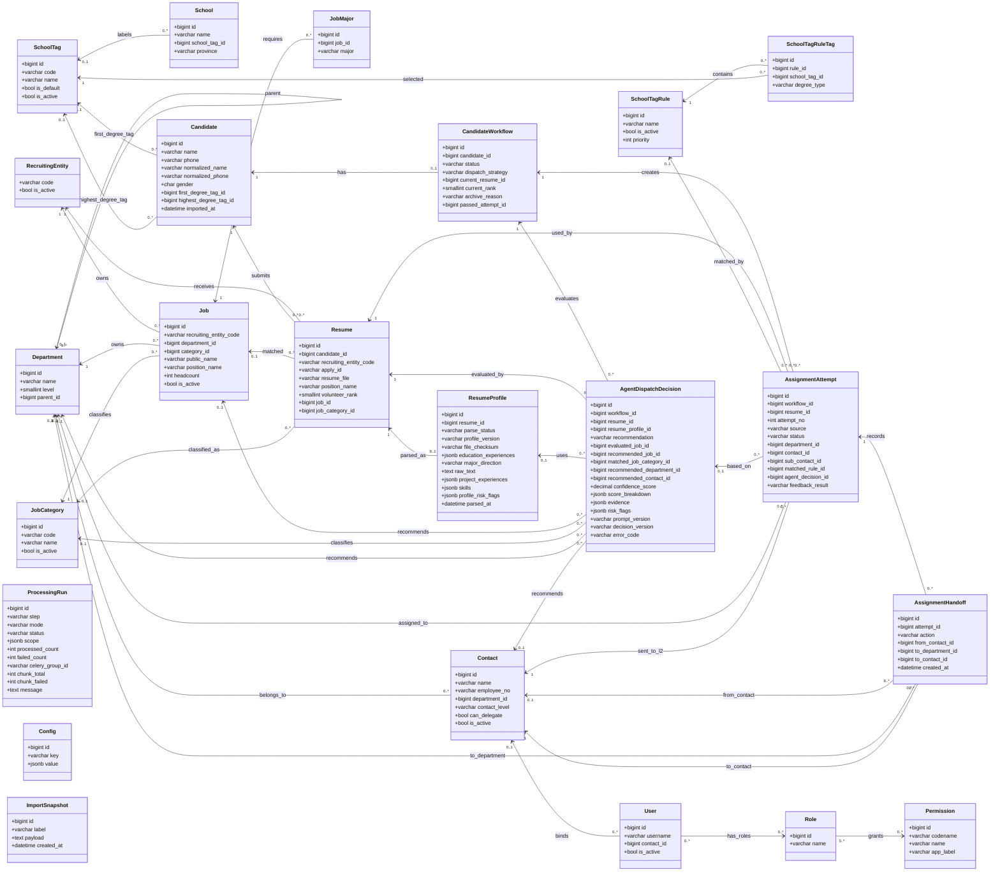

# 智能简历筛选系统 — 数据库设计

> 存储：PostgreSQL；以 Django 模型组织。本设计覆盖输入件落库、前置数据准备、候选人处理主流程、分配下发、权限。所有数据同处**一个池**，按时间标签筛选，**不分批次**。
> 上游业务需求见 `docs/需求描述.md`；后端实现口径见 `docs/后端设计.md`；前端展示口径见 `docs/前端设计.md`。

## 一、建模关键判断

1. **人 / 投递分离**：`简历信息列表` 一行 = 一次投递。同一人可投多个岗位，故拆为 **Candidate（同学/人）** 与 **Resume（投递记录）**。人通过规范化姓名 + 规范化手机号归并；`应聘ID` 按投递维度识别（简历包 `姓名（应聘ID）` 据此定位投递）。
2. **单一数据池 + 时间标签**：不引入批次概念。候选人、投递、分配同处一个池，按 `imported_at` 等时间标签筛选；每次导入按规范化姓名 + 手机号、`应聘ID` 等业务键在应用层查询后幂等并入：低风险重复更新当前主记录，但不删除已反馈流程、分配尝试和历史快照。院校、招聘主体、部门、接口人、岗位需求为**主数据**，同在池中维护。
3. **处理结果就近存放**：院校打标作为前置处理落在 Candidate（个人学历属性）；志愿、岗位类别落在 Resume（投递属性）；分配进入候选人级工作流。
4. **Rule / AI 策略可追溯**：简历分类、分配与下发记录 `dispatch_strategy`（rule/ai）、分类理由、AI 决策证据，支持人工核对。
5. **分类与分配合并为同一环节**：岗位分类不再是独立流程步骤，而是简历分配+下发策略内部动作。Rule 按确定性规则完成分类和分配；AI 读取简历正文和项目经历后生成可审计决策，再进入同一分配工作流。
6. **配置/字典外置**：院校标签准入规则等进配置表或规则表，不写死；南北归属不落库，也不进入 `Config` 表或可维护省份字典，仅在志愿排序规则中运行时判断。
7. **招聘主体实体化但保持极简**：`招聘主体` 不是普通文本字段，拆为 `RecruitingEntity` 主数据；当前仅维护 `code`，如 GW / YLS。投递、岗位需求等业务表保存 `recruiting_entity_code` 引用主体；部门主数据不建立“属于招聘主体”的关系。
8. **业务唯一性不依赖数据库 unique**：除主键外，尽量不在数据库层做业务 `unique` 约束；`RecruitingEntity.code` 作为主体标识直接承担主键。其他导入、创建、编辑场景由服务层按业务键查询并拦截重复，数据库只保留普通索引用于性能。这样更方便处理历史脏数据、人工合并和导入回滚。
9. **招聘周期边界**：不引入批次/周期表，以当前数据池作为一个持续招聘周期；同一 `Candidate` 只维护一个当前分配流程。历史招聘周期隔离暂不设计。

**字段类型与外键拆分原则**

| 字段类型                                          | 建模口径                                     | 示例                                                                                |
| ------------------------------------------------- | -------------------------------------------- | ----------------------------------------------------------------------------------- |
| 会被多个表引用、需要启停/权限/统计的业务对象     | 拆独立表 + FK                                | 招聘主体`RecruitingEntity`、部门 `Department`、接口人 `Contact`、岗位 `Job` |
| 稳定枚举、只驱动状态机且无需独立维护              | 保留短 varchar/char，并在应用层 choices 校验 | workflow.status、attempt.status、source、role                                       |
| 会参与核心匹配、筛选、统计或配置选择的标签/类别   | 拆独立表 + FK                                | 岗位类别`JobCategory`、院校标签 `SchoolTag`                                     |
| 外部输入的展示文本，短期不需要统一维护            | 保留 varchar，必要时加普通索引               | 岗位族、工作地点、学历要求、原始应聘状态                                            |
| 个人属性短码                                      | 使用 char 或短 varchar，不做长文本           | gender 建议`char(1)`：M/F/U                                                       |

## 二、UML 类图

> UML 类图从“对象 + 核心属性 + 依赖关系”视角展示核心模型。为保证图可读，类图只展示关键字段；完整字段、状态枚举和约束以下方字段表为准。

**UML 对象说明**

| 对象                  | 含义                                                                                                       | 所属域        |
| --------------------- | ---------------------------------------------------------------------------------------------------------- | ------------- |
| RecruitingEntity      | 招聘主体主数据，如 GW/YLS；统一使用 `code` 作为主体标识、导入匹配值和页面展示值                             | 主数据        |
| Department            | 部门主数据，支持一层/二层/三级树形结构；二级部门用于岗位归属和 HR 下发目标，三级部门用于二级接口人继续转派 | 主数据        |
| Contact               | 部门接口人主数据，绑定二级或三级部门；二级接口人负责转派，三级接口人负责最终反馈                           | 主数据 / 下发 |
| Job                   | 岗位需求主数据，来自校招岗位分类及专业要求；承载岗位类别、部门、工作地、学历、HC 等                        | 主数据 / 需求 |
| JobCategory           | 岗位类别字典，供岗位需求、简历分类、Rule/AI 分配和前端筛选复用                                             | 主数据 / 字典 |
| JobMajor              | 岗位需求专业明细；一条岗位需求可配置多个需求专业                                                           | 主数据 / 需求 |
| SchoolTag             | 院校标签字典，来自用户提供的默认院校标签和后续维护；供学校、候选人打标和准入规则引用                       | 主数据 / 字典 |
| Candidate             | 候选人/同学实体，通过规范化姓名 + 规范化手机号进行应用层归并                                               | 候选人数据    |
| Resume                | 投递记录实体，一条记录对应一个应聘ID；同一候选人可有多条投递/志愿                                          | 候选人数据    |
| ResumeProfile         | 简历结构化画像，从简历文件解析正文、项目经历、实习经历、技能等，供 AI 策略使用                             | AI 数据       |
| CandidateWorkflow     | 候选人级分配流程，一个候选人一个当前流程；记录当前志愿、流程状态、归档原因、通过结果                       | 工作流        |
| AssignmentAttempt     | 分配尝试，一次具体的 Rule/AI/手动分配动作；承载目标部门、接口人、下发状态和反馈结果                        | 工作流 / 下发 |
| AssignmentHandoff     | 分配转交历史，记录 HR 下发给二级接口人、二级接口人转派给三级接口人的动作历史                               | 工作流 / 下发 |
| AgentDispatchDecision | AI 策略决策记录，保存推荐动作、推荐部门/接口人、置信度、理由、证据和风险点                                 | AI 审计       |
| SchoolTagRule         | 院校标签准入规则，由 HR 配置；存在启用规则时用于 Rule/AI 自动分配准入判断                                  | 配置 / 规则   |
| ProcessingRun         | 批处理运行记录，跟踪前置处理和候选人处理主流程的执行状态、范围和结果                                       | 系统          |
| Config                | 系统配置项，保存 AI 阈值、超时、WeLink 开关等可调参数                                                      | 系统 / 配置   |
| ImportSnapshot        | 上传撤销快照，支持简历导入后的单级回滚                                                                     | 系统 / 导入   |
| User                  | 系统用户，承载 HR、二级接口人、三级接口人、管理员等角色；接口人用户可绑定 Contact                          | 权限          |
| Role                  | RBAC 角色，对应 Django Group，如 HR、二级接口人、三级接口人、管理员                                        | 权限          |
| Permission            | RBAC 权限点，对应 Django Permission，使用稳定权限码控制菜单、页面和操作                                    | 权限          |

## 三、主数据（CRUD 维护）

### RecruitingEntity 招聘主体

| 字段         | 类型     | 说明                                                    |
| ------------ | -------- | ------------------------------------------------------- |
| code         | varchar(PK) | 主体编码，如 GW / YLS；作为业务主键、导入匹配值和页面展示值 |
| is_active    | bool     | 是否启用                                                |
| created_at   | datetime |                                                         |
| updated_at   | datetime |                                                         |

> 招聘主体从字符串字段拆出，是为了避免 GW / YLS 等主体值散落在投递、岗位需求等业务表中。当前 `code` 同时承担主体标识、导入匹配和页面展示，并作为主键被业务表的 `recruiting_entity_code` 引用；主体表不再另设 `id` 或额外业务唯一约束。后续如果出现外部编码、法定名称、页面展示名不一致的真实场景，再通过迁移扩展字段。主体查不到时创建或进入人工映射。

### Department 部门（树形）

| 字段      | 类型           | 说明                             |
| --------- | -------------- | -------------------------------- |
| id        | PK             |                                  |
| name      | varchar        | 部门名                           |
| level     | smallint       | 1=一层，2=二层，3=三级           |
| parent_id | FK→Department | 一层为空；二层挂一层；三级挂二层 |

> 部门主数据只表达组织层级，不建立“属于招聘主体”的关系。招聘主体保留在投递、岗位需求等业务记录上；岗位通过 `department_id` 指向二级部门。

### Contact 接口人

| 字段          | 类型           | 说明                                                      |
| ------------- | -------------- | --------------------------------------------------------- |
| id            | PK             |                                                           |
| name          | varchar        | 姓名                                                      |
| employee_no   | varchar        | 工号；应用层按工号查询并拦截重复                          |
| department_id | FK→Department | 所属二级或三级部门                                        |
| contact_level | varchar        | secondary / tertiary；二级接口人可转派，三级接口人可反馈  |
| can_delegate  | bool           | 是否允许向下属三级部门接口人转派，通常仅二级接口人为 true |
| is_active     | bool           | 是否启用                                                  |

> 账号口径：导入部门接口人信息时，系统按 `employee_no` 幂等维护 `Contact`，并同步创建或更新同工号登录账号：`User.username = Contact.employee_no`，`User.contact_id` 指向该接口人；新账号默认密码为 `pass1234`，已有账号保留原可用密码和非接口人业务角色；同步时按 `contact_level` 替换二级/三级接口人角色。部门接口人 replace 导入时，本次文件中不存在的旧接口人及其绑定账号同步停用。

> 权限口径：二级接口人只能把 HR 下发给自己的分配尝试转派给其所属二级部门下的启用三级接口人；三级接口人只处理转派给自己的尝试并提交反馈。

### School 院校

| 字段          | 类型               | 说明                                           |
| ------------- | ------------------ | ---------------------------------------------- |
| id            | PK                 |                                                |
| name          | varchar            | 学校；导入时应用层按规范化校名查询并拦截重复   |
| school_tag_id | FK→SchoolTag null | 院校标签；导入院校分类时按平台标签映射         |
| province      | varchar null       | 学校所在省份；户籍缺失时用于查重与志愿排序兜底 |

### SchoolTag 院校标签

| 字段       | 类型     | 说明                                                 |
| ---------- | -------- | ---------------------------------------------------- |
| id         | PK       |                                                      |
| code       | varchar  | 标签编码；应用层拦截重复                             |
| name       | varchar  | 标签名称，如 985、211、非目标院校等                  |
| is_default | bool     | 是否默认标签；未匹配学校时可使用，应用层保证最多一个 |
| is_active  | bool     | 是否启用                                             |
| sort_order | int      | 前端展示顺序                                         |
| created_at | datetime |                                                      |
| updated_at | datetime |                                                      |

> 默认院校标签由用户提供。院校分类时，学校命中 `School.school_tag_id` 则写入候选人学历标签；未命中学校或学校未配置标签时，可使用 `is_default=true` 的标签。

### JobCategory 岗位类别

| 字段       | 类型     | 说明                         |
| ---------- | -------- | ---------------------------- |
| id         | PK       |                              |
| code       | varchar  | 岗位类别编码；应用层拦截重复 |
| name       | varchar  | 岗位类别名称                 |
| is_active  | bool     | 是否启用                     |
| sort_order | int      | 前端展示顺序                 |
| created_at | datetime |                              |
| updated_at | datetime |                              |

### Job 岗位需求（即「校招岗位分类及专业要求」+「结构化需求表」）

| 字段                 | 类型                 | 说明                                           |
| -------------------- | -------------------- | ---------------------------------------------- |
| id                   | PK                   |                                                |
| recruiting_entity_code | FK→RecruitingEntity(code) | 招聘主体                                  |
| department_id        | FK→Department       | 二级部门                                       |
| category_id          | FK→JobCategory      | 岗位类别（分配策略匹配目标）                   |
| public_name          | varchar              | 对外发布名称                                   |
| is_public            | bool                 | 是否对外发布                                   |
| position_name        | varchar              | 职位名称                                       |
| job_family           | varchar              | 岗位族                                         |
| location             | varchar              | 工作地点                                       |
| education            | varchar              | 学历要求                                       |
| headcount            | int                  | 需求数量（HC，用于岗位需求展示与后续容量策略） |
| is_active            | bool                 | 是否启用；分配时只匹配启用岗位                 |
| remark               | text null            | 岗位需求调整说明                               |
| created_at           | datetime             |                                                |
| updated_at           | datetime             |                                                |

> 岗位需求作为持续维护的主数据，不引入招聘周期表。导入或编辑时按招聘主体、部门、岗位名称/对外名称、岗位类别等业务键在应用层匹配已有 `Job`；命中则更新，不再招聘的岗位通过 `is_active=false` 失效，不做硬删除。分配时只匹配启用岗位；历史投递和分配尝试通过 `job_id` 与快照字段保持可追溯。

### JobMajor 岗位需求专业（需求专业多值）

| 字段   | 类型    | 说明     |
| ------ | ------- | -------- |
| id     | PK      |          |
| job_id | FK→Job |          |
| major  | varchar | 需求专业 |

## 四、候选与投递（数据池）

### Candidate 候选人

| 字段                  | 类型               | 说明                                                                                    |
| --------------------- | ------------------ | --------------------------------------------------------------------------------------- |
| id                    | PK                 |                                                                                         |
| name                  | varchar            | 姓名                                                                                    |
| phone                 | varchar            | 手机号（原文，仅存储）                                                                  |
| normalized_name       | varchar            | 规范化姓名，用于应用层查重和候选人归并                                                  |
| normalized_phone      | varchar            | 规范化手机号，用于应用层查重和候选人归并                                                |
| gender                | char(1)            | M=男，F=女，U=未知；外部文本导入时映射为短码                                            |
| household_province    | varchar            | 户口所在地                                                                              |
| first_degree_school   | varchar            | 第一学历毕业院校                                                                        |
| highest_degree_school | varchar            | 最高学历毕业院校                                                                        |
| highest_major         | varchar            | 最高学历专业                                                                            |
| first_degree_tag_id   | FK→SchoolTag null | 前置院校分类：第一学历标签                                                              |
| highest_degree_tag_id | FK→SchoolTag null | 前置院校分类：最高学历标签                                                              |
| imported_at           | datetime           | 导入时间（时间标签，用于筛选）                                                          |
| updated_at            | datetime           | 最近更新时间                                                                            |

> 归并口径：导入服务优先按 `normalized_name + normalized_phone` 查询候选人；手机号缺失的候选人直接舍弃，不入库、不进入分配，并在导入结果中记录舍弃原因；命中一条候选人时复用，命中多条时阻断相关记录并进入导入错误清单，不在数据库层用 `unique` 强压。
> 简历库主列表以 Candidate 为展示粒度，一名候选人一行；候选人的全部投递通过详情页/抽屉按 Resume 展示。

### Resume 投递记录

| 字段                          | 类型                      | 说明                                                                          |
| ----------------------------- | ------------------------- | ----------------------------------------------------------------------------- |
| id                            | PK                        |                                                                               |
| candidate_id                  | FK→Candidate             |                                                                               |
| apply_id                      | varchar                   | 应聘ID（投递维度业务键）；导入/创建时应用层查询并拦截重复                     |
| resume_file                   | varchar                   | 简历包文件名（`姓名（应聘ID）`）；文件落盘 `media/resumes/`，供分配页导出 |
| recruiting_entity_code        | FK→RecruitingEntity(code) | 招聘主体                                                                      |
| org                           | varchar                   | 所属机构                                                                      |
| position_name                 | varchar                   | 对外职位名称（投递岗位）                                                      |
| status                        | varchar                   | 原始应聘状态（待处理等），用于展示与筛选                                      |
| apply_date                    | date                      | 应聘日期（查重与志愿排序依据）                                                |
| volunteer_rank                | smallint null             | 查重与志愿排序：志愿次序（1–4）                                              |
| assigned_recruiting_entity_code | FK→RecruitingEntity(code) null | 查重与志愿排序：分配主体                                                |
| job_id                        | FK→Job null              | 简历分类、分配与下发环节匹配到的岗位                                          |
| job_category_id               | FK→JobCategory null      | 简历分类、分配与下发环节写入的岗位类别                                        |
| category_mode                 | varchar                   | rule / ai                                                                     |
| category_reason               | text null                 | AI 模式可解释理由                                                             |
| imported_at                   | datetime                  | 导入时间（时间标签，用于筛选）                                                |

### ResumeProfile 简历结构化画像

| 字段                   | 类型          | 说明                                                 |
| ---------------------- | ------------- | ---------------------------------------------------- |
| id                     | PK            |                                                      |
| resume_id              | FK→Resume    | 一条投递业务上对应一份解析画像；应用层保证一对一     |
| parse_status           | varchar       | pending / parsed / failed                            |
| file_checksum          | varchar null  | 简历文件内容哈希；文件变化后触发重新解析             |
| profile_version        | varchar null  | 画像抽取 schema / prompt / 解析器版本                |
| raw_text               | text null     | 从 PDF 简历抽取出的正文                              |
| summary                | text null     | 简历摘要                                             |
| education_experiences  | jsonb         | 教育经历数组                                         |
| major_direction        | varchar null  | AI/解析器提取的专业方向                              |
| project_experiences    | jsonb         | 项目经历数组，含项目名称、角色、技术栈、职责、成果等 |
| internship_experiences | jsonb         | 实习/工作经历数组                                    |
| skills                 | jsonb         | 技能关键词数组                                       |
| certificates           | jsonb         | 证书、竞赛、奖项等                                   |
| profile_risk_flags     | jsonb         | 画像风险点，如文本过短、教育经历缺失、项目经历不足   |
| parse_model            | varchar null  | 解析使用的模型或解析器版本                           |
| parse_error            | text null     | 解析失败原因                                         |
| parsed_at              | datetime null | 最近解析时间                                         |
| created_at             | datetime      |                                                      |
| updated_at             | datetime      |                                                      |

> AI 策略依赖 `ResumeProfile`。输入简历统一为 PDF；若简历文件缺失、PDF 解析失败、正文抽取失败或项目经历不足，AI 决策必须显式记录风险点，不得静默生成高置信度下发结论。数据库保存抽取后的 `raw_text` 和结构化 `ResumeProfile`，不保存 LLM 完整原始响应。`file_checksum + profile_version` 用于判断是否复用画像，简历文件或画像版本变化后重新解析。

## 五、简历分类、分配与下发

### SchoolTagRule 院校标签准入规则

| 字段       | 类型     | 说明                                         |
| ---------- | -------- | -------------------------------------------- |
| id         | PK       |                                              |
| name       | varchar  | 规则名称                                     |
| is_active  | bool     | 是否启用                                     |
| priority   | int      | 展示/评估顺序，规则之间为 OR，不影响命中语义 |
| created_at | datetime |                                              |
| updated_at | datetime |                                              |

### SchoolTagRuleTag 院校准入规则标签明细

| 字段          | 类型              | 说明                                       |
| ------------- | ----------------- | ------------------------------------------ |
| id            | PK                |                                            |
| rule_id       | FK→SchoolTagRule | 所属规则                                   |
| school_tag_id | FK→SchoolTag     | 允许的院校标签                             |
| degree_type   | varchar           | first / highest，分别表示第一学历/最高学历 |

> 命中口径：存在启用规则时，候选人的 `first_degree_tag_id` 命中某条启用规则下 `degree_type=first` 的标签，且 `highest_degree_tag_id` 命中同一条规则下 `degree_type=highest` 的标签，才算通过该规则；多条启用规则之间是 OR。没有任何启用规则时，院校准入视为全部通过，不阻断自动分配。「非目标院校」只是普通 `SchoolTag`，HR 可配置进规则。系统不预置启用规则；默认院校标签由用户提供。

### CandidateWorkflow 候选人分配流程

| 字段              | 类型                       | 说明                                               |
| ----------------- | -------------------------- | -------------------------------------------------- |
| id                | PK                         |                                                    |
| candidate_id      | FK→Candidate              | 一个候选人业务上唯一一个分配流程；应用层保证一对一 |
| status            | varchar                    | pending / in_progress / passed / archived          |
| dispatch_strategy | varchar                    | rule / ai，最近一次分配使用的策略                  |
| current_resume_id | FK→Resume null            | 当前处理到的投递                                   |
| current_rank      | smallint null              | 当前志愿序号                                       |
| archive_reason    | varchar null               | 归档原因                                           |
| archive_detail    | text null                  | 归档说明，如未命中规则、无下一志愿、无接口人       |
| passed_attempt_id | FK→AssignmentAttempt null | 通过的分配尝试                                     |
| started_at        | datetime null              | 首次进入分配时间                                   |
| completed_at      | datetime null              | 通过或归档时间                                     |
| created_at        | datetime                   |                                                    |
| updated_at        | datetime                   |                                                    |

> 流程口径：一个候选人业务上只维护一个当前分配流程，由应用层按 `candidate_id` 查询后复用/更新，不依赖数据库唯一约束。归档候选人不单独建表，通过 `status=archived` + 归档字段查询；后续规则调整不会自动恢复归档流程，HR 可手动强制分配。
> `current_resume` / `current_rank` 驱动简历库主列表的当前志愿展示：初始指向第一志愿，反馈未通过后切换到下一志愿，通过后保留通过志愿，归档后保留最后处理志愿。

**流程状态枚举**

| 状态        | 中文含义 | 进入方式                                          | 是否终态               |
| ----------- | -------- | ------------------------------------------------- | ---------------------- |
| pending     | 待分配   | 创建流程但尚未生成有效尝试                        | 否                     |
| in_progress | 进行中   | 生成待下发/已下发尝试，或归档后被手动强制分配恢复 | 否                     |
| passed      | 已通过   | 任一尝试反馈通过                                  | 是                     |
| archived    | 已归档   | 无可继续尝试的志愿，或自动分配前置条件失败        | 是（可被手动分配恢复） |

**归档原因枚举**

| 值                      | 含义                             |
| ----------------------- | -------------------------------- |
| school_rule_not_matched | 候选人院校标签未命中任何启用规则 |
| no_next_resume          | 没有下一条可尝试志愿             |
| job_not_matched         | 投递未匹配到岗位                 |
| department_not_found    | 岗位未关联有效二级部门           |
| contact_not_found       | 二级部门下没有可用二级接口人     |
| sub_contact_not_found   | 二级部门下没有可用三级接口人     |
| agent_no_recommendation | AI 未形成有效下发建议            |
| all_rejected            | 全部可尝试志愿均被反馈未通过     |
| rerun_preserved         | 分配环节重跑时保留既有归档结果   |

> `archive_reason` 存枚举，`archive_detail` 存人类可读说明和具体上下文，前端归档候选人页按这两个字段展示原因。

### AssignmentAttempt 分配尝试

| 字段                             | 类型                           | 说明                                                                                            |
| -------------------------------- | ------------------------------ | ----------------------------------------------------------------------------------------------- |
| id                               | PK                             |                                                                                                 |
| workflow_id                      | FK→CandidateWorkflow          | 所属候选人流程                                                                                  |
| resume_id                        | FK→Resume                     | 本次尝试使用的投递                                                                              |
| attempt_no                       | int                            | 流程内尝试序号                                                                                  |
| source                           | varchar                        | rule / ai / manual                                                                              |
| status                           | varchar                        | pending_review / pending_dispatch / dispatched_l2 / assigned_l3 / passed / rejected / cancelled |
| department_id                    | FK→Department null            | 分配到的二级部门                                                                                |
| contact_id                       | FK→Contact                    | 二级接口人，HR 下发对象                                                                         |
| sub_department_id                | FK→Department null            | 三级部门，二级接口人转派后写入                                                                  |
| sub_contact_id                   | FK→Contact null               | 三级接口人，最终反馈人                                                                          |
| matched_rule_id                  | FK→SchoolTagRule null         | 自动分配命中的院校规则；手动分配为空                                                            |
| agent_decision_id                | FK→AgentDispatchDecision null | AI 策略决策依据；规则/手动分配为空                                                              |
| match_mode                       | varchar                        | rule / ai                                                                                       |
| match_reason                     | text null                      | 分配/匹配理由                                                                                   |
| confidence_score                 | decimal null                   | AI 置信度，规则/手动分配为空                                                                    |
| review_required                  | bool                           | 是否需要 HR 重点复核；AI 低置信度时为 true                                                      |
| welink_message_id                | varchar null                   | WeLink 消息标识，真实集成后回填                                                                 |
| dispatched_at                    | datetime null                  | HR 下发给二级接口人的时间                                                                       |
| assigned_to_sub_at               | datetime null                  | 二级接口人转派给三级接口人的时间                                                                |
| feedback_result                  | varchar null                   | passed / rejected                                                                               |
| feedback_note                    | text null                      | 三级接口人反馈备注                                                                              |
| feedback_at                      | datetime null                  | 反馈提交时间                                                                                    |
| cancelled_at                     | datetime null                  | 取消时间                                                                                        |
| cancel_reason                    | varchar null                   | 取消原因，如分配环节重跑、通过后取消其他尝试、手动分配替换                                      |
| manual_reason                    | text null                      | HR 手动强制分配原因；自动分配为空                                                               |
| department_name_snapshot         | varchar null                   | 分配时二级部门名称快照                                                                          |
| contact_name_snapshot            | varchar null                   | 分配时二级接口人姓名快照                                                                        |
| resume_apply_id_snapshot         | varchar null                   | 投递应聘ID快照                                                                                  |
| position_name_snapshot           | varchar null                   | 投递岗位名称快照                                                                                |
| created_by_id                    | FK→User null                  | 手动分配或下发操作者；系统自动分配可为空                                                        |
| created_at                       | datetime                       |                                                                                                 |
| updated_at                       | datetime                       |                                                                                                 |

> 状态约束：反馈一旦提交即锁定，不允许二次修改。三级接口人反馈「通过」后，`CandidateWorkflow.status=passed`，并取消同候选人其他未反馈尝试；三级接口人反馈「未通过」后，系统自动寻找下一志愿，若无可分配投递则归档。Rule 策略创建 `source=rule` 尝试，AI 策略创建 `source=ai` 尝试，HR 手动强制分配创建 `source=manual` 尝试。手动强制分配绕过院校规则和志愿顺序；已通过候选人不可再强制分配。

### AssignmentHandoff 分配转交记录

| 字段             | 类型                  | 说明                                            |
| ---------------- | --------------------- | ----------------------------------------------- |
| id               | PK                    |                                                 |
| attempt_id       | FK→AssignmentAttempt | 所属分配尝试                                    |
| action           | varchar               | hr_dispatch / sub_assign / sub_reassign         |
| from_contact_id  | FK→Contact null      | 转出接口人；HR 下发时为空                       |
| to_department_id | FK→Department null   | 转入部门，HR 下发为二级部门，二级转派为三级部门 |
| to_contact_id    | FK→Contact           | 转入接口人                                      |
| note             | text null             | 转派备注                                        |
| created_by_id    | FK→User null         | 操作者                                          |
| created_at       | datetime              |                                                 |

> `AssignmentHandoff` 只记录转交历史，不作为通用审计日志，也不替代 `AssignmentAttempt` 上的当前二级/三级接口人字段。列表查询优先读 `AssignmentAttempt.contact_id`、`sub_contact_id`；详情页展示转交历史时读取本表。

### AgentDispatchDecision AI 策略决策

| 字段                      | 类型                   | 说明                                           |
| ------------------------- | ---------------------- | ---------------------------------------------- |
| id                        | PK                     |                                                |
| workflow_id               | FK→CandidateWorkflow  | 所属候选人流程                                 |
| resume_id                 | FK→Resume             | 本次评估的志愿投递                             |
| resume_profile_id         | FK→ResumeProfile null | 使用的简历画像                                 |
| processing_run_id         | FK→ProcessingRun null | 对应分配环节运行记录                           |
| recommendation            | varchar null           | dispatch / review / archive；失败态可为空      |
| evaluated_job_id          | FK→Job null           | 当前评估输入岗位，用于决策复用和审计           |
| recommended_job_id        | FK→Job null           | 推荐匹配的岗位需求                             |
| matched_job_category_id   | FK→JobCategory null   | AI 判断的岗位类别，可同步写回投递              |
| recommended_department_id | FK→Department null    | 推荐二级部门                                   |
| recommended_contact_id    | FK→Contact null       | 推荐二级接口人                                 |
| confidence_score          | decimal null           | 0–1 置信度；失败态可为空                       |
| score_breakdown           | jsonb null             | 分项评分，如专业、技能、项目、实习、岗位需求、部门确定性、简历质量 |
| summary                   | text null              | 面向 HR 的一句话结论摘要                       |
| reason                    | text null              | 推荐理由；失败态可为空                         |
| evidence                  | jsonb                  | 引用证据，如项目经历、技能关键词、专业匹配片段；无证据时为空数组 |
| risk_flags                | jsonb                  | 风险点，如简历缺失、项目描述薄弱、专业不匹配；无风险时为空数组 |
| error_code                | varchar null           | AI 失败分类，如 pdf_missing / llm_timeout / invalid_ai_output |
| error_message             | text null              | 人类可读错误说明                               |
| model_name                | varchar null           | 模型名称                                       |
| prompt_version            | varchar null           | 提示词版本                                     |
| decision_version          | varchar null           | 决策 schema / 评分规则版本                     |
| created_at                | datetime               |                                                |

> `AgentDispatchDecision` 只保存 AI 推荐动作、置信度、分项评分、理由、证据、风险点和失败分类等决策结果；AI 阈值、失败处理和状态流转以后端设计为准。失败态最小必填为 `workflow_id`、`resume_id`、`processing_run_id`、`error_code`、`error_message` 和版本字段，不要求伪造推荐动作、置信度或理由。表名保留 Agent，是因为 AI 策略内部以智能体方式完成简历阅读、岗位适配和分流建议。`resume_id + evaluated_job_id + file_checksum + profile_version + prompt_version + decision_version` 可用于应用层复用决策，其中 `file_checksum/profile_version` 通过 `resume_profile_id` 关联 `ResumeProfile` 校验；不依赖数据库唯一约束。

**尝试状态枚举**

| 状态             | 中文含义   | 允许操作                                                    |
| ---------------- | ---------- | ----------------------------------------------------------- |
| pending_review   | 待 HR 复核 | HR 可查看 AI 理由并确认下发、取消或转人工处理；接口人不可见 |
| pending_dispatch | 待下发     | HR 可下发、取消；接口人不可见                               |
| dispatched_l2    | 已下发二级 | 二级接口人可转派给下属三级接口人；HR 可查看、导出           |
| assigned_l3      | 已转派三级 | 三级接口人可反馈通过/未通过；二级接口人和 HR 可查看         |
| passed           | 已通过     | 终态，只读                                                  |
| rejected         | 未通过     | 终态，只读，系统自动尝试下一志愿                            |
| cancelled        | 已取消     | 终态，只读                                                  |

**状态一致性规则**

- `status=passed` 时，`feedback_result=passed` 且 `feedback_at` 必须非空。
- `status=rejected` 时，`feedback_result=rejected` 且 `feedback_at` 必须非空。
- `status in (pending_review, pending_dispatch, dispatched_l2, assigned_l3, cancelled)` 时，`feedback_result` 应为空。
- `feedback_at` 非空即表示反馈锁定，后续不得修改反馈结果和备注。
- `status=dispatched_l2` 时，`contact_id`、`dispatched_at` 必须非空，`sub_contact_id` 为空。
- `status=assigned_l3` 时，`contact_id`、`sub_contact_id`、`assigned_to_sub_at` 必须非空。
- 二级转派时，`sub_contact.department.parent_id` 必须等于 `AssignmentAttempt.department_id`，且操作者绑定的二级接口人必须等于 `contact_id`。
- `source=rule` 时，`agent_decision_id` 为空；存在启用院校规则且命中时 `matched_rule_id` 非空，没有启用规则时可为空。
- `source=ai` 时，`agent_decision_id` 必须非空，并保存 `confidence_score` 与 `review_required`；只有达到复核阈值的 AI 决策才会生成 `pending_review` 或 `pending_dispatch` 尝试，低于复核阈值的 AI 决策只保留在 `AgentDispatchDecision` 中供 HR 处理。
- `source=manual` 时，`matched_rule_id` 与 `agent_decision_id` 为空，建议填写 `manual_reason`。
- 创建尝试时写入二级部门、二级接口人、应聘ID、岗位名称快照，历史列表和导出优先展示快照，避免部门/接口人/岗位后续改名导致历史不可读。三级转派历史由 `AssignmentHandoff` 记录。

> 具体状态流转、AI 阈值策略、HR 下发、二级转派、三级反馈和手动强制分配逻辑见 `docs/后端设计.md`。本节仅保留状态枚举和字段一致性约束。

### 分配环节数据保留

- 重跑分配环节不清空全部历史；已反馈、已通过、已归档记录保留，只取消并重建未反馈的自动分配尝试。
- 切换 Rule / AI 策略时，只取消并重建未反馈的自动尝试；Rule 尝试与 AI 尝试都算自动尝试，手动尝试、已反馈尝试和已通过流程不受影响。

### 约束、索引与删除策略

**应用层唯一/幂等拦截**

> 数据库层尽量不做业务 `unique` 约束；服务层在创建/导入前按业务键查询并拦截重复，必要时提示人工合并。数据库保留普通索引保证查询性能。这样可以容忍历史脏数据、临时导入错误和后续人工纠偏。

| 模型              | 应用层拦截口径                                       | 数据库策略 |
| ----------------- | ---------------------------------------------------- | ---------- |
| RecruitingEntity  | code 命中已有主体                                    | 主键索引   |
| JobCategory       | code 或规范化 name 命中已有岗位类别                  | 普通索引   |
| SchoolTag         | code 或规范化 name 命中已有院校标签                  | 普通索引   |
| Candidate         | normalized_name + normalized_phone；缺手机号直接舍弃 | 普通索引   |
| Resume            | apply_id 命中已有投递                                | 普通索引   |
| ResumeProfile     | resume_id 已有画像则更新                             | 普通索引   |
| CandidateWorkflow | candidate_id 已有流程则复用/更新                     | 普通索引   |
| AssignmentAttempt | workflow_id + attempt_no 已存在则重新取号或拦截      | 普通索引   |
| Contact           | employee_no 命中已有接口人                           | 普通索引   |
| School            | 规范化 school.name 命中已有院校                      | 普通索引   |
| SchoolTagRuleTag  | rule_id + school_tag_id + degree_type 已存在则拦截   | 普通索引   |

**查询索引**

| 模型                  | 索引                                       | 用途                             |
| --------------------- | ------------------------------------------ | -------------------------------- |
| RecruitingEntity      | code                                       | 导入主体映射、主体筛选           |
| RecruitingEntity      | is_active                                  | 只展示启用主体                   |
| JobCategory           | code, is_active                            | 岗位类别映射与筛选               |
| SchoolTag             | code, is_active                            | 院校标签映射与筛选               |
| SchoolTag             | is_default                                 | 查找默认院校标签                 |
| Department            | parent_id, level                            | 维护部门树和层级筛选             |
| Candidate             | normalized_name, normalized_phone          | 候选人归并与查重                 |
| Candidate             | first_degree_tag_id, highest_degree_tag_id | 院校准入规则匹配                 |
| CandidateWorkflow     | status                                     | 工作流/归档候选人列表            |
| CandidateWorkflow     | updated_at                                 | 最近处理排序                     |
| AssignmentAttempt     | status                                     | 尝试状态筛选                     |
| AssignmentAttempt     | contact_id, status                         | 二级接口人只看下发给自己的尝试   |
| AssignmentAttempt     | sub_contact_id, status                     | 三级接口人只看转派给自己的尝试   |
| AssignmentAttempt     | workflow_id, status                        | 取消同流程未反馈尝试             |
| AssignmentAttempt     | source, status                             | 分配环节重跑时定位未反馈自动尝试 |
| AssignmentHandoff     | attempt_id, created_at                     | 分配尝试详情页展示转交历史       |
| AgentDispatchDecision | workflow_id, resume_id                     | 查看候选人某志愿的 AI 决策       |
| AgentDispatchDecision | resume_id, evaluated_job_id                | AI 决策复用                      |
| AgentDispatchDecision | resume_profile_id, prompt_version, decision_version | AI 决策复用时校验画像版本 |
| AgentDispatchDecision | recommendation, confidence_score           | AI 复核队列和筛选                |
| AgentDispatchDecision | prompt_version, decision_version           | AI 决策复用与版本筛选            |
| AgentDispatchDecision | error_code                                 | AI 失败分类筛选                  |
| Resume                | apply_id                                   | 导入投递幂等拦截                 |
| Resume                | recruiting_entity_code                     | 按招聘主体筛选                   |
| Resume                | candidate_id, volunteer_rank               | 按志愿顺序寻找下一投递           |
| Resume                | job_id                                     | 按岗位筛选投递                   |
| Resume                | job_category_id                            | 按岗位类别筛选投递               |
| Job                   | recruiting_entity_code, department_id      | 按主体/部门筛选岗位需求          |
| Job                   | category_id                                | 按岗位类别筛选岗位需求           |
| Contact               | employee_no                                | 导入接口人幂等拦截               |
| School                | name                                       | 导入院校幂等拦截                 |
| School                | school_tag_id                              | 院校标签筛选                     |
| SchoolTagRule         | is_active, priority                        | 分配环节读取启用规则             |
| SchoolTagRuleTag      | rule_id, degree_type                       | 读取规则内第一/最高学历标签      |
| SchoolTagRuleTag      | school_tag_id, degree_type                 | 查看标签被哪些规则引用           |
| ProcessingRun         | step, status                               | 任务列表与轮询                   |

**外键删除策略**

| 关系                                                  | 删除策略 | 说明                                      |
| ----------------------------------------------------- | -------- | ----------------------------------------- |
| Candidate → Resume                                   | CASCADE  | 删除候选人时删除其投递                    |
| Resume → ResumeProfile                               | CASCADE  | 删除投递时删除其解析画像                  |
| Candidate → CandidateWorkflow                        | CASCADE  | 删除候选人时删除当前流程                  |
| CandidateWorkflow → AssignmentAttempt                | CASCADE  | 删除流程时删除尝试                        |
| CandidateWorkflow → AgentDispatchDecision            | CASCADE  | 删除流程时删除 AI 决策                    |
| AssignmentAttempt → AssignmentHandoff                | CASCADE  | 删除尝试时删除转交历史                    |
| Resume → AssignmentAttempt                           | PROTECT  | 已产生分配历史的投递不允许直接删除        |
| Resume → AgentDispatchDecision                       | CASCADE  | 投递删除时删除对应 AI 决策                |
| Resume → CandidateWorkflow.current_resume            | SET_NULL | 当前投递被删除时清空指针，流程保留        |
| AssignmentAttempt → CandidateWorkflow.passed_attempt | SET_NULL | 通过尝试被清理时清空指针，流程状态仍保留  |
| AgentDispatchDecision → AssignmentAttempt            | SET_NULL | 决策记录清理时保留尝试历史快照            |
| Contact → AssignmentAttempt                          | PROTECT  | 保留历史接口人分配记录                    |
| Contact → AssignmentHandoff                          | PROTECT  | 保留转交历史                              |
| Department → AssignmentAttempt                       | PROTECT  | 保留历史部门分配记录                      |
| Department → AssignmentHandoff                       | PROTECT  | 保留转交部门历史                          |
| RecruitingEntity → Resume                            | PROTECT  | 保留投递所属主体                          |
| RecruitingEntity → Job                               | PROTECT  | 保留岗位需求所属主体                      |
| JobCategory → Job                                    | PROTECT  | 已被岗位需求引用的类别不允许直接删除      |
| JobCategory → Resume                                 | SET_NULL | 类别删除后投递保留，历史展示依赖快照/文本 |
| SchoolTag → School                                   | SET_NULL | 标签删除后学校保留                        |
| SchoolTag → Candidate                                | SET_NULL | 标签删除后候选人保留                      |
| SchoolTagRule → SchoolTagRuleTag                     | CASCADE  | 删除规则时删除规则标签明细                |
| SchoolTag → SchoolTagRuleTag                         | PROTECT  | 被规则引用的标签不允许直接删除            |
| SchoolTagRule → AssignmentAttempt                    | SET_NULL | 规则删除后历史尝试仍保留快照和匹配理由    |
| User → AssignmentAttempt.created_by                  | SET_NULL | 操作者账号删除不影响历史记录              |
| Job → Resume                                         | SET_NULL | 岗位主数据调整不删除投递                  |

> 历史类记录优先保留。若业务上需要删除主数据，先停用或改名；确需硬删除时，由管理端做影响检查。

## 六、系统 / 任务 / 权限

### ProcessingRun 处理任务（Celery 跟踪）

| 字段                     | 类型      | 说明                                                          |
| ------------------------ | --------- | ------------------------------------------------------------- |
| id                       | PK        |                                                               |
| scope                    | jsonb     | 处理范围/筛选条件（如时间标签区间、状态）                     |
| step                     | varchar   | import / all / step1 / step2 / step3 / step4 / step5          |
| mode                     | varchar   | dispatch 环节记录 rule / ai                                   |
| status                   | varchar   | pending / running / success / partial_failed / failed          |
| celery_task_id           | varchar   |                                                               |
| celery_group_id          | varchar null | Celery group/chord id；本机同步模式可为空                   |
| params                   | jsonb     | 运行参数（如规则版本、分配策略、AI 阈值、触发来源、处理范围） |
| total_count              | int       | 总处理数量                                                     |
| processed_count          | int       | 已处理数量                                                     |
| success_count            | int       | 成功数量                                                       |
| failed_count             | int       | 失败数量                                                       |
| review_count             | int       | 进入 HR 复核数量                                               |
| dispatch_count           | int       | 待下发数量                                                     |
| archive_count            | int       | 建议归档或人工处理数量                                         |
| chunk_size               | int null  | 每个子任务处理数量；非 chunk 运行为空                         |
| chunk_total              | int null  | 子任务总数                                                     |
| chunk_done               | int null  | 已完成子任务数                                                 |
| chunk_failed             | int null  | 失败子任务数                                                   |
| chunk_errors             | jsonb     | 子任务失败摘要，包含 chunk 序号、范围和错误摘要                |
| model_name               | varchar null | AI 模型名称；非 AI 运行为空                                  |
| prompt_version           | varchar null | AI 提示词版本；非 AI 运行为空                                |
| decision_version         | varchar null | AI 决策版本；非 AI 运行为空                                  |
| started_at / finished_at | datetime  |                                                               |
| error                    | text null |                                                               |

> 步骤映射：`step1`=查重与志愿排序，`step2`=简历分类、分配与下发，`step3`=院校分类，`step4`=需求录入，`step5`=兼容旧入口的分配步骤别名。`all` 执行正式步骤，顺序以后端设计为准，不额外执行 `step5`。

### Config 配置（键值）

| 字段  | 类型    | 说明                                                                                              |
| ----- | ------- | ------------------------------------------------------------------------------------------------- |
| id    | PK      |                                                                                                   |
| key   | varchar | 如 ai_timeout_seconds、ai_dispatch_threshold、ai_review_threshold、ai_concurrency、ai_retry_count、ai_retry_backoff_seconds、welink_enabled；应用层拦截重复 |
| value | jsonb   | 配置值                                                                                            |

> `Config` 只保存可由配置页维护的非敏感运行参数。大模型供应商、模型名、API Key 环境变量名、Base URL 环境变量名、提示词版本和决策版本由后端 `apps.pipeline.ai_config` 从环境变量读取；真实 API Key 不落库、不经普通配置 API 返回。

### ImportSnapshot 上传撤销快照（单级）

| 字段       | 类型     | 说明                                                                       |
| ---------- | -------- | -------------------------------------------------------------------------- |
| id         | PK       |                                                                            |
| created_at | datetime |                                                                            |
| label      | varchar  | 如「上传简历前」                                                           |
| payload    | text     | Candidate/Resume/CandidateWorkflow/AssignmentAttempt 的 django 序列化 json |

> 每次上传含简历的数据前写一份，**仅保留最近一份**；`/api/import/undo/` 用 payload 还原这些表，回到上传前状态，撤销后该快照删除。

### User 用户（继承 AbstractUser）

| 字段            | 类型             | 说明               |
| --------------- | ---------------- | ------------------ |
| ...AbstractUser |                  | 用户名/密码/W3 等  |
| contact_id      | FK→Contact null | 角色为接口人时绑定 |
| is_active       | bool             | 是否启用账号       |

> 生产 RBAC 不依赖 `User.role` 单字段。用户通过 Django `auth_group` 绑定一个或多个角色，通过角色获得权限点；`contact_id` 只用于接口人身份和数据范围绑定。接口人用户由部门接口人导入自动创建或更新，用户名使用工号，新账号默认密码为 `pass1234`。本地正式开发阶段可使用系统账号密码登录，后续 W3 接入时按工号映射到 `User.username`。用户管理不单独维护 `first_name`、`last_name` 等 Django 姓名类字段；接口人展示姓名来自绑定的 `Contact.name`，`User` 不新增业务姓名字段。

### RBAC 角色与权限（Django Group/Permission）

| 对象           | 表/来源                                    | 说明                                                                                                                                                                      |
| -------------- | ------------------------------------------ | ------------------------------------------------------------------------------------------------------------------------------------------------------------------------- |
| Role           | Django`auth_group`                       | 角色，如 HR、二级接口人、三级接口人、管理员；前端「角色管理」维护                                                                                                         |
| Permission     | Django`auth_permission` + 后端权限注册表 | 权限点，采用稳定权限码，如`resume.view`、`resume.import`、`attempt.dispatch`、`attempt.assign_sub_contact`、`attempt.feedback`、`settings.manage_permissions` |
| UserRole       | Django`accounts_user_groups`             | 用户与角色多对多；前端「用户管理」维护                                                                                                                                    |
| RolePermission | Django`auth_group_permissions`           | 角色与权限多对多；前端「权限配置」维护                                                                                                                                    |

> 前端支持配置 RBAC，但权限点本身由后端预置并以树形清单返回，避免管理员在页面上创建无法被代码识别的权限码。前端根据 `/api/me/` 返回的权限码控制菜单、路由和按钮；后端 DRF 权限类仍按同一权限码做接口级校验。
> 数据范围不单独建表：当前由角色权限 + `User.contact_id` + `Contact.department_id` 推导。二级接口人仅可见 `contact_id` 指向自己的 `AssignmentAttempt`，并可转派给所属二级部门下的三级接口人；三级接口人仅可见 `sub_contact_id` 指向自己的 `AssignmentAttempt`，并提交通过/未通过反馈。
