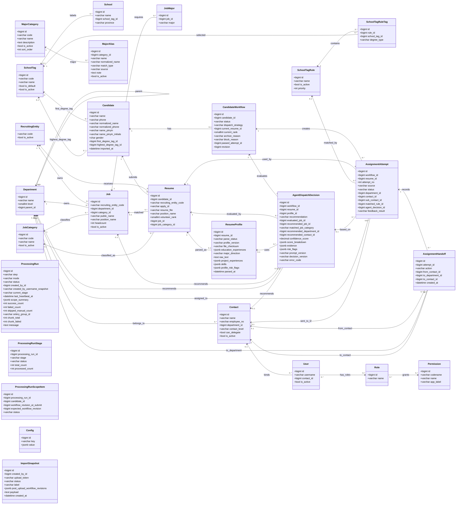

# 智能简历筛选系统 — 数据库设计

> 本文是实体、字段、关系、索引、约束和删除策略的唯一详细契约。业务规则、状态流转/API 和页面交互分别引用其它三份核心设计文档；本文不承担当前实现状态说明，目标字段未落地时应在后端/前端文档中明确标为待实现。

> 存储：PostgreSQL；以 Django 模型组织。本设计覆盖输入件落库、前置数据准备、候选人处理主流程、分配下发、权限。所有数据同处**一个池**，按时间标签筛选，**不分批次**。
> 上游业务需求见 `docs/需求描述.md`；后端实现口径见 `docs/后端设计.md`；前端展示口径见 `docs/前端设计.md`。

## 一、建模关键判断

1. **人 / 投递分离**：`简历信息列表` 一行 = 一次投递。同一人可投多个岗位，故拆为 **Candidate（同学/人）** 与 **Resume（投递记录）**。人通过规范化姓名 + 规范化手机号归并；`应聘ID` 按投递维度识别（简历包 `姓名（应聘ID）` 据此定位投递）。
2. **单一数据池 + 时间标签**：不引入批次概念。候选人、投递、分配同处一个池，按 `imported_at` 等时间标签筛选；每次导入按规范化姓名 + 手机号、`应聘ID` 等业务键在应用层查询后幂等并入：低风险重复更新当前主记录，但不删除已反馈流程、分配尝试和历史快照。院校、招聘主体、部门、接口人、岗位需求为**主数据**，同在池中维护。
3. **处理结果就近存放**：院校打标作为前置处理落在 Candidate（个人学历属性）；志愿、岗位类别落在 Resume（投递属性）；分配进入候选人级工作流。
4. **Rule / AI 策略可追溯**：简历分类、分配与下发记录 `dispatch_strategy`（rule/ai）、分类理由、AI 决策证据，支持人工核对。
5. **分类与分配合并为同一环节**：岗位分类不再是独立流程步骤，而是简历分配+下发策略内部动作。Rule 按确定性规则完成分类和分配；AI 读取简历正文和项目经历后生成可审计决策，再进入同一分配工作流。
6. **简历状态为推导态**：简历库展示的待处理、已分类、已分配、待筛选、通过、不通过由 CandidateWorkflow、AssignmentAttempt、当前 Resume 分类字段和院校标签推导，不覆盖导入原始 `Resume.status`；内部状态码保持不变。
7. **配置/字典外置**：院校标签准入规则、专业大类映射词表等进配置表或规则表，不写死；南北归属不落库，也不进入 `Config` 表或可维护省份字典，仅在志愿排序规则中运行时判断。
8. **招聘主体实体化但保持极简**：`招聘主体` 不是普通文本字段，拆为 `RecruitingEntity` 主数据；当前仅维护 `code`，如 GW / YLS。投递、岗位需求等业务表保存 `recruiting_entity_code` 引用主体；部门主数据不建立“属于招聘主体”的关系。
9. **业务唯一性不依赖数据库 unique**：除主键外，尽量不在数据库层做业务 `unique` 约束；`RecruitingEntity.code` 作为主体标识直接承担主键。其他导入、创建、编辑场景由服务层按业务键查询并拦截重复，数据库只保留普通索引用于性能。这样更方便处理历史脏数据、人工合并和导入回滚。
10. **表格交互状态不落库**：列宽和当前表头筛选值属于前端会话状态，不新增业务字段。分页列表筛选直接查询对应模型字段；分配尝试中部门、接口人、应聘 ID 和岗位名称等历史可见文本同时查询当前关联对象与快照字段，保证关联对象删除后仍可筛选历史记录。
11. **招聘周期边界**：不引入批次/周期表，以当前数据池作为一个持续招聘周期；同一 `Candidate` 只维护一个当前分配流程。历史招聘周期隔离暂不设计。

**字段类型与外键拆分原则**

| 字段类型                                          | 建模口径                                     | 示例                                                                                |
| ------------------------------------------------- | -------------------------------------------- | ----------------------------------------------------------------------------------- |
| 会被多个表引用、需要启停/权限/统计的业务对象     | 拆独立表 + FK                                | 招聘主体`RecruitingEntity`、部门 `Department`、接口人 `Contact`、岗位 `Job` |
| 稳定枚举、只驱动状态机且无需独立维护              | 保留短 varchar/char，并在应用层 choices 校验 | workflow.status、attempt.status、source、role                                       |
| 会参与核心匹配、筛选、统计或配置选择的标签/类别   | 拆独立表 + FK                                | 岗位类别`JobCategory`、院校标签 `SchoolTag`、专业大类 `MajorCategory`             |
| 外部输入的展示文本，短期不需要统一维护            | 保留 varchar，必要时加普通索引               | 岗位族、工作地点、学历要求、原始应聘状态                                            |
| 个人属性短码                                      | 使用 char 或短 varchar，不做长文本           | gender 建议`char(1)`：M/F/U                                                       |

## 二、UML 类图

> UML 类图从“对象 + 核心属性 + 依赖关系”视角展示核心模型。为保证图可读，类图只展示关键字段；完整字段、状态枚举和约束以下方字段表为准。

**UML 对象说明**

| 对象                  | 含义                                                                                                       | 所属域        |
| --------------------- | ---------------------------------------------------------------------------------------------------------- | ------------- |
| RecruitingEntity      | 招聘主体主数据，如 GW/YLS；统一使用 `code` 作为主体标识、导入匹配值和页面展示值                             | 主数据        |
| Department            | 部门主数据，支持一层/二层/三级树形结构；二级部门用于岗位归属和 HR 下发目标，三级部门用于二级接口人继续转派 | 主数据        |
| Contact               | 部门接口人主数据，绑定二级或三级部门；二级接口人负责转派，三级接口人负责最终反馈                           | 主数据 / 下发 |
| Job                   | 岗位需求主数据，来自校招岗位分类及专业要求；承载岗位类别、部门、工作地、学历、HC 等                        | 主数据 / 需求 |
| JobCategory           | 岗位类别字典，供岗位需求、简历分类、Rule/AI 分配和前端筛选复用                                             | 主数据 / 字典 |
| JobMajor              | 岗位需求专业明细；一条岗位需求可配置多个需求专业                                                           | 主数据 / 需求 |
| MajorCategory         | 专业大类字典，内置第一版校招常见专业大类，支持 HR/管理员维护                                               | 主数据 / 字典 |
| MajorAlias            | 专业别名/关键词，映射候选人最高学历专业和岗位需求专业到专业大类                                             | 主数据 / 字典 |
| SchoolTag             | 院校标签字典；预置启用 `NON_TARGET / 非目标院校`，供学校、候选人打标和准入规则引用                         | 主数据 / 字典 |
| Candidate             | 候选人/同学实体，通过规范化姓名 + 规范化手机号进行应用层归并                                               | 候选人数据    |
| Resume                | 投递记录实体，一条记录对应一个应聘ID；同一候选人可有多条投递/志愿                                          | 候选人数据    |
| ResumeProfile         | 简历结构化画像，从简历文件解析正文、项目经历、实习经历、技能等，供 AI 策略使用                             | AI 数据       |
| CandidateWorkflow     | 候选人级分配流程，一个候选人一个当前流程；记录当前志愿、流程状态、归档原因、通过结果                       | 工作流        |
| AssignmentAttempt     | 分配尝试，一次具体的 Rule/AI/手动分配动作；承载目标部门、接口人、下发状态和反馈结果                        | 工作流 / 下发 |
| AssignmentHandoff     | 分配转交历史，记录 HR 下发给二级接口人、二级接口人转派给三级接口人的动作历史                               | 工作流 / 下发 |
| AgentDispatchDecision | AI 策略决策记录，保存推荐动作、推荐部门/接口人、置信度、理由、证据和风险点                                 | AI 审计       |
| SchoolTagRule         | 院校标签准入规则，由 HR 配置；存在启用规则时用于 Rule/AI 自动分配准入判断                                  | 配置 / 规则   |
| ProcessingRun         | 批处理父运行记录，跟踪发起人、阶段、范围摘要、执行状态和结果                                                 | 系统          |
| ProcessingRunStage    | 父运行内的阶段进度记录，如普通上传的 Step1、Step2                                                           | 系统          |
| ProcessingRunScopeItem | 提交时固化的候选人范围明细，仅供后台执行和审计，不对任务中心返回                                             | 系统          |
| Config                | 系统配置项，保存全局 AI 分配开关、AI 阈值、超时、连接测试状态、WeLink 开关及加密 AI 连接配置 | 系统 / 配置   |
| ImportSnapshot        | 上传撤销快照，支持简历导入后的单级回滚                                                                     | 系统 / 导入   |
| User                  | 系统用户，承载 HR、二级接口人、三级接口人、管理员等角色；接口人用户可绑定 Contact                          | 权限          |
| Role                  | RBAC 角色，对应 Django Group，如 HR、二级接口人、三级接口人、管理员                                        | 权限          |
| Permission            | RBAC 权限点，对应 Django Permission，使用稳定权限码控制菜单、页面和操作                                    | 权限          |

## 三、主数据（CRUD 维护）

### RecruitingEntity 招聘主体

| 字段         | 类型     | 说明                                                    |
| ------------ | -------- | ------------------------------------------------------- |
| code         | varchar(PK) | 主体编码，如 GW / YLS；作为业务主键、导入匹配值和页面展示值 |
| is_active    | bool     | 是否启用                                                |
| created_at   | datetime |                                                         |
| updated_at   | datetime |                                                         |

> 招聘主体从字符串字段拆出，是为了避免 GW / YLS 等主体值散落在投递、岗位需求等业务表中。当前 `code` 同时承担主体标识、导入匹配和页面展示，并作为主键被业务表的 `recruiting_entity_code` 引用；主体表不再另设 `id` 或额外业务唯一约束。后续如果出现外部编码、法定名称、页面展示名不一致的真实场景，再通过迁移扩展字段。主体查不到时创建或进入人工映射。

### Department 部门（树形）

| 字段      | 类型           | 说明                             |
| --------- | -------------- | -------------------------------- |
| id        | PK             |                                  |
| name      | varchar        | 部门名                           |
| level     | smallint       | 1=一层，2=二层，3=三级           |
| parent_id | FK→Department | 一层为空；二层挂一层；三级挂二层 |

> 部门主数据只表达组织层级，不建立“属于招聘主体”的关系。招聘主体保留在投递、岗位需求等业务记录上；岗位通过 `department_id` 指向二级部门。

### Contact 接口人

| 字段          | 类型           | 说明                                                      |
| ------------- | -------------- | --------------------------------------------------------- |
| id            | PK             |                                                           |
| name          | varchar        | 姓名                                                      |
| employee_no   | varchar        | 工号；应用层按工号查询并拦截重复                          |
| department_id | FK→Department | 所属二级或三级部门                                        |
| contact_level | varchar        | secondary / tertiary；二级接口人可转派，三级接口人可反馈  |
| can_delegate  | bool           | 是否允许向下属三级部门接口人转派，通常仅二级接口人为 true |
| is_active     | bool           | 是否启用                                                  |

> 账号口径：导入部门接口人信息时，系统按 `employee_no` 幂等维护 `Contact`，并同步创建或更新同工号登录账号：`User.username = Contact.employee_no`，`User.contact_id` 指向该接口人；新账号默认密码为 `pass1234`，已有账号保留原可用密码和非接口人业务角色；同步时按 `contact_level` 替换二级/三级接口人角色。部门接口人 replace 导入时，本次文件中不存在的旧接口人及其绑定账号同步停用；用户管理或接口人清单中的单条删除采用清理语义，删除用户时同步删除绑定接口人，删除接口人时同步删除绑定用户。历史分配、转派和 AI 决策记录不删除，相关用户/接口人外键置空，展示依赖已保存的快照字段。
> 主体边界：`Contact` 与 `Department` 均不保存招聘主体归属或“主体来源”字段；外部接口人文件中的招聘主体不进入这两个模型，也不作为列表筛选字段。

> 权限口径：二级接口人只能把 HR 下发给自己的分配尝试转派给其所属二级部门下的启用三级接口人；三级接口人只处理转派给自己的尝试并提交反馈。

### School 院校

| 字段          | 类型               | 说明                                           |
| ------------- | ------------------ | ---------------------------------------------- |
| id            | PK                 |                                                |
| name          | varchar            | 学校；导入时应用层按规范化校名查询并拦截重复   |
| school_tag_id | FK→SchoolTag null | 院校标签；导入院校分类时按平台标签映射         |
| province      | varchar null       | 学校所在省份；户籍缺失时用于查重与志愿排序兜底 |

### SchoolTag 院校标签

| 字段       | 类型     | 说明                                                 |
| ---------- | -------- | ---------------------------------------------------- |
| id         | PK       |                                                      |
| code       | varchar  | 标签编码；应用层拦截重复                             |
| name       | varchar  | 标签名称，如 985、211、非目标院校等                  |
| is_default | bool     | 是否默认兜底标签；未匹配学校时优先使用，应用层保证最多一个 |
| is_active  | bool     | 是否启用                                             |
| sort_order | int      | 前端展示顺序                                         |
| created_at | datetime |                                                      |
| updated_at | datetime |                                                      |

> `seed_base` 预置启用 `SchoolTag(code="NON_TARGET", name="非目标院校")`，分类服务也会在缺失时自愈创建。院校分类时，学校命中 `School.school_tag_id` 则写入候选人学历标签；未命中 `School`（即院校清单外）时必须写入 `NON_TARGET`；只有清单内学校未配置标签时，才优先使用 `is_default=true` 的标签，无默认标签则写入 `NON_TARGET`。

### JobCategory 岗位类别

| 字段       | 类型     | 说明                         |
| ---------- | -------- | ---------------------------- |
| id         | PK       |                              |
| code       | varchar  | 岗位类别编码；应用层拦截重复 |
| name       | varchar  | 岗位类别名称                 |
| is_active  | bool     | 是否启用                     |
| sort_order | int      | 前端展示顺序                 |
| created_at | datetime |                              |
| updated_at | datetime |                              |

### Job 岗位需求（即「校招岗位分类及专业要求」+「结构化需求表」）

| 字段                 | 类型                 | 说明                                           |
| -------------------- | -------------------- | ---------------------------------------------- |
| id                   | PK                   |                                                |
| recruiting_entity_code | FK→RecruitingEntity(code) | 招聘主体                                  |
| department_id        | FK→Department       | 二级部门                                       |
| category_id          | FK→JobCategory      | 岗位类别（分配策略匹配目标）                   |
| public_name          | varchar              | 对外发布名称                                   |
| is_public            | bool                 | 是否对外发布                                   |
| position_name        | varchar              | 职位名称                                       |
| job_family           | varchar              | 岗位族                                         |
| location             | varchar              | 工作地点                                       |
| education            | varchar              | 学历要求                                       |
| headcount            | int                  | 需求数量（HC，用于岗位需求展示与后续容量策略） |
| is_active            | bool                 | 是否启用；分配时只匹配启用岗位                 |
| remark               | text null            | 岗位需求调整说明                               |
| created_at           | datetime             |                                                |
| updated_at           | datetime             |                                                |

> 岗位需求作为持续维护的主数据，不引入招聘周期表。导入或编辑时按招聘主体、部门、岗位名称/对外名称、岗位类别等业务键在应用层匹配已有 `Job`；命中则更新。岗位需求页面的“删除”采用 `is_active=false` 失效语义，不做硬删除。分配时只匹配启用岗位；历史投递和分配尝试通过 `job_id` 与快照字段保持可追溯。

### JobMajor 岗位需求专业（需求专业多值）

| 字段   | 类型    | 说明     |
| ------ | ------- | -------- |
| id     | PK      |          |
| job_id | FK→Job |          |
| major  | varchar | 需求专业 |

> `JobMajor.major` 保留岗位需求文件中的原始需求专业文本，不强制绑定专业大类，避免丢失用户原始需求表达。Rule 分配时再通过 `MajorAlias` 将候选人专业与岗位需求专业映射到 `MajorCategory`。

### MajorCategory 专业大类

| 字段        | 类型     | 说明                                   |
| ----------- | -------- | -------------------------------------- |
| id          | PK       |                                        |
| code        | varchar  | 专业大类编码；应用层拦截重复           |
| name        | varchar  | 专业大类名称                           |
| description | text     | 大类说明，用于配置页辅助 HR 理解口径   |
| is_active   | bool     | 是否启用；停用后不参与专业匹配         |
| sort_order  | int      | 前端展示顺序                           |
| created_at  | datetime |                                        |
| updated_at  | datetime |                                        |

### MajorAlias 专业别名 / 关键词

| 字段            | 类型              | 说明                                                                |
| --------------- | ----------------- | ------------------------------------------------------------------- |
| id              | PK                |                                                                     |
| category_id     | FK→MajorCategory | 所属专业大类                                                        |
| name            | varchar           | 专业名称、别名或关键词                                              |
| normalized_name | varchar           | 规范化名称：去空白、统一大小写，用于快速匹配                        |
| match_type      | varchar           | exact / contains；第一版默认 contains，必要时可配置 exact 精确命中 |
| source          | varchar           | builtin / user / import，标记内置、人工维护或导入来源               |
| note            | text null         | 备注，如“跨专业谨慎使用”“仅作为泛称兜底”                            |
| is_active       | bool              | 是否启用；停用后不参与专业匹配                                      |
| created_at      | datetime          |                                                                     |
| updated_at      | datetime          |                                                                     |

> 匹配口径：Rule 策略对候选人 `Candidate.highest_major` 和岗位需求 `JobMajor.major` 做相同规范化。先查启用 `MajorAlias`；`match_type=exact` 要求规范化文本完全相等，`match_type=contains` 允许双向包含。候选人专业映射出的大类与任一岗位需求专业映射出的大类有交集，则专业通过。若大类无交集，或候选人/岗位任一侧未映射到启用大类，则再执行专业名双向包含兜底。词表和兜底都不命中时继续尝试下一个候选岗位。岗位没有 `JobMajor` 时不读取词表并直接放行。
> 通配口径：岗位需求专业为“专业不限 / 不限 / 不限专业”等通配表达时，按未配置需求专业处理，直接放行；“相关专业”不作为默认通配，只作为可维护别名，由 HR 按招聘口径决定是否启用。
> 删除口径：专业大类和别名属于可维护主数据，内置项允许停用和编辑。专业大类存在任何别名时不允许直接删除；常规维护优先停用，确需删除需先删除或迁移别名。历史分配尝试不保留外键，只通过 `match_reason` 快照展示当时命中的专业大类/专业名。

**内置专业大类词表第一版**

> 第一版词表用于校招 Rule 分配，覆盖常见本科、研究生和应用型专业名称。它参考高等教育专业目录的“学科门类 / 一级学科 / 专业类”口径整理，但不是国家目录的完整镜像；用户可在配置页按公司招聘口径继续增删改。除 `OTHER_GENERAL` 外，内置大类和别名默认启用；`OTHER_GENERAL` 默认停用，只作为 HR 可按招聘口径启用或拆分的泛称模板，避免“相关专业 / 理工类”等宽泛表达造成误放行。

| code | 名称 | 内置别名 / 关键词 |
| ---- | ---- | ----------------- |
| CS_SOFTWARE | 计算机与软件类 | 计算机、计算机科学与技术、软件工程、网络工程、信息安全、网络空间安全、物联网工程、数字媒体技术、数据科学与大数据技术、大数据、人工智能、智能科学与技术、空间信息与数字技术、区块链工程、密码科学与技术 |
| ELECTRONICS_COMM | 电子信息与通信类 | 电子信息、电子科学与技术、电子信息工程、通信工程、信息工程、微电子科学与工程、集成电路设计与集成系统、集成电路科学与工程、光电信息科学与工程、电子封装技术、电磁场与无线技术、广播电视工程、医学信息工程 |
| AUTOMATION_CONTROL | 自动化与控制类 | 自动化、控制科学与工程、控制工程、机器人工程、智能装备、智能制造工程、测控技术与仪器、仪器科学与技术、精密仪器、导航工程、轨道交通信号与控制 |
| ELECTRICAL_ENERGY | 电气与能源动力类 | 电气工程、电气工程及其自动化、电机电器、智能电网信息工程、能源与动力工程、热能与动力工程、新能源科学与工程、储能科学与工程、能源互联网工程、核工程与核技术 |
| MECHANICAL_VEHICLE | 机械与车辆类 | 机械工程、机械设计制造及其自动化、机械电子工程、过程装备与控制工程、车辆工程、汽车服务工程、智能车辆工程、工业设计、机电一体化、农业机械化及其自动化 |
| MATERIAL_CHEM | 材料与化工类 | 材料科学与工程、材料物理、材料化学、金属材料工程、无机非金属材料工程、高分子材料与工程、复合材料与工程、新能源材料与器件、冶金工程、化学、应用化学、化学工程与工艺、制药工程、能源化学工程、精细化工 |
| CIVIL_ARCH_TRAFFIC | 土建建筑交通类 | 土木工程、建筑学、城乡规划、风景园林、给排水科学与工程、建筑环境与能源应用工程、道路桥梁与渡河工程、城市地下空间工程、工程管理、工程造价、交通工程、交通运输、智慧交通、铁道工程 |
| MATH_STATS_PHYSICS | 数学统计物理类 | 数学、数学与应用数学、信息与计算科学、统计学、应用统计学、数据计算及应用、物理学、应用物理学、核物理、声学、系统科学 |
| GEO_ENV_SAFETY | 地理环境安全类 | 环境科学、环境工程、环境科学与工程、资源环境科学、地理科学、地理信息科学、自然地理与资源环境、人文地理与城乡规划、测绘工程、遥感科学与技术、安全工程、应急技术与管理、消防工程 |
| BIO_MED_FOOD | 生物医药食品类 | 生物科学、生物技术、生物信息学、生物工程、生物医学工程、基础医学、临床医学、口腔医学、公共卫生与预防医学、预防医学、药学、药物制剂、中药学、护理学、医学检验技术、食品科学与工程、食品质量与安全、食品营养与健康 |
| AGRI_FORESTRY | 农林牧渔类 | 农学、园艺、植物保护、种子科学与工程、农业资源与环境、动物科学、动物医学、兽医学、林学、园林、森林保护、水产养殖学、海洋渔业科学与技术、草业科学 |
| ECON_FINANCE | 经济金融类 | 经济学、经济统计学、国民经济学、应用经济学、财政学、金融学、金融工程、保险学、投资学、国际经济与贸易、贸易经济、数字经济、精算学、金融科技 |
| ACCOUNTING_AUDIT | 财会审计税务类 | 会计学、财务管理、审计学、税收学、税务、资产评估、财务会计教育、大数据与会计 |
| BUSINESS_MANAGEMENT | 工商管理与市场类 | 工商管理、市场营销、人力资源管理、劳动关系、创业管理、国际商务、零售业管理、企业管理、组织行为学 |
| SUPPLY_CHAIN_IE | 物流供应链与工业工程类 | 物流管理、物流工程、采购管理、供应链管理、工业工程、质量管理工程、标准化工程、电子商务、跨境电子商务 |
| PUBLIC_ADMIN | 公共管理类 | 行政管理、公共事业管理、劳动与社会保障、土地资源管理、城市管理、海关管理、公共关系学、健康服务与管理 |
| LAW_COMPLIANCE | 法学合规类 | 法学、法律、知识产权、信用风险管理与法律防控、国际经贸规则、政治学、社会学、社会工作、公安学、治安学、侦查学 |
| LANGUAGE_LITERATURE | 语言文学类 | 汉语言文学、汉语言、中文、中国语言文学、秘书学、英语、商务英语、翻译、日语、德语、法语、俄语、西班牙语、外国语言文学 |
| NEWS_MEDIA | 新闻传播与传媒类 | 新闻学、传播学、广播电视学、广告学、编辑出版学、网络与新媒体、数字出版、国际新闻与传播、会展 |
| DESIGN_ART | 设计艺术类 | 艺术学、视觉传达设计、环境设计、产品设计、服装与服饰设计、数字媒体艺术、动画、美术学、绘画、摄影、艺术设计学、工业设计 |
| EDUCATION_PSY | 教育心理体育类 | 教育学、学前教育、小学教育、特殊教育、教育技术学、科学教育、心理学、应用心理学、体育教育、运动训练、社会体育指导与管理 |
| HISTORY_PHILOSOPHY | 历史哲学类 | 历史学、世界史、考古学、文物与博物馆学、哲学、逻辑学、宗教学、伦理学 |
| OTHER_GENERAL | 其他通用类（默认停用） | 相关专业、理工类、工科类、文科类、经管类、管理类、工程类、技术类、复合型专业 |

## 四、候选与投递（数据池）

### Candidate 候选人

| 字段                  | 类型               | 说明                                                                                    |
| --------------------- | ------------------ | --------------------------------------------------------------------------------------- |
| id                    | PK                 |                                                                                         |
| name                  | varchar            | 姓名                                                                                    |
| phone                 | varchar            | 手机号（原文，仅存储）                                                                  |
| normalized_name       | varchar            | 规范化姓名，用于应用层查重和候选人归并                                                  |
| normalized_phone      | varchar            | 规范化手机号，用于应用层查重和候选人归并                                                |
| name_pinyin           | varchar            | 姓名全拼，用于候选人搜索                                                                |
| name_pinyin_initials  | varchar            | 姓名拼音首字母，用于候选人搜索                                                          |
| gender                | char(1)            | M=男，F=女，U=未知；外部文本导入时映射为短码                                            |
| household_province    | varchar            | 户口所在地                                                                              |
| first_degree_school   | varchar            | 第一学历毕业院校                                                                        |
| highest_degree_school | varchar            | 最高学历毕业院校                                                                        |
| highest_major         | varchar            | 最高学历专业                                                                            |
| first_degree_tag_id   | FK→SchoolTag null | 前置院校分类：第一学历标签                                                              |
| highest_degree_tag_id | FK→SchoolTag null | 前置院校分类：最高学历标签                                                              |
| imported_at           | datetime           | 导入时间（时间标签，用于筛选）                                                          |
| updated_at            | datetime           | 最近更新时间                                                                            |

> 归并口径：导入服务优先按 `normalized_name + normalized_phone` 查询候选人；手机号缺失的候选人直接舍弃，不入库、不进入分配，并在导入结果中记录舍弃原因；命中一条候选人时复用，命中多条时阻断相关记录并进入导入错误清单，不在数据库层用 `unique` 强压。
> 简历库主列表以 Candidate 为展示粒度，一名候选人一行；主列表和详情展示 `highest_major` 最高学历专业；候选人的全部投递通过详情页/抽屉按 Resume 展示。
> 当前应聘ID继续来自当前 `Resume.apply_id`，保留查询和可选列能力，但主表默认隐藏该列；原因仍来自现有分配、归档或阻塞原因字段，主表截断及鼠标悬浮展示完整文字均为前端展示行为，不新增或删除数据库字段。
> 搜索口径：导入或更新候选人姓名时同步维护 `name_pinyin` 和 `name_pinyin_initials`，候选人列表姓名筛选同时匹配姓名原文、全拼和首字母；拼音字段只服务搜索，不参与候选人归并。

### Resume 投递记录

| 字段                          | 类型                      | 说明                                                                          |
| ----------------------------- | ------------------------- | ----------------------------------------------------------------------------- |
| id                            | PK                        |                                                                               |
| candidate_id                  | FK→Candidate             |                                                                               |
| apply_id                      | varchar                   | 应聘ID（投递维度业务键）；导入/创建时应用层查询并拦截重复                     |
| resume_file                   | varchar                   | 简历包文件名（`姓名（应聘ID）`）；文件落盘 `media/resumes/`，供鉴权预览和导出 |
| recruiting_entity_code        | FK→RecruitingEntity(code) | 招聘主体                                                                      |
| org                           | varchar                   | 所属机构                                                                      |
| position_name                 | varchar                   | 对外职位名称（投递岗位）                                                      |
| status                        | varchar                   | 导入文件中的原始应聘状态（待处理等），可在详情展示/筛选；不作为简历库推导的“简历状态” |
| apply_date                    | date                      | 应聘日期（查重与志愿排序依据）                                                |
| volunteer_rank                | smallint null             | 查重与志愿排序：志愿次序（1–4）                                              |
| assigned_recruiting_entity_code | FK→RecruitingEntity(code) null | 查重与志愿排序：分配主体                                                |
| job_id                        | FK→Job null              | 简历分类、分配与下发环节匹配到的岗位                                          |
| job_category_id               | FK→JobCategory null      | 简历分类、分配与下发环节写入的岗位类别                                        |
| category_mode                 | varchar                   | rule / ai                                                                     |
| category_reason               | text null                 | AI 模式可解释理由                                                             |
| imported_at                   | datetime                  | 导入时间（时间标签，用于筛选）                                                |

### ResumeProfile 简历结构化画像

| 字段                   | 类型          | 说明                                                 |
| ---------------------- | ------------- | ---------------------------------------------------- |
| id                     | PK            |                                                      |
| resume_id              | FK→Resume    | 一条投递业务上对应一份解析画像；应用层保证一对一     |
| parse_status           | varchar       | pending / text_extracted / parsed / failed           |
| file_checksum          | varchar null  | 简历文件内容哈希；文件变化后触发重新解析             |
| profile_version        | varchar null  | 画像抽取 schema / prompt / 解析器版本                |
| raw_text               | text null     | 从 PDF 简历抽取出的正文                              |
| summary                | text null     | 简历摘要                                             |
| education_experiences  | jsonb         | 教育经历数组                                         |
| major_direction        | varchar null  | AI/解析器提取的专业方向                              |
| project_experiences    | jsonb         | 项目经历数组，含项目名称、角色、技术栈、职责、成果等 |
| internship_experiences | jsonb         | 实习/工作经历数组                                    |
| skills                 | jsonb         | 技能关键词数组                                       |
| certificates           | jsonb         | 证书、竞赛、奖项等                                   |
| profile_risk_flags     | jsonb         | 画像风险点，如文本过短、教育经历缺失、项目经历不足   |
| parse_model            | varchar null  | 解析使用的模型或解析器版本                           |
| parse_error            | text null     | 解析失败原因                                         |
| parsed_at              | datetime null | 最近解析时间                                         |
| created_at             | datetime      |                                                      |
| updated_at             | datetime      |                                                      |

> AI 策略依赖 `ResumeProfile`。输入简历统一为 PDF；若简历文件缺失、PDF 解析失败、正文抽取失败或项目经历不足，AI 决策必须显式记录风险点，不得静默生成高置信度下发结论。数据库保存抽取后的 `raw_text` 和结构化 `ResumeProfile`，不保存 LLM 完整原始响应。`file_checksum + profile_version` 用于判断是否复用画像，简历文件或画像版本变化后重新解析。

## 五、简历分类、分配与下发

### SchoolTagRule 院校标签准入规则

| 字段       | 类型     | 说明                                         |
| ---------- | -------- | -------------------------------------------- |
| id         | PK       |                                              |
| name       | varchar  | 规则名称                                     |
| is_active  | bool     | 是否启用                                     |
| priority   | int      | 展示/评估顺序，规则之间为 OR，不影响命中语义 |
| created_at | datetime |                                              |
| updated_at | datetime |                                              |

### SchoolTagRuleTag 院校准入规则标签明细

| 字段          | 类型              | 说明                                       |
| ------------- | ----------------- | ------------------------------------------ |
| id            | PK                |                                            |
| rule_id       | FK→SchoolTagRule | 所属规则                                   |
| school_tag_id | FK→SchoolTag     | 允许的院校标签                             |
| degree_type   | varchar           | first / highest，分别表示第一学历/最高学历 |

> 命中口径：存在启用规则时，候选人的 `first_degree_tag_id` 命中某条启用规则下 `degree_type=first` 的标签，且 `highest_degree_tag_id` 命中同一条规则下 `degree_type=highest` 的标签，才算通过该规则；多条启用规则之间是 OR。没有任何启用规则时，院校准入视为全部通过，不阻断自动分配。「非目标院校」只是普通 `SchoolTag`，HR 可配置进规则。系统不预置启用规则；默认院校标签由用户提供。

### CandidateWorkflow 候选人分配流程

| 字段              | 类型                       | 说明                                               |
| ----------------- | -------------------------- | -------------------------------------------------- |
| id                | PK                         |                                                    |
| candidate_id      | FK→Candidate              | 一个候选人业务上唯一一个分配流程；应用层保证一对一 |
| status            | varchar                    | pending / in_progress / passed / archived          |
| dispatch_strategy | varchar                    | rule / ai，最近一次分配使用的策略                  |
| current_resume_id | FK→Resume null            | 当前处理到的投递                                   |
| current_rank      | smallint null              | 当前志愿序号                                       |
| archive_reason    | varchar null               | 归档原因                                           |
| archive_detail    | text null                  | 归档说明，如未命中规则、无下一志愿                 |
| block_reason      | varchar null               | 非终态阻塞原因，如当前志愿缺可用二级接口人         |
| block_detail      | text null                  | 阻塞说明，记录当前志愿、岗位、部门和主数据缺口上下文 |
| passed_attempt_id | FK→AssignmentAttempt null | 通过的分配尝试                                     |
| revision          | bigint                    | 已落地：每次 `CandidateWorkflow.save()` 递增；用于自动任务并发校验 |
| started_at        | datetime null              | 首次进入分配时间                                   |
| completed_at      | datetime null              | 通过或归档时间                                     |
| created_at        | datetime                   |                                                    |
| updated_at        | datetime                   |                                                    |

> 流程口径：一个候选人业务上只维护一个当前分配流程，`CandidateWorkflow.candidate_id` 已由 `OneToOneField` 施加数据库唯一约束，`revision` 字段已落地。当前自动分配已在同一事务内以 `select_for_update` 锁定 Candidate 与 CandidateWorkflow；所有人工流程写操作统一采用同一锁与版本语义仍为**目标迁移（未实现）**。归档候选人不单独建表，通过 `status=archived` + 归档字段查询；后续规则调整不会自动恢复归档流程，HR 可手动强制分配，或在简历库“处理简历”入口按弹窗选择的简历状态范围主动重开。
> `current_resume` / `current_rank` 驱动简历库主列表的当前志愿展示：初始指向第一志愿，反馈未通过后切换到下一志愿，通过后保留通过志愿，归档后保留最后处理志愿；当前志愿匹配岗位和二级部门但缺可用二级接口人时，保持当前志愿并写入阻塞原因。
> 简历状态推导：`raw=待处理`、`classified=已分类`、`allocated=已分配`、`pending_screening=待筛选`、`screening_passed=通过`、`screening_rejected=不通过`。该状态不单独落库，状态码保持不变；查询筛选时由应用层基于当前候选人/投递、分类字段、院校标签、最新有效 `AssignmentAttempt` 和 `CandidateWorkflow` 推导。多条历史并存时优先级为 `screening_passed > pending_screening > allocated > screening_rejected > classified > raw`；历史 rejected/cancelled 不覆盖下一志愿活动尝试。HR 主动“处理简历”时，`ProcessingRun.scope.system_statuses` 仍记录本次选择的状态范围。

> 简历库主表移除流程状态和分配状态列及筛选不触发数据库字段变更；`CandidateWorkflow.status`、`Resume.status` 和 `AssignmentAttempt.status` 继续保存领域状态，并供候选人详情、投递明细、尝试历史和后台流程使用。

**流程状态枚举**

| 状态        | 中文含义 | 进入方式                                          | 是否终态               |
| ----------- | -------- | ------------------------------------------------- | ---------------------- |
| pending     | 待分配   | 创建流程但尚未生成有效尝试 | 否                     |
| in_progress | 进行中   | 生成待下发/已下发尝试，当前志愿缺可用二级接口人被阻塞，或归档后被手动强制分配、简历库“处理简历”主动重开恢复 | 否                     |
| passed      | 已通过   | 任一尝试反馈通过                                  | 是                     |
| archived    | 已归档   | 无可继续尝试的志愿，或自动分配前置条件失败        | 是（可被手动分配或“处理简历”主动重开恢复） |

**归档原因枚举**

| 值                      | 含义                             |
| ----------------------- | -------------------------------- |
| school_rule_not_matched | 候选人院校标签未命中任何启用规则 |
| no_next_resume          | 没有下一条可尝试志愿             |
| job_not_matched         | 投递未匹配到岗位                 |
| department_not_found    | 岗位未关联有效二级部门           |
| contact_not_found       | 二级部门下没有可用二级接口人     |
| agent_no_recommendation | AI 未形成有效下发建议            |
| hr_cancelled            | HR 取消当前待复核或待下发尝试   |
| all_rejected            | 全部可尝试志愿均被反馈未通过     |

> `archive_reason` 存枚举，`archive_detail` 存人类可读说明和具体上下文，简历库按这两个字段展示归档原因。AI 建议归档、低于复核阈值、简历缺失/解析失败或最终失败且不生成 `AssignmentAttempt` 时，流程写入 `status=archived`、`archive_reason=agent_no_recommendation`，对应 `AgentDispatchDecision` 保留供 HR 查看和后续处置。AI 开关仍开启且当前连接测试有效时可重试；如需 Rule，先关闭全局 AI 开关再发起新处理；手动分配始终可用。当前志愿已匹配岗位和二级部门但缺可用二级接口人时，应使用正式阻塞码 `block_reason=contact_not_found` / `block_detail`，流程保持 `in_progress`，不写入归档原因。

**阻塞原因枚举**

| 值 | 含义 |
| --- | ---- |
| contact_not_found | 当前志愿匹配岗位和二级部门，但二级部门下没有可用二级接口人 |

> `block_reason/block_detail` 只表示非终态待处理阻塞。生成有效分配尝试、手动强制分配、流程通过、流程归档或简历库重新处理重开时，应清空这两个字段。

### AssignmentAttempt 分配尝试

| 字段                             | 类型                           | 说明                                                                                            |
| -------------------------------- | ------------------------------ | ----------------------------------------------------------------------------------------------- |
| id                               | PK                             |                                                                                                 |
| workflow_id                      | FK→CandidateWorkflow          | 所属候选人流程                                                                                  |
| resume_id                        | FK→Resume                     | 本次尝试使用的投递                                                                              |
| attempt_no                       | int                            | 流程内尝试序号                                                                                  |
| source                           | varchar                        | rule / ai / manual                                                                              |
| status                           | varchar                        | pending_review / pending_dispatch / dispatched_l2 / assigned_l3 / passed / rejected / cancelled |
| department_id                    | FK→Department null            | 分配到的二级部门                                                                                |
| contact_id                       | FK→Contact null               | 二级接口人，HR 下发对象；删除接口人后清空，历史展示依赖快照                                     |
| sub_department_id                | FK→Department null            | 三级部门，二级接口人转派后写入                                                                  |
| sub_contact_id                   | FK→Contact null               | 三级接口人，最终反馈人；删除接口人后清空，历史展示依赖快照                                      |
| matched_rule_id                  | FK→SchoolTagRule null         | 自动分配命中的院校规则；手动分配为空                                                            |
| agent_decision_id                | FK→AgentDispatchDecision null | AI 策略决策依据；规则/手动分配为空                                                              |
| match_mode                       | varchar                        | rule / ai / manual                                                                              |
| match_reason                     | text null                      | 分配/匹配理由                                                                                   |
| confidence_score                 | decimal null                   | AI 置信度，规则/手动分配为空                                                                    |
| review_required                  | bool                           | 是否需要 HR 重点复核；AI 低置信度时为 true                                                      |
| welink_message_id                | varchar null                   | WeLink 消息标识，真实集成后回填                                                                 |
| dispatched_at                    | datetime null                  | HR 下发给二级接口人的时间                                                                       |
| assigned_to_sub_at               | datetime null                  | 二级接口人转派给三级接口人的时间                                                                |
| feedback_result                  | varchar null                   | passed / rejected                                                                               |
| feedback_note                    | text null                      | 三级接口人反馈备注                                                                              |
| feedback_at                      | datetime null                  | 反馈提交时间                                                                                    |
| cancelled_at                     | datetime null                  | 取消时间                                                                                        |
| cancel_reason                    | varchar null                   | 取消原因，如分配环节重跑、通过后取消其他尝试、手动分配替换                                      |
| manual_reason                    | text null                      | HR 手动强制分配原因；自动分配为空                                                               |
| department_name_snapshot         | varchar null                   | 分配时二级部门名称快照                                                                          |
| contact_name_snapshot            | varchar null                   | 分配时二级接口人姓名快照                                                                        |
| contact_employee_no_snapshot     | varchar null                   | 分配时二级接口人工号快照                                                                        |
| sub_department_name_snapshot     | varchar null                   | 转派时三级部门名称快照                                                                          |
| sub_contact_name_snapshot        | varchar null                   | 转派时三级接口人姓名快照                                                                        |
| sub_contact_employee_no_snapshot | varchar null                   | 转派时三级接口人工号快照                                                                        |
| resume_apply_id_snapshot         | varchar null                   | 投递应聘ID快照                                                                                  |
| position_name_snapshot           | varchar null                   | 投递岗位名称快照                                                                                |
| created_by_username_snapshot     | varchar null                   | 创建/手动分配操作者用户名快照；账号删除后用于历史展示                                           |
| created_by_id                    | FK→User null                  | 手动分配或下发操作者；系统自动分配可为空                                                        |
| created_at                       | datetime                       |                                                                                                 |
| updated_at                       | datetime                       |                                                                                                 |

> 状态约束：反馈一旦提交即锁定，不允许二次修改。三级接口人反馈「通过」后，`CandidateWorkflow.status=passed`，并取消同候选人其他未反馈尝试；三级接口人反馈「未通过」后，系统自动寻找下一志愿，若无可分配投递则归档。Rule 策略创建 `source=rule` 尝试，AI 策略创建 `source=ai` 尝试，HR 手动强制分配创建 `source=manual` 尝试。Rule 自动分配会校验投递招聘主体与岗位需求主体一致性，使用稳定岗位命中优先级选择 `resume_id` 匹配到的 `job_id`，再使用 `MajorCategory` / `MajorAlias` 对 `JobMajor` 需求专业和候选人最高学历专业做专业大类匹配；若大类无交集，或候选人/岗位任一侧未映射到启用大类，则再执行专业名双向包含兜底。岗位没有需求专业，或需求专业为通配表达时不阻断；`match_reason` 保存院校、志愿、岗位、专业大类/专业名、部门和接口人的匹配理由。手动强制分配绕过院校规则、志愿顺序和自动专业筛选；已通过候选人不可再通过手动强制分配入口分配，如需重开必须走简历库“处理简历”。二级接口人的数据范围只包含 `contact_id` 指向自己且已下发的尝试，至少排除 `pending_review`、`pending_dispatch`、`cancelled` 等 HR 内部或无效状态。

### AssignmentHandoff 分配转交记录

| 字段             | 类型                  | 说明                                            |
| ---------------- | --------------------- | ----------------------------------------------- |
| id               | PK                    |                                                 |
| attempt_id       | FK→AssignmentAttempt | 所属分配尝试                                    |
| action           | varchar               | hr_dispatch / sub_assign / sub_reassign；HR 直达三级时仍依次写 hr_dispatch、sub_assign 两条记录 |
| from_contact_id  | FK→Contact null      | 转出接口人；HR 下发时为空                       |
| to_department_id | FK→Department null   | 转入部门，HR 下发为二级部门，二级转派为三级部门 |
| to_contact_id    | FK→Contact null      | 转入接口人；删除接口人后清空，历史展示依赖快照或尝试快照 |
| from_contact_name_snapshot | varchar null | 转出接口人姓名快照 |
| from_contact_employee_no_snapshot | varchar null | 转出接口人工号快照 |
| to_department_name_snapshot | varchar null | 转入部门名称快照 |
| to_contact_name_snapshot | varchar null | 转入接口人姓名快照 |
| to_contact_employee_no_snapshot | varchar null | 转入接口人工号快照 |
| note             | text null             | 转派备注                                        |
| created_by_username_snapshot | varchar null | 操作者用户名快照；账号删除后用于历史展示        |
| created_by_id    | FK→User null         | 操作者                                          |
| created_at       | datetime              |                                                 |

> `AssignmentHandoff` 只记录转交历史，不作为通用审计日志，也不替代 `AssignmentAttempt` 上的当前二级/三级接口人字段。列表查询优先读 `AssignmentAttempt.contact_id`、`sub_contact_id`；接口人被单条删除后这些外键可为空，详情页展示转交历史时优先使用本表 from/to 快照、尝试快照和审计记录。
> HR 手动直达三级接口人时，应用层必须先由三级部门父级确定二级部门；只有一个启用二级接口人时自动补齐，存在多个时由 HR 显式提交 `secondary_contact_id`，没有有效二级接口人时不创建尝试。`AssignmentAttempt.contact_id/sub_contact_id` 同时写入，再依次记录 HR→二级、二级→三级两条 Handoff。

### AgentDispatchDecision AI 策略决策

| 字段                      | 类型                   | 说明                                           |
| ------------------------- | ---------------------- | ---------------------------------------------- |
| id                        | PK                     |                                                |
| workflow_id               | FK→CandidateWorkflow  | 所属候选人流程                                 |
| resume_id                 | FK→Resume             | 本次评估的志愿投递                             |
| profile_id                | FK→ResumeProfile null | 使用的简历画像                                 |
| processing_run_id         | FK→ProcessingRun null | 对应分配环节运行记录                           |
| recommendation            | varchar null           | dispatch / review / archive；失败态可为空      |
| evaluated_job_id          | FK→Job null           | 当前评估输入岗位，用于决策复用和审计           |
| recommended_job_id        | FK→Job null           | 推荐匹配的岗位需求                             |
| matched_job_category      | varchar null           | AI 判断的岗位类别名称快照，可同步写回投递       |
| recommended_department_id | FK→Department null    | 推荐二级部门                                   |
| recommended_contact_id    | FK→Contact null       | 推荐二级接口人                                 |
| recommended_contact_name_snapshot | varchar null  | 推荐接口人姓名快照；接口人删除后用于 AI 决策展示 |
| recommended_contact_employee_no_snapshot | varchar null | 推荐接口人工号快照；接口人删除后用于 AI 决策展示 |
| confidence_score          | decimal null           | 0–1 置信度；失败态可为空                       |
| score_breakdown           | jsonb null             | 六项评分：major_match / skills_match / experience_evidence / job_requirement / department_certainty / resume_quality |
| summary                   | text null              | 面向 HR 的一句话结论摘要                       |
| reason                    | text null              | 推荐理由；失败态可为空                         |
| evidence                  | jsonb                  | 引用证据，如项目经历、技能关键词、专业匹配片段；无证据时为空数组 |
| risks                     | jsonb                  | 面向 HR 展示的风险说明；无风险时为空数组       |
| risk_flags                | jsonb                  | 风险点，如简历缺失、项目描述薄弱、专业不匹配；无风险时为空数组 |
| error_code                | varchar null           | AI 失败分类，如 pdf_missing / llm_timeout / invalid_ai_output |
| error_message             | text null              | 稳定错误码对应的脱敏摘要；不得保存第三方 SDK 原始异常 |
| model_name                | varchar null           | 模型名称                                       |
| prompt_version            | varchar null           | 提示词版本                                     |
| decision_version          | varchar null           | 决策 schema / 评分规则版本                     |
| created_at                | datetime               |                                                |

> `AgentDispatchDecision` 只保存 AI 推荐动作、置信度、分项评分、理由、证据、风险点和失败分类等决策结果；AI 阈值、失败处理和状态流转以后端设计为准。失败态最小必填为 `workflow_id`、`resume_id`、`processing_run_id`、`error_code`、`error_message` 和版本字段，不要求伪造推荐动作、置信度或理由。`error_code/error_message` 必须为服务端统一映射的稳定错误码和脱敏摘要，绝不保存第三方 SDK 原始异常。表名保留 Agent，是因为 AI 策略内部以智能体方式完成简历阅读、岗位适配和分流建议。`resume_id + evaluated_job_id + file_checksum + profile_version + prompt_version + decision_version` 可用于应用层复用决策，其中 `file_checksum/profile_version` 通过 `profile_id` 关联 `ResumeProfile` 校验；不依赖数据库唯一约束。

**尝试状态枚举**

| 状态             | 中文含义   | 允许操作                                                    |
| ---------------- | ---------- | ----------------------------------------------------------- |
| pending_review   | 待 HR 复核 | HR 可查看 AI 理由并确认下发、取消或转人工处理；接口人不可见 |
| pending_dispatch | 待下发     | HR 可下发、取消；接口人不可见                               |
| dispatched_l2    | 已下发二级 | 二级接口人可转派给下属三级接口人；HR 可查看、导出           |
| assigned_l3      | 已转派三级 | 三级接口人可反馈通过/未通过；二级接口人和 HR 可查看         |
| passed           | 已通过     | 终态，只读                                                  |
| rejected         | 未通过     | 终态，只读，系统自动尝试下一志愿                            |
| cancelled        | 已取消     | 终态，只读                                                  |

**状态一致性规则**

- `status=passed` 时，`feedback_result=passed` 且 `feedback_at` 必须非空。
- `status=rejected` 时，`feedback_result=rejected` 且 `feedback_at` 必须非空。
- `status in (pending_review, pending_dispatch, dispatched_l2, assigned_l3, cancelled)` 时，`feedback_result` 应为空。
- `feedback_at` 非空即表示反馈锁定，后续不得修改反馈结果和备注。
- 流转进入 `dispatched_l2` 时，`contact_id`、`dispatched_at` 必须非空，`sub_contact_id` 为空；若后续单条删除接口人，历史记录允许 `contact_id` 被清空，展示依赖二级接口人快照。
- 流转进入 `assigned_l3` 时，`contact_id`、`sub_contact_id`、`assigned_to_sub_at` 必须非空；若后续单条删除接口人，历史记录允许 `contact_id/sub_contact_id` 被清空，展示依赖二级/三级接口人快照。
- HR 手动直达三级时还必须写入 `dispatched_at`，并同时保存父级二级部门/接口人及三级部门/接口人快照；父级二级接口人不唯一且 HR 未明确选择时拒绝创建。
- 二级转派时，`sub_contact.department.parent_id` 必须等于 `AssignmentAttempt.department_id`，且操作者绑定的二级接口人必须等于 `contact_id`；若历史接口人外键已因删除被清空，该历史尝试不再允许继续转派，只读展示快照。
- `source=rule` 时，`agent_decision_id` 为空；存在启用院校规则且命中时 `matched_rule_id` 非空，没有启用规则时可为空。
- `source=ai` 时，`agent_decision_id` 必须非空，并保存 `confidence_score` 与 `review_required`；只有达到复核阈值的 AI 决策才会生成 `pending_review` 或 `pending_dispatch` 尝试，低于复核阈值的 AI 决策只保留在 `AgentDispatchDecision` 中供 HR 处理。
- `source=manual` 时，`matched_rule_id` 与 `agent_decision_id` 为空，建议填写 `manual_reason`。
- AI 决策未生成尝试时，不新增“待人工”尝试状态；`CandidateWorkflow` 统一归档为 `agent_no_recommendation`。AI 开关仍开启且当前连接测试有效时可重试；如需 Rule，先关闭全局 AI 开关再发起新处理；也可通过手动强制分配重新打开流程。
- 创建尝试时写入二级部门、二级接口人姓名/工号、应聘ID、岗位名称和操作者快照；三级转派时写入三级部门、三级接口人姓名/工号快照；转派历史由 `AssignmentHandoff` 记录 from/to 接口人、转入部门和操作者快照。历史列表和导出优先展示快照，避免部门/接口人/岗位/账号后续改名或删除导致历史不可读。

> 具体状态流转、AI 阈值策略、HR 下发、二级转派、三级反馈和手动强制分配逻辑见 `docs/后端设计.md`。本节仅保留状态枚举和字段一致性约束。

### 分配环节数据保留

- 普通重跑分配环节不清空全部历史；已反馈、已通过、已归档记录保留，只取消并重建未反馈的自动分配尝试。
- 简历库“处理简历”按全局 `ai_enabled` 选择唯一 Rule / AI 模式，每次只创建一条拥有固化 `mode` 的 `ProcessingRun`。切换开关只影响后续提交，不取消排队中或运行中的任务，也不修改历史尝试。手动尝试、已反馈尝试和已通过流程不受影响。
- `ai_enabled=false` 时禁止对历史 `AgentDispatchDecision` 发起 AI 重试，但历史决策与尝试保留；已有 `pending_review` 仍可确认、取消或转人工，已有 `pending_dispatch` 仍可下发，后续转派和反馈不受影响。
- 简历库“处理简历”是 HR 主动重新分配入口，只处理 `ProcessingRun.scope.system_statuses` 和当前筛选条件命中的候选人，请求不携带模式。该入口可重开已通过、已归档或已不通过候选人流程：保留历史尝试、反馈和审计记录，清空 `passed_attempt_id`、归档原因、阻塞原因和完成时间，将 `CandidateWorkflow.status` 恢复为 `in_progress`，再按当前全局模式生成新的自动尝试。AI 开启但连接未通过当前配置测试时拒绝，不降级为 Rule。

### 约束、索引与删除策略

**应用层唯一/幂等拦截**

> 数据库层尽量不做业务 `unique` 约束；服务层在创建/导入前按业务键查询并拦截重复，必要时提示人工合并。数据库保留普通索引保证查询性能。这样可以容忍历史脏数据、临时导入错误和后续人工纠偏。

| 模型              | 应用层拦截口径                                       | 数据库策略 |
| ----------------- | ---------------------------------------------------- | ---------- |
| RecruitingEntity  | code 命中已有主体                                    | 主键索引   |
| JobCategory       | code 或规范化 name 命中已有岗位类别                  | 普通索引   |
| MajorCategory     | code 或规范化 name 命中已有专业大类                  | 普通索引   |
| MajorAlias        | category_id + normalized_name + match_type 已存在则拦截 | 普通索引 |
| SchoolTag         | code 或规范化 name 命中已有院校标签                  | 普通索引   |
| Candidate         | normalized_name + normalized_phone；缺手机号直接舍弃 | 普通索引   |
| Candidate         | name、name_pinyin、name_pinyin_initials 支持搜索      | 普通索引   |
| Candidate         | highest_major 支持简历库最高学历专业筛选             | 普通索引   |
| Resume            | apply_id 命中已有投递                                | 普通索引   |
| ResumeProfile     | resume_id 已有画像则更新                             | 普通索引   |
| CandidateWorkflow | candidate_id 已有流程则复用/更新                     | 普通索引   |
| AssignmentAttempt | workflow_id + attempt_no 已存在则重新取号或拦截      | 普通索引   |
| Contact           | employee_no 命中已有接口人                           | 普通索引   |
| User              | username 命中已有用户；删除用户采用账号清理语义      | 普通索引   |
| School            | 规范化 school.name 命中已有院校                      | 普通索引   |
| SchoolTagRuleTag  | rule_id + school_tag_id + degree_type 已存在则拦截   | 普通索引   |

**查询索引**

| 模型                  | 索引                                       | 用途                             |
| --------------------- | ------------------------------------------ | -------------------------------- |
| RecruitingEntity      | code                                       | 导入主体映射、主体筛选           |
| RecruitingEntity      | is_active                                  | 只展示启用主体                   |
| JobCategory           | code, is_active                            | 岗位类别映射与筛选               |
| MajorCategory         | code, is_active                            | 专业大类映射与配置页筛选         |
| MajorAlias            | category_id, is_active                     | 查看某专业大类下启用别名         |
| MajorAlias            | normalized_name, is_active                 | Rule 专业大类匹配                |
| MajorAlias            | match_type, is_active                      | Rule 按匹配方式筛选词条          |
| SchoolTag             | code, is_active                            | 院校标签映射与筛选               |
| SchoolTag             | is_default                                 | 查找默认院校标签                 |
| Department            | parent_id, level                            | 维护部门树和层级筛选             |
| Candidate             | normalized_name, normalized_phone          | 候选人归并与查重                 |
| Candidate             | highest_major                              | 简历库最高学历专业筛选           |
| Candidate             | first_degree_tag_id, highest_degree_tag_id | 院校准入规则匹配                 |
| CandidateWorkflow    | candidate_id UNIQUE                        | 已落地：每候选人唯一当前流程 |
| CandidateWorkflow     | status                                     | 流程执行、详情和后台查询         |
| CandidateWorkflow     | updated_at                                 | 最近处理排序                     |
| AssignmentAttempt     | status                                     | 尝试执行、详情和后台查询         |
| AssignmentAttempt     | contact_id, status                         | 二级接口人只看下发给自己的尝试   |
| AssignmentAttempt     | sub_contact_id, status                     | 三级接口人只看转派给自己的尝试   |
| AssignmentAttempt     | workflow_id, status                        | 取消同流程未反馈尝试             |
| AssignmentAttempt     | source, status                             | 分配环节重跑时定位未反馈自动尝试 |
| AssignmentHandoff     | attempt_id, created_at                     | 分配尝试详情页展示转交历史       |
| AgentDispatchDecision | workflow_id, resume_id                     | 查看候选人某志愿的 AI 决策       |
| AgentDispatchDecision | resume_id, evaluated_job_id                | AI 决策复用                      |
| AgentDispatchDecision | profile_id, prompt_version, decision_version | AI 决策复用时校验画像版本 |
| AgentDispatchDecision | recommendation, confidence_score           | AI 复核队列和筛选                |
| AgentDispatchDecision | prompt_version, decision_version           | AI 决策复用与版本筛选            |
| AgentDispatchDecision | error_code                                 | AI 失败分类筛选                  |
| Resume                | apply_id                                   | 导入投递幂等拦截                 |
| Resume                | recruiting_entity_code                     | 按招聘主体筛选                   |
| Resume                | candidate_id, volunteer_rank               | 按志愿顺序寻找下一投递           |
| Resume                | job_id                                     | 按岗位筛选投递                   |
| Resume                | job_category_id                            | 按岗位类别筛选投递               |
| Job                   | recruiting_entity_code, department_id      | 按主体/部门筛选岗位需求          |
| Job                   | category_id                                | 按岗位类别筛选岗位需求           |
| Contact               | employee_no                                | 导入接口人幂等拦截               |
| School                | name                                       | 导入院校幂等拦截                 |
| School                | school_tag_id                              | 院校标签筛选                     |
| SchoolTagRule         | is_active, priority                        | 分配环节读取启用规则             |
| SchoolTagRuleTag      | rule_id, degree_type                       | 读取规则内第一/最高学历标签      |
| SchoolTagRuleTag      | school_tag_id, degree_type                 | 查看标签被哪些规则引用           |
| ProcessingRun         | status, created_at                         | 任务中心活跃任务排序与轮询       |
| ProcessingRun         | created_by_id, status                      | 按发起人查询可撤销上传关联任务   |
| ProcessingRunStage    | processing_run_id, status                  | 阶段进度查询                     |
| ProcessingRunScopeItem | processing_run_id, candidate_id UNIQUE     | 已落地：固化范围去重和候选人执行定位 |

**外键删除策略**

| 关系                                                  | 删除策略 | 说明                                      |
| ----------------------------------------------------- | -------- | ----------------------------------------- |
| Candidate → Resume                                   | CASCADE（受服务层保护） | 仅当候选人不存在分配尝试、反馈、AI 决策或转派历史时允许删除；通过保护检查后再级联其无历史投递 |
| Resume → ResumeProfile                               | CASCADE  | 删除投递时删除其解析画像                  |
| Candidate → CandidateWorkflow                        | CASCADE  | 删除候选人时删除当前流程                  |
| CandidateWorkflow → AssignmentAttempt                | CASCADE  | 删除流程时删除尝试                        |
| CandidateWorkflow → AgentDispatchDecision            | CASCADE  | 删除流程时删除 AI 决策                    |
| AssignmentAttempt → AssignmentHandoff                | CASCADE  | 删除尝试时删除转交历史                    |
| Resume → AssignmentAttempt                           | PROTECT  | 已产生分配历史的投递不允许直接删除        |
| Resume → AgentDispatchDecision                       | CASCADE  | 投递删除时删除对应 AI 决策                |
| Resume → CandidateWorkflow.current_resume            | SET_NULL | 当前投递被删除时清空指针，流程保留        |
| AssignmentAttempt → CandidateWorkflow.passed_attempt | SET_NULL | 通过尝试被清理时清空指针，流程状态仍保留  |
| AgentDispatchDecision → AssignmentAttempt            | SET_NULL | 决策记录清理时保留尝试历史快照            |
| Contact → AssignmentAttempt.contact/sub_contact      | SET_NULL | 单条删除接口人前清空二级/三级接口人外键；历史展示依赖接口人快照字段 |
| Contact → AssignmentHandoff.from/to_contact          | SET_NULL | 单条删除接口人前清空转交历史中的接口人外键；历史展示依赖 Handoff from/to 快照、尝试快照和审计记录 |
| Contact → AgentDispatchDecision.recommended_contact  | SET_NULL | 单条删除接口人前清空 AI 推荐接口人外键；AI 决策记录保留 |
| Contact → User.contact                               | 应用层同步删除 | 单条删除接口人时同步删除绑定账号；replace 导入仍只停用接口人与账号 |
| ProcessingRun → ProcessingRunStage                   | CASCADE  | 父任务清理时清理阶段记录；正常业务不删除父任务 |
| ProcessingRun → ProcessingRunScopeItem               | CASCADE  | 父任务清理时清理内部固化范围；正常业务不删除父任务 |
| Candidate → ProcessingRunScopeItem                   | CASCADE（受服务层保护） | 候选人仅在无受保护历史时允许删除，随之清理内部范围项 |
| User → ProcessingRun.created_by                      | SET_NULL | 保留发起人用户名快照和任务审计 |
| User → ProcessingRun.cancelled_by                    | SET_NULL | 保留取消人用户名快照和取消审计 |
| User → ImportSnapshot.created_by                     | SET_NULL | 保留上传人快照和撤销审计 |
| Department → AssignmentAttempt                       | PROTECT  | 保留历史部门分配记录                      |
| Department → AssignmentHandoff                       | PROTECT  | 保留转交部门历史                          |
| RecruitingEntity → Resume                            | PROTECT  | 保留投递所属主体                          |
| RecruitingEntity → Job                               | PROTECT  | 保留岗位需求所属主体                      |
| JobCategory → Job                                    | PROTECT  | 已被岗位需求引用的类别不允许直接删除      |
| JobCategory → Resume                                 | SET_NULL | 类别删除后投递保留，历史展示依赖快照/文本 |
| MajorCategory → MajorAlias                           | PROTECT / 应用层拦截 | 专业大类存在任何别名时不允许直接删除；常规维护优先停用，确需删除需先删除或迁移别名 |
| SchoolTag → School                                   | SET_NULL | 标签删除后学校保留                        |
| SchoolTag → Candidate                                | SET_NULL | 标签删除后候选人保留                      |
| SchoolTagRule → SchoolTagRuleTag                     | CASCADE  | 删除规则时删除规则标签明细                |
| SchoolTag → SchoolTagRuleTag                         | PROTECT  | 被规则引用的标签不允许直接删除            |
| SchoolTagRule → AssignmentAttempt                    | SET_NULL | 规则删除后历史尝试仍保留快照和匹配理由    |
| User → AssignmentAttempt.created_by                  | SET_NULL | 单条删除用户前清空操作者外键；历史展示依赖快照和审计记录 |
| User → AssignmentHandoff.created_by                  | SET_NULL | 单条删除用户前清空转交操作者外键；转交历史保留 |
| User → auth_token / UserRole                         | CASCADE  | 删除用户时删除 Token、角色绑定等账号相关内容 |
| User → Contact                                       | 应用层同步删除 | 单条删除用户时同步删除绑定接口人；历史记录先清空接口人外键 |
| Job → Resume                                         | SET_NULL | 岗位主数据调整不删除投递                  |

> 历史类记录优先保留。用户和接口人单条删除允许清理账号/接口人主数据，但必须先解除历史记录外键，仅保留快照文本和审计记录；岗位、部门、院校等其它主数据仍优先采用停用或影响检查。
> 候选人删除必须先做服务层影响检查：存在 `AssignmentAttempt`、任何反馈、`AgentDispatchDecision` 或 `AssignmentHandoff` 时返回 409，不执行数据库级联。上述 Candidate 级 CASCADE 只用于完全没有受保护历史的数据维护场景。

## 六、系统 / 任务 / 权限

### ProcessingRun 处理任务（Celery 跟踪）

| 字段                     | 类型      | 说明                                                          |
| ------------------------ | --------- | ------------------------------------------------------------- |
| id                       | PK        |                                                               |
| created_by_id            | FK→User null | 任务发起人；账号删除后置空                                  |
| created_by_username_snapshot | varchar | 发起人用户名快照，供任务中心和审计展示                       |
| scope                    | jsonb     | 提交时的原始筛选条件和运行参数，不作为执行时的动态查询条件      |
| scope_summary            | jsonb     | 对外可见的范围摘要，如命中数量、筛选摘要；不含候选人 ID        |
| step                     | varchar   | import / all / step1 / step2 / step3 / step4                  |
| mode                     | varchar   | dispatch 环节记录 rule / ai                                   |
| status                   | varchar   | pending / running / waiting_conflict / cancelling / cancelled / success / partial_failed / failed / undone |
| current_stage            | varchar null | 当前阶段，如 step1 / step2；未开始或已结束可为空              |
| last_heartbeat_at        | datetime null | worker 最近一次批量回写时间，用于任务中心识别卡住的任务      |
| celery_task_id           | varchar   |                                                               |
| celery_group_id          | varchar null | Celery group/chord id；本机同步模式可为空                   |
| params                   | jsonb     | 运行参数（如规则版本、分配策略、AI 阈值、触发来源、处理范围） |
| success_count            | int       | 成功数量                                                       |
| failed_count             | int       | 失败数量                                                       |
| skipped_manual_count     | int       | 因提交版本不一致而安全跳过的数量                               |
| review_count             | int       | 进入 HR 复核数量                                               |
| dispatch_count           | int       | 待下发数量                                                     |
| archive_count            | int       | 建议归档或人工处理数量                                         |
| chunk_size               | int null  | 每个子任务处理数量；非 chunk 运行为空                         |
| chunk_total              | int null  | 子任务总数                                                     |
| chunk_done               | int null  | 已完成子任务数                                                 |
| chunk_failed             | int null  | 失败子任务数                                                   |
| chunk_errors             | jsonb     | 子任务失败摘要，包含 chunk 序号、范围和错误摘要                |
| model_name               | varchar null | AI 模型名称；非 AI 运行为空                                  |
| prompt_version           | varchar null | AI 提示词版本；非 AI 运行为空                                |
| decision_version         | varchar null | AI 决策版本；非 AI 运行为空                                  |
| started_at / finished_at | datetime  |                                                               |
| cancel_requested_at      | datetime null | HR/管理员请求取消的时间                                      |
| cancelled_at             | datetime null | 执行器安全停止并完成取消的时间；排队任务可与请求时间相同     |
| cancelled_by_id          | FK→User null | 取消人；账号删除后置空                                      |
| cancelled_by_username_snapshot | varchar null | 取消人用户名快照，供任务中心和审计展示                    |
| undone_at                | datetime null | 对应上传被单级撤销的时间；非撤销运行为空                  |
| undone_by_id             | FK→User null | 执行撤销的操作者                                            |
| message                  | text null | 面向用户的运行摘要或阶段信息                                    |
| error                    | text null |                                                               |
| created_at               | datetime  | 运行记录创建时间                                               |

> 步骤映射：`step1`=查重与志愿排序，`step2`=简历分类、分配与下发，`step3`=院校分类，`step4`=需求数据准备核对。`all` 按 `step3 → step4 → step1 → step2` 执行。上传含候选人时读取 `ai_enabled` 并只创建一条当前模式运行，按 `Step1 → Step2` 编排，绝不复用 `all`。简历库“处理简历”创建一条当前模式、只含 `step2` 的运行，并携带 `scope.system_statuses`；公开请求不接受 `modes`。生产异步提交返回 202，本地 eager 模式同步完成后返回 200，两者均返回 `processing_runs`。提交时将候选人和 `ProcessingRun.mode` 固化，后续切换开关不改变该任务。任务中心继续轮询运行及阶段记录并支持取消。

### ProcessingRunStage 运行阶段

| 字段 | 类型 | 说明 |
| --- | --- | --- |
| id | PK | |
| processing_run_id | FK→ProcessingRun | 所属父运行 |
| stage | varchar | step1 / step2 / step3 / step4 等 |
| status | varchar | pending / running / waiting_conflict / cancelled / success / partial_failed / failed / skipped |
| total_count / processed_count / success_count / failed_count / skipped_manual_count | int | 阶段工作量及结果统计 |
| review_count / dispatch_count / archive_count | int | 阶段业务结果统计；不适用阶段为 0 |
| last_heartbeat_at | datetime null | worker 最近一次批量回写时间 |
| started_at / finished_at | datetime null | 阶段起止时间 |
| error | text null | 阶段错误摘要 |

> **目标设计（部分未实现）**：前端连续进度按所有已创建阶段的 `Σ processed_count / Σ total_count` 计算；待开始的后续阶段在创建时即写入 `total_count`，确保进入 Step2 不会将进度重置为 0。父 `ProcessingRun` 不保存阶段进度的权威值，只汇总状态和最终业务结果。
> **目标设计（未实现）**：worker 每次批量回写刷新父运行和当前阶段的 heartbeat。超过配置的 heartbeat 超时阈值仍未刷新时，当前阶段和父运行标记为 `failed`，错误码为 `worker_heartbeat_timeout`；安全重试仅重新投递 `pending` / `waiting_conflict` ScopeItem，已完成、已失败和 `skipped_manual_change` 项保持原状。

### ProcessingRunScopeItem 固化处理范围

| 字段 | 类型 | 说明 |
| --- | --- | --- |
| id | PK | |
| processing_run_id | FK→ProcessingRun | 所属运行 |
| candidate_id | FK→Candidate | 提交时固化的候选人；不直接通过任务中心 API 返回 |
| workflow_revision_at_submit | bigint null | 已实现：提交时记录的流程版本快照；提交时不存在流程则为 null，写入后不变 |
| expected_workflow_revision | bigint | **目标迁移**：本任务下一次执行所需版本；初始等于提交版本，只能由本任务成功写入时在同一事务内推进 |
| status | varchar | pending / processing / waiting_conflict / success / failed / skipped_manual_change |
| message | text null | 跳过或失败摘要 |
| created_at / updated_at | datetime | |

> `candidate_id` 不可为空；`workflow_revision_at_submit=null` 只表示提交时该候选人尚无 `CandidateWorkflow`。ScopeItem 只为候选人处理阶段创建；Step3/Step4 等非候选人阶段不创建 ScopeItem，阶段自身独立统计。当前 `resume_process` 的 Step1 不写 CandidateWorkflow，Step2 因而仍可使用提交快照。`(processing_run_id, candidate_id)` 数据库唯一约束、CandidateWorkflow revision 已落地；expected revision 的比较/推进，以及完整的 `skipped_manual_change` 重试语义仍为**目标迁移（未实现）**。当前自动分配仅在每候选人事务内通过 `select_for_update` 锁定 Candidate 与 CandidateWorkflow 串行执行，锁只覆盖该候选人事务，不使用独立锁表；锁被占用时 ScopeItem 等待重试、父/阶段运行显示 `waiting_conflict` 的完整机制尚未落地。

### Config 配置（键值）

| 字段  | 类型    | 说明                                                                                              |
| ----- | ------- | ------------------------------------------------------------------------------------------------- |
| id    | PK      |                                                                                                   |
| key   | varchar | 如 ai_enabled、ai_timeout_seconds、ai_dispatch_threshold、ai_review_threshold、ai_concurrency、ai_retry_count、ai_retry_backoff_seconds、ai_connection_test_fingerprint、ai_connection_tested_at、processing_run_heartbeat_timeout_seconds、welink_enabled；应用层拦截重复 |
| value | jsonb   | 配置值                                                                                            |

> `Config` 保存普通运行参数，以及由 `settings.manage_ai_connection` 权限维护的 AI 模型连接配置和测试状态。`ai_enabled=false` 时新任务只运行 Rule，`true` 时只运行 AI。开启前必须存在与当前完整连接配置指纹一致的成功测试记录；保存连接或清除 Key 时删除测试状态并把开关写为 false。模型连接仅从这些数据库记录读取，运行时不读取环境变量或部署文件。API Key 使用 Fernet 加密写入，只在服务端调用时解密；连接指纹可以覆盖 Key 的不可逆摘要，但任何 GET、序列化、审计、任务结果或错误响应都不返回 Key 明文、密文或摘要。
> `Config.key` 必须来自后端注册表白名单，注册表同时声明值类型、范围、默认值和所需权限；未知 key 不创建。业务规则和 AI 非敏感运行参数可授予 HR/管理员维护；AI 连接配置仅 `settings.manage_ai_connection` 可维护，`processing_run_heartbeat_timeout_seconds`、认证与安全配置由各自管理员权限可维护。AI 连接不经普通 `/api/configs/` 暴露，而使用专用 API。

### ImportSnapshot 上传撤销快照（按上传记录单级，目标设计）

| 字段       | 类型     | 说明                                                                       |
| ---------- | -------- | -------------------------------------------------------------------------- |
| id         | PK       |                                                                            |
| created_by_id | FK→User null | 上传和快照创建人；账号删除后置空 |
| created_by_username_snapshot | varchar | 上传人用户名快照 |
| created_at | datetime | |
| label      | varchar  | 如「上传简历前」 |
| upload_token | uuid / varchar | 本次上传记录的稳定标识，用于查询和撤销 |
| scope      | jsonb    | 本次上传影响的 candidate_id、resume_id 和业务键范围；不包含无关数据 |
| post_upload_workflow_revisions | jsonb | **目标迁移**：每个受影响候选人在本次上传及关联处理完成后的允许撤销版本基线 |
| processing_run_ids | jsonb | 与该上传及后处理关联的 ProcessingRun id 列表 |
| status | varchar | available / undone |
| undone_at / undone_by_id | datetime / FK→User null | 撤销审计 |
| payload    | text     | Candidate / Resume / ResumeProfile / CandidateWorkflow / AgentDispatchDecision / AssignmentAttempt / AssignmentHandoff 的 django 序列化 json |

> **目标设计（未实现）**：每次上传含简历的数据前先解析业务键，并按上传记录创建独立影响范围快照；HR 只可查询和撤销本人 `available` 快照，管理员可查询和撤销全部上传记录，同一上传记录只能撤销一次。关联处理完成后，由同一上传链路回写 `post_upload_workflow_revisions` 作为允许撤销的版本基线。`/api/import/undo/` 在一个事务内依次锁定范围内全部 Candidate 与 CandidateWorkflow，关联 `ProcessingRun` 仍在 `pending`、`running` 或 `waiting_conflict` 时返回 `409`；任一候选人当前 revision 与版本基线不一致时整体返回 `409`，不做部分回滚。校验通过才还原 `scope` 内业务数据，不回滚无关候选人的修改。撤销后快照标记为 `undone`，相关 `ProcessingRun` 不删除而更新为 `status=undone` 并写入 `undone_at/undone_by_id`，保留操作审计。

### User 用户（继承 AbstractUser）

| 字段            | 类型             | 说明               |
| --------------- | ---------------- | ------------------ |
| ...AbstractUser |                  | 用户名/密码/W3 等  |
| contact_id      | FK→Contact null | 角色为接口人时绑定 |
| is_active       | bool             | 是否启用账号       |

> 生产 RBAC 不依赖 `User.role` 单字段。用户通过 Django `auth_group` 绑定一个或多个角色，通过角色获得权限点；`contact_id` 只用于接口人身份和数据范围绑定。接口人用户由部门接口人导入自动创建或更新，用户名使用工号，新账号默认密码为 `pass1234`。本地正式开发阶段可使用系统账号密码登录，后续 W3 接入时按工号映射到 `User.username`。用户管理不单独维护 `first_name`、`last_name` 等 Django 姓名类字段；接口人展示姓名来自绑定的 `Contact.name`，`User` 不新增业务姓名字段。用户管理删除采用账号清理语义，删除账号、Token 和角色绑定；若用户绑定 `Contact`，同步删除该接口人。删除前清空历史记录中的用户/接口人外键，历史展示依赖快照字段。

### RBAC 角色与权限（Django Group/Permission）

| 对象           | 表/来源                                    | 说明                                                                                                                                                                      |
| -------------- | ------------------------------------------ | ------------------------------------------------------------------------------------------------------------------------------------------------------------------------- |
| Role           | Django`auth_group`                       | 角色，如 HR、二级接口人、三级接口人、管理员；前端「角色管理」维护                                                                                                         |
| Permission     | Django`auth_permission` + 后端权限注册表 | 权限点，采用稳定权限码，如`resume.view`、`resume.import`、`attempt.dispatch`、`attempt.review`、`attempt.assign_sub_contact`、`attempt.feedback`、`settings.manage_config`、`settings.manage_permissions`、`settings.manage_ai_connection`、`settings.manage_security` |
| UserRole       | Django`accounts_user_groups`             | 用户与角色多对多；前端「用户管理」维护                                                                                                                                    |
| RolePermission | Django`auth_group_permissions`           | 角色与权限多对多；前端「权限配置」维护                                                                                                                                    |

> 前端支持配置 RBAC，但权限点本身由后端预置并以树形清单返回，避免管理员在页面上创建无法被代码识别的权限码。前端根据 `/api/me/` 返回的权限码控制菜单、路由和按钮；后端 DRF 权限类仍按同一权限码做接口级校验。
> 预置角色权限只在角色首次创建时初始化。接口人导入可以确保二级/三级接口人角色存在，但不得覆盖管理员后续维护的 `auth_group_permissions`。
> 数据范围不单独建表：当前由角色权限 + `User.contact_id` + `Contact.department_id` 推导。二级接口人仅可见 `contact_id` 指向自己且已由 HR 下发的 `AssignmentAttempt`，并可转派给所属二级部门下的三级接口人；三级接口人仅可见 `sub_contact_id` 指向自己的 `AssignmentAttempt`，并提交通过/未通过反馈。
