# 海纳智聘 — 数据库设计

> 本文是实体、字段、关系、索引、约束和删除策略的唯一详细契约。业务规则、状态流转/API 和页面交互分别引用其它三份核心设计文档；本文不承担当前实现状态说明，目标字段未落地时应在后端/前端文档中明确标为待实现。

> 存储：PostgreSQL；以 Django 模型组织。本设计覆盖输入件落库、前置数据准备、候选人处理主流程、分配下发、权限。所有数据同处**一个池**，按时间标签筛选，**不分批次**。
> 上游业务需求见 `docs/需求描述.md`；后端实现口径见 `docs/后端设计.md`；前端展示口径见 `docs/前端设计.md`。

## 一、建模关键判断

1. **人 / 投递分离**：`简历信息列表` 一行 = 一次投递。同一人可投多个岗位，故拆为 **Candidate（同学/人）** 与 **Resume（投递记录）**。人通过规范化姓名 + 规范化手机号归并；`应聘ID` 按投递维度识别（简历包 `姓名（应聘ID）` 据此定位投递）。
2. **单一数据池 + 时间标签**：不引入批次概念。候选人、投递、分配同处一个池，按 `imported_at` 等时间标签筛选；每次导入按规范化姓名 + 手机号、`应聘ID` 等业务键在应用层查询后幂等并入：低风险重复更新当前主记录，但不删除已反馈流程、分配尝试和历史快照。院校、招聘主体、部门、接口人、岗位需求为**主数据**，同在池中维护。
3. **处理结果就近存放**：Step2 完整生成的院校标签落在 Candidate（个人学历属性）；志愿、岗位类别落在 Resume（投递属性）；分配进入候选人级工作流。
4. **Rule / AI 策略可追溯**：候选人处理和分配记录 `dispatch_strategy`（rule/ai）、Rule 前检理由、AI 决策证据，支持人工核对。
5. **岗位映射共享、专业审核分流**：Step2 固化院校标签并完成学历/院校准入；Step3 先由 Rule / AI 共享的独立服务固定岗位映射。Rule 模式随后执行专业词表和名称包含审核并完成确定性分配；AI 模式不读取专业词表做确定性审核，只固定岗位、二级部门和二级接口人，Step4 再判断简历专业实际方向和岗位实质匹配。
6. **简历状态为推导态**：简历库展示的待处理、已归档、待重新分配、待复核、待下发、待业务反馈、通过、不通过由当前志愿、处理证据和当前有效 AssignmentAttempt 推导，不覆盖导入原始 `Resume.status`；`classified / allocated` 停止作为查询状态码使用。“已归档”仅是展示归类，不要求改写 `CandidateWorkflow.status`。
7. **配置/字典外置**：院校标签准入规则、专业大类映射词表等进配置表或规则表，不写死；南北归属不落库，也不进入 `Config` 表或可维护省份字典，仅在志愿排序规则中运行时判断。
8. **招聘主体实体化但保持极简**：`招聘主体` 不是普通文本字段，拆为 `RecruitingEntity` 主数据；当前仅维护 `code`，如 GW / YLS。投递、岗位需求等业务表保存 `recruiting_entity_code` 引用主体；部门主数据不建立“属于招聘主体”的关系。
9. **业务唯一性不依赖数据库 unique**：除主键外，尽量不在数据库层做业务 `unique` 约束；`RecruitingEntity.code` 作为主体标识直接承担主键。其他导入、创建、编辑场景由服务层按业务键查询并拦截重复，数据库只保留普通索引用于性能。这样更方便处理历史脏数据、人工合并和导入回滚。
10. **表格交互状态不落库**：列宽和当前表头筛选值属于前端会话状态，不新增业务字段。分页列表筛选直接查询对应模型字段；分配尝试中部门、接口人、应聘 ID 和岗位名称等历史可见文本同时查询当前关联对象与快照字段，保证关联对象删除后仍可筛选历史记录。
11. **招聘周期边界**：不引入批次/周期表，以当前数据池作为一个持续招聘周期；同一 `Candidate` 只维护一个当前分配流程。历史招聘周期隔离暂不设计。
12. **招聘分析不建统计表**：v1 不增加数仓、日报快照或预聚合表，直接基于 `Resume.imported_at` cohort 和现有流程、尝试、AI 决策聚合；接口缓存 5 分钟，数据量扩大后再评估预聚合。
13. **灾备清单不落业务库**：数据库 custom-format dump、media、版本/checksum 清单、状态和恢复演练报告保存在数据库外的 restic 加密仓库，避免备份元数据与业务库同损。独立 backup 镜像启动后立即备份一次，之后默认每小时生成一个增量快照并保留 48 hourly、30 daily、12 monthly；`BACKUP_TARGET_PATH` 默认 `/mnt/smart-resume-filter-backups`，部署前必须是已存在、可写并指向异机挂载或外置磁盘的绝对路径。首次部署脚本分别生成 Django、PostgreSQL 和 restic 三项独立密钥，只保存在权限为 `600` 的部署 `.env` 与独立密钥保管流程中，不回显、不写入业务库或备份快照。检测到已有容器或任何项目数据卷时不得生成新密钥，必须恢复原 `.env` 后再启动。恢复不新增业务表，任何恢复均显式确认，覆盖生产库还需二次确认，目标库存在活动连接时拒绝执行；演练使用独立 Compose project、宿主机端口和数据卷。
14. **导出配置不落库**：简历组合导出的字段目录是后端代码白名单，用户最近一次选择按用户保存在浏览器 `localStorage`，不新增用户偏好、导出任务或报表表。字段目录升级到版本 2，分组改为“状态与原因”并删除 `processing_result`；历史选择由前端过滤失效键。Excel 和 ZIP 在请求内从 Candidate、Resume、Job、CandidateWorkflow、AssignmentAttempt、ProcessingRunScopeItem 等现有字段派生。
15. **任务级 HC 容量快照**：`job_hc_coefficient` 只存于 Config，默认 1、范围 1–100。每个 ProcessingRun 使用独立 `ProcessingRunJobCapacity` 冻结岗位 HC、系数、容量和已用量；自动尝试通过可空外键关联其容量占用，手动强制分配不关联。取消下发前尝试可幂等释放，已下发占用不释放。
16. **岗位 Replace 使用现有模型全量同步**：固定完整业务键为招聘主体、一级部门、二级部门、三级部门、对外发布名称、内部职位名称、岗位类别，统一按去空白、忽略大小写后的值比较，`is_public` 仍是可更新属性而非业务键。完整键唯一命中时覆盖 `Job` 全部可导入属性和完整 `JobMajor` 明细并重新启用；历史层级不完整岗位只对应一个新完整路径时原位补齐，旧二级聚合岗位一拆多时停用旧记录并新建三级明细。其它未命中新建，文件外岗位只停用；文件或数据库重复完整键整批报错回滚，全无效文件不改变现有岗位。该语义复用 `Job.department / Job.is_active / JobMajor` 和既有事务，不新增字段、约束或数据库迁移，也不删除历史岗位引用或 `ProcessingRunJobCapacity` 快照。
17. **W3 OAuth2 不建身份映射表**：W3 是非 OIDC OAuth2 SSO，UserInfo 顶层返回 `tenantId`、`uuid`、`globalUserID`、`email`、`employeeNumber`。默认只用 `employeeNumber` 精确匹配 `User.username`、用 `email` 按大小写不敏感口径匹配 `User.email`，两者必须同时匹配同一个已存在且启用的 `User`；`tenantId`、`uuid`、`globalUserID` 不参与匹配、不落库。不保存 provider subject、access token 或 UserInfo，也不做单字段 OR/降级或自动建号。短期 `state`/PKCE 事务和一次性待领取登录结果复用 Django Session，项目登录态继续复用既有 DRF `auth_token`；所有 W3 配置只来自服务端环境变量，不写入 `Config`，协议本身不新增身份映射模型。为使接口人主数据具备双字段身份信息，`core.0032_contact_email` 新增 `Contact.email` 并回填已有绑定用户的非空邮箱，这是接口人 schema migration，不是 W3 身份映射表。
18. **W3 部署校验不落业务库**：`deploy.sh` 和 `verify.sh` 都调用 `validate-w3-env.sh` 读取权限受控的 `.env`，不把校验结果、提供方参数或 secret 写入业务表。W3 是可用部署的必要条件：`.env.example` 的 `W3_OAUTH2_ENABLED=False` 只作为首次生成 `.env` 并退出的安全占位；第二次真正部署前必须改为 true。校验器在 Docker build/load/init/up 等任何变更前执行，先强制 `DJANGO_DEBUG=False`，再对 W3 disabled、缺失或非法配置直接失败。必填变量为 client id、三类提供方 HTTPS 端点、精确且无 params/query/fragment 的 `/api/auth/w3/callback/` redirect URI、工号/邮箱点路径、客户端认证方式、正数请求超时和正整数事务 TTL；工号/邮箱路径默认分别为 `employeeNumber / email`。认证方式只允许 `client_secret_basic / client_secret_post / none`，前两者要求 secret，`none` 可空；scope 按提供方要求。本站回跳 `/login` 和 PKCE 使用安全默认；模板不含本地登录开关。失败只输出配置键名和稳定说明，不显示 secret；校验结果仍不写业务库。
19. **内置受保护管理员不新增字段**：固定账号 `User.username="012358"`、`User.email="huyue2@ueascend.com"` 由账号应用的数据迁移创建，设置不可用密码、`is_superuser/is_staff/is_active=true` 并绑定“管理员”组。保护身份由后端代码常量派生，不新增 `is_builtin` 等数据库字段或可编辑配置；用户 API 返回的保护标识是序列化派生值。运行时拒绝编辑、停用、改绑或删除该账号。
20. **生产 HTTPS 入口不落业务库**：生产域名、TLS 证书、外层企业网关/WAF/Nginx/Caddy、`FRONTEND_BIND / BACKEND_BIND` 和代理请求头属于部署配置，不新增业务表或 `Config` 键。流量只进入 frontend 暴露端口，再由 frontend 内置 Nginx 将 `/api` 转发到 Compose 内网 `backend:8000`；backend 不作为外层代理或客户端入口。部署环境的 `DJANGO_ALLOWED_HOSTS` 填生产域名，`W3_OAUTH2_REDIRECT_URI` 与该域名的 HTTPS 回调逐字一致；这些值只在部署环境和校验流程中维护。
21. **账号保留密码列但不保留密码能力**：`User` 继续继承 Django `AbstractUser` 并保留 `password` 列，以维持框架、迁移和第三方组件兼容；该列只允许保存不可用密码标记。账号模型拦截 `set_password()` 和直接保存可用哈希，接口人同步、用户管理与 `seed_base` 都写入不可用标记；`accounts.0007_invalidate_user_passwords` 以不可逆数据迁移使现有密码哈希全部失效，不新增替代密码表或恢复材料。DRF `auth_token` 仍作为 W3 登录完成后的项目会话，也可在 DEBUG 开发环境由命令轮换签发。
22. **岗位层级派生、职位清单与分页都不增加持久化状态**：`Job.department_id` 继续可空；岗位有有效归属时只保存二级或三级的最深节点，API 中的一至三级 ID/名称由部门树即时派生。`GET /api/jobs/export/` 只从当前 `Job / JobMajor / Department` 查询结果生成可回导 XLSX，不建导出任务、文件或字段表；共享主表的 `10 / 20 / 50 / 100 / 500` 每页选项及 `page_size` 最大 500 只是请求/前端状态，不落库。

**字段类型与外键拆分原则**

| 字段类型                                          | 建模口径                                     | 示例                                                                                |
| ------------------------------------------------- | -------------------------------------------- | ----------------------------------------------------------------------------------- |
| 会被多个表引用、需要启停/权限/统计的业务对象     | 拆独立表 + FK                                | 招聘主体`RecruitingEntity`、部门 `Department`、接口人 `Contact`、岗位 `Job` |
| 稳定枚举、只驱动状态机且无需独立维护              | 保留短 varchar/char，并在应用层 choices 校验 | workflow.status、attempt.status、source、role                                       |
| 会参与核心匹配、筛选、统计或配置选择的标签/类别   | 拆独立表 + FK                                | 岗位类别`JobCategory`、院校标签 `SchoolTag`、专业大类 `MajorCategory`             |
| 外部输入的展示文本，短期不需要统一维护            | 保留 varchar，必要时加普通索引               | 岗位族、工作地点、学历要求、原始应聘状态                                            |
| 个人属性短码                                      | 使用 char 或短 varchar，不做长文本           | gender 建议`char(1)`：M/F/U                                                       |

## 二、UML 类图

> UML 类图从“对象 + 核心属性 + 依赖关系”视角展示核心模型。为保证图可读，类图只展示关键字段；完整字段、状态枚举和约束以下方字段表为准。

```mermaid
classDiagram
    direction LR

    class Department {
        +bigint id
        +varchar name
        +smallint level
        +bigint parent_id
    }

    class RecruitingEntity {
        +varchar code
        +bool is_active
    }

    class Contact {
        +bigint id
        +varchar name
        +varchar employee_no
        +varchar email
        +bigint department_id
        +varchar contact_level
        +bool can_delegate
        +bool is_active
    }

    class School {
        +bigint id
        +varchar name
        +bigint school_tag_id
        +varchar province
    }

    class SchoolTag {
        +bigint id
        +varchar code
        +varchar name
        +bool is_default
        +bool is_active
    }

    class JobCategory {
        +bigint id
        +varchar code
        +varchar name
        +bool is_active
    }

    class Job {
        +bigint id
        +varchar recruiting_entity_code
        +bigint department_id
        +bigint category_id
        +varchar public_name
        +varchar position_name
        +int headcount
        +bool is_active
    }

    class JobMajor {
        +bigint id
        +bigint job_id
        +varchar major
    }

    class MajorCategory {
        +bigint id
        +varchar code
        +varchar name
        +text description
        +bool is_active
        +int sort_order
    }

    class MajorAlias {
        +bigint id
        +bigint category_id
        +varchar name
        +varchar normalized_name
        +varchar match_type
        +varchar source
        +text note
        +bool is_active
    }

    class Candidate {
        +bigint id
        +varchar name
        +varchar phone
        +varchar normalized_name
        +varchar normalized_phone
        +varchar name_pinyin
        +varchar name_pinyin_initials
        +char gender
        +varchar highest_education
        +bigint first_degree_tag_id
        +bigint highest_degree_tag_id
        +datetime imported_at
    }

    class Resume {
        +bigint id
        +bigint candidate_id
        +varchar recruiting_entity_code
        +varchar apply_id
        +varchar resume_file
        +varchar position_name
        +date apply_date
        +smallint volunteer_rank
        +bigint job_id
        +bigint job_category_id
        +datetime imported_at
    }

    class ResumeProfile {
        +bigint id
        +bigint resume_id
        +varchar parse_status
        +varchar profile_version
        +varchar file_checksum
        +jsonb education_experiences
        +varchar major_direction
        +text raw_text
        +jsonb project_experiences
        +jsonb skills
        +jsonb profile_risk_flags
        +datetime parsed_at
    }

    class SchoolTagRule {
        +bigint id
        +varchar name
        +bool is_active
        +int priority
    }

    class SchoolTagRuleTag {
        +bigint id
        +bigint rule_id
        +bigint school_tag_id
        +varchar degree_type
    }

    class SchoolTagRuleEducation {
        +bigint id
        +bigint rule_id
        +varchar education
    }

    class CandidateWorkflow {
        +bigint id
        +bigint candidate_id
        +varchar status
        +varchar dispatch_strategy
        +bigint current_resume_id
        +smallint current_rank
        +varchar archive_reason
        +varchar block_reason
        +bigint passed_attempt_id
        +bigint revision
        +bigint active_processing_scope_item_id
        +uuid active_processing_token
        +datetime active_processing_expires_at
    }

    class AssignmentAttempt {
        +bigint id
        +bigint workflow_id
        +bigint resume_id
        +int attempt_no
        +varchar source
        +varchar status
        +bigint department_id
        +bigint contact_id
        +bigint sub_contact_id
        +bigint matched_rule_id
        +bigint agent_decision_id
        +bigint capacity_reservation_id
        +datetime capacity_released_at
        +varchar feedback_result
    }

    class AssignmentHandoff {
        +bigint id
        +bigint attempt_id
        +varchar action
        +bigint from_contact_id
        +bigint to_department_id
        +bigint to_contact_id
        +datetime created_at
    }

    class AgentDispatchDecision {
        +bigint id
        +bigint workflow_id
        +bigint resume_id
        +bigint profile_id
        +varchar recommendation
        +bigint evaluated_job_id
        +bigint recommended_job_id
        +varchar matched_job_category
        +bigint recommended_department_id
        +bigint recommended_contact_id
        +decimal confidence_score
        +jsonb score_breakdown
        +jsonb evidence
        +jsonb risk_flags
        +varchar prompt_version
        +varchar decision_version
        +varchar error_code
    }

    class AIPromptVersion {
        +bigint id
        +varchar version
        +varchar status
        +int release_sequence
        +jsonb modules
        +varchar content_hash
        +int lock_version
        +datetime tested_at
        +varchar test_model_name
        +datetime published_at
        +bigint restored_from_id
    }

    class ProcessingRun {
        +bigint id
        +varchar step
        +varchar mode
        +varchar status
        +bigint created_by_id
        +varchar created_by_username_snapshot
        +varchar current_stage
        +datetime last_heartbeat_at
        +jsonb scope_summary
        +int success_count
        +int failed_count
        +int skipped_count
        +int cancelled_count
        +int ai_concurrency_limit
        +int ai_effective_concurrency
        +int ai_retry_count
        +int ai_rate_limit_count
        +varchar prompt_version
        +int job_hc_coefficient_snapshot
        +varchar celery_group_id
        +int chunk_total
        +int chunk_failed
        +text message
    }

    class ProcessingRunStage {
        +bigint id
        +bigint processing_run_id
        +varchar stage
        +varchar status
        +int total_count
        +int processed_count
        +int skipped_count
        +int cancelled_count
    }

    class ProcessingRunScopeItem {
        +bigint id
        +bigint processing_run_id
        +bigint candidate_id
        +bigint workflow_revision_at_submit
        +varchar status
        +uuid dispatch_token
        +int attempt_count
        +datetime queued_at
        +datetime started_at
        +datetime finished_at
        +varchar error_code
    }

    class ProcessingRunJobCapacity {
        +bigint id
        +bigint processing_run_id
        +bigint job_id
        +int headcount_snapshot
        +int coefficient_snapshot
        +int capacity
        +int used_count
    }

    class Config {
        +bigint id
        +varchar key
        +jsonb value
    }

    class ImportSnapshot {
        +bigint id
        +bigint created_by_id
        +varchar upload_token
        +varchar status
        +varchar label
        +jsonb post_upload_workflow_revisions
        +text payload
        +datetime created_at
    }

    class User {
        +bigint id
        +varchar username
        +bigint contact_id
        +bool is_active
    }

    class Role {
        +bigint id
        +varchar name
    }

    class Permission {
        +bigint id
        +varchar codename
        +varchar name
        +varchar app_label
    }

    Department "0..1" <-- "0..*" Department : parent
    RecruitingEntity "1" <-- "0..*" Job : owns
    RecruitingEntity "1" <-- "0..*" Resume : receives
    Department "1" <-- "0..*" Contact : belongs_to
    Department "1" <-- "0..*" Job : owns
    JobCategory "1" <-- "0..*" Job : classifies
    Job "1" <-- "0..*" JobMajor : requires
    MajorCategory "1" <-- "0..*" MajorAlias : maps
    SchoolTag "0..1" <-- "0..*" School : labels

    Candidate "1" <-- "0..*" Resume : submits
    SchoolTag "0..1" <-- "0..*" Candidate : first_degree_tag
    SchoolTag "0..1" <-- "0..*" Candidate : highest_degree_tag
    Resume "1" <-- "0..1" ResumeProfile : parsed_as
    Job "0..1" <-- "0..*" Resume : matched
    JobCategory "0..1" <-- "0..*" Resume : classified_as
    Candidate "1" <-- "0..1" CandidateWorkflow : has

    CandidateWorkflow "1" <-- "0..*" AssignmentAttempt : creates
    CandidateWorkflow "1" <-- "0..*" AgentDispatchDecision : evaluates
    Resume "1" <-- "0..*" AssignmentAttempt : used_by
    Resume "1" <-- "0..*" AgentDispatchDecision : evaluated_by
    ResumeProfile "0..1" <-- "0..*" AgentDispatchDecision : uses
    Job "0..1" <-- "0..*" AgentDispatchDecision : recommends
    SchoolTagRule "0..1" <-- "0..*" AssignmentAttempt : matched_by
    SchoolTagRule "1" <-- "0..*" SchoolTagRuleTag : contains
    SchoolTagRule "1" <-- "0..*" SchoolTagRuleEducation : allows
    SchoolTag "1" <-- "0..*" SchoolTagRuleTag : selected
    AgentDispatchDecision "0..1" <-- "0..*" AssignmentAttempt : based_on
    ProcessingRunJobCapacity "0..1" <-- "0..*" AssignmentAttempt : reserves

    Department "0..1" <-- "0..*" AssignmentAttempt : assigned_to
    Contact "0..1" <-- "0..*" AssignmentAttempt : sent_to_l2
    Department "0..1" <-- "0..*" AgentDispatchDecision : recommends
    Contact "0..1" <-- "0..*" AgentDispatchDecision : recommends
    AssignmentAttempt "1" <-- "0..*" AssignmentHandoff : records
    Contact "0..1" <-- "0..*" AssignmentHandoff : from_contact
    Department "0..1" <-- "0..*" AssignmentHandoff : to_department
    Contact "0..1" <-- "0..*" AssignmentHandoff : to_contact

    ProcessingRun "1" <-- "0..*" ProcessingRunScopeItem : freezes_candidates
    ProcessingRun "1" <-- "0..*" ProcessingRunJobCapacity : freezes_job_capacity
    Job "1" <-- "0..*" ProcessingRunJobCapacity : snapshots
    AIPromptVersion "0..1" <-- "0..*" AIPromptVersion : restored_from

    Contact "0..1" <-- "0..*" User : binds
    User "0..*" --> "0..*" Role : has_roles
    Role "0..*" --> "0..*" Permission : grants
```

**UML 对象说明**

| 对象                  | 含义                                                                                                       | 所属域        |
| --------------------- | ---------------------------------------------------------------------------------------------------------- | ------------- |
| RecruitingEntity      | 招聘主体主数据，如 GW/YLS；统一使用 `code` 作为主体标识、导入匹配值和页面展示值                             | 主数据        |
| Department            | 部门主数据，支持一层/二层/三级树形结构；岗位可指向二级或三级最深归属节点，分配统一回溯二级，三级也用于转派 | 主数据        |
| Contact               | 部门接口人主数据，绑定二级或三级部门；二级接口人负责转派，三级接口人负责最终反馈                           | 主数据 / 下发 |
| Job                   | 岗位需求主数据，来自校招岗位分类及专业要求；承载岗位类别、部门、工作地、学历、HC 等                        | 主数据 / 需求 |
| JobCategory           | 岗位类别字典，供岗位需求、简历分类、Rule/AI 分配和前端筛选复用                                             | 主数据 / 字典 |
| JobMajor              | 岗位需求专业明细；一条岗位需求可配置多个需求专业                                                           | 主数据 / 需求 |
| MajorCategory         | 专业大类字典，内置第一版校招常见专业大类，支持 HR/管理员维护                                               | 主数据 / 字典 |
| MajorAlias            | 专业别名/关键词，映射候选人最高学历专业和岗位需求专业到专业大类                                             | 主数据 / 字典 |
| SchoolTag             | 院校标签字典；预置启用 `NON_TARGET / 非目标院校`，供学校、候选人打标和准入规则引用                         | 主数据 / 字典 |
| Candidate             | 候选人/同学实体，通过规范化姓名 + 规范化手机号进行应用层归并                                               | 候选人数据    |
| Resume                | 投递记录实体，一条记录对应一个应聘ID；同一候选人可有多条投递/志愿                                          | 候选人数据    |
| ResumeProfile         | 简历结构化画像，从简历文件解析正文、项目经历、实习经历、技能等，供 AI 策略使用                             | AI 数据       |
| CandidateWorkflow     | 候选人级分配流程，一个候选人一个当前流程；记录当前志愿、流程状态、归档原因、通过结果                       | 工作流        |
| AssignmentAttempt     | 分配尝试，一次具体的 Rule/AI/手动分配动作；承载目标部门、接口人、下发状态和反馈结果                        | 工作流 / 下发 |
| AssignmentHandoff     | 分配转交历史，记录 HR 下发给二级接口人、二级接口人转派给三级接口人的动作历史                               | 工作流 / 下发 |
| AgentDispatchDecision | AI 策略决策记录，保存推荐动作、Rule 固定引用、置信度、理由、证据、风险点和专项分流审计                    | AI 审计       |
| AIPromptVersion       | 五个业务 Prompt 模块的共享草稿、激活/归档版本、测试发布审计和历史恢复来源                            | AI 配置 / 审计 |
| SchoolTagRule         | 院校标签准入规则，由 HR 配置；存在启用规则时用于 Rule/AI 自动分配准入判断                                  | 配置 / 规则   |
| SchoolTagRuleEducation | 准入规则允许的最高学历明细；同一规则下学历编码唯一，空集合表示不限制                                       | 配置 / 规则   |
| ProcessingRun         | 批处理父运行记录，跟踪发起人、阶段、范围摘要、执行状态和结果                                                 | 系统          |
| ProcessingRunStage    | 父运行内的阶段进度记录，如普通上传的 Step1、Step2                                                           | 系统          |
| ProcessingRunScopeItem | 提交时固化的候选人范围明细，仅供后台执行和审计，不对任务中心返回                                             | 系统          |
| ProcessingRunJobCapacity | 每个处理任务独立冻结的岗位 HC、系数、容量和已用量，供自动分配并发占用与释放                              | 系统 / 分配   |
| Config                | 系统配置项，保存 AI 运行参数、专项配置、连接测试状态、WeLink 开关及加密 AI 连接配置；不保存全局分配模式 | 系统 / 配置   |
| ImportSnapshot        | 上传撤销快照，支持简历导入后的单级回滚                                                                     | 系统 / 导入   |
| User                  | 系统用户，承载 HR、二级接口人、三级接口人、管理员等角色；接口人用户可绑定 Contact                          | 权限          |
| Role                  | RBAC 角色，对应 Django Group，如 HR、二级接口人、三级接口人、管理员                                        | 权限          |
| Permission            | RBAC 权限点，对应 Django Permission，使用稳定权限码控制菜单、页面和操作                                    | 权限          |

## 三、主数据（CRUD 维护）

### RecruitingEntity 招聘主体

| 字段         | 类型     | 说明                                                    |
| ------------ | -------- | ------------------------------------------------------- |
| code         | varchar(PK) | 主体编码，如 GW / YLS；作为业务主键、导入匹配值和页面展示值 |
| is_active    | bool     | 是否启用                                                |
| created_at   | datetime |                                                         |
| updated_at   | datetime |                                                         |

> 招聘主体从字符串字段拆出，是为了避免 GW / YLS 等主体值散落在投递、岗位需求等业务表中。当前 `code` 同时承担主体标识、导入匹配和页面展示，并作为主键被业务表的 `recruiting_entity_code` 引用；主体表不再另设 `id` 或额外业务唯一约束。后续如果出现外部编码、法定名称、页面展示名不一致的真实场景，再通过迁移扩展字段。主体查不到时创建或进入人工映射。

### Department 部门（树形）

| 字段      | 类型           | 说明                             |
| --------- | -------------- | -------------------------------- |
| id        | PK             |                                  |
| name      | varchar        | 部门名                           |
| level     | smallint       | 1=一层，2=二层，3=三级           |
| parent_id | FK→Department | 一层为空；二层挂一层；三级挂二层 |

> 部门主数据只表达组织层级，不建立“属于招聘主体”的关系。招聘主体保留在投递、岗位需求等业务记录上；岗位通过既有 `department_id` 指向二级或三级的最深归属节点，不新增层级字段。统一解析规则为：二级节点推导一级/二级，三级节点推导一级/二级/三级；三级父级不是有效二级节点时视为无有效二级归属。

### Contact 接口人

| 字段          | 类型           | 说明                                                      |
| ------------- | -------------- | --------------------------------------------------------- |
| id            | PK             |                                                           |
| name          | varchar        | 姓名                                                      |
| employee_no   | varchar UNIQUE | 工号；数据库唯一约束，账号同步前仍在应用层检查占用冲突    |
| email         | EmailField     | 公司邮箱；历史兼容 `blank=True, default=""`，新建、页面维护和导入时必填，统一转为小写并在应用层拦截重复 |
| department_id | FK→Department | 所属二级或三级部门                                        |
| contact_level | varchar        | secondary / tertiary；二级接口人可转派，三级接口人可反馈  |
| can_delegate  | bool           | 是否允许向下属三级部门接口人转派，通常仅二级接口人为 true |
| is_active     | bool           | 是否启用                                                  |

> 账号口径：导入或页面新增/编辑部门接口人时，系统按 `employee_no` 幂等维护 `Contact`，并同步创建或更新普通账号：`User.username = Contact.employee_no`、`User.email = Contact.email`、`User.contact_id` 指向该接口人；工号或邮箱被不同账号占用时拒绝，因此内置受保护管理员的固定工号和邮箱也不能被接口人主数据占用。新建和更新账号均设置不可用密码，已有目标账号保留非接口人业务角色；同步时按所属部门层级确定 `contact_level` 并替换二级/三级接口人角色，按 `Contact.is_active` 同步 `User.is_active`，编辑工号或邮箱时同步更新绑定账号。部门接口人 replace 导入时，本次文件中不存在的旧接口人及其绑定账号同步停用；普通用户管理或接口人清单中的单条删除采用清理语义，删除用户时同步删除绑定接口人，删除接口人时同步删除绑定普通用户。内置受保护管理员不绑定 `Contact`，不能通过接口人同步路径修改、停用或删除。历史分配、转派和 AI 决策记录不删除，相关用户/接口人外键置空，展示依赖已保存的快照字段。
> 迁移口径：`core.0032_contact_email` 以 `blank=True, default=""` 新增 `Contact.email`，保证历史行可迁移；数据迁移把已有绑定 `User` 的非空邮箱去空白、转为小写后回填对应接口人。迁移后新建、页面维护和导入接口人均要求有效邮箱；未能回填的旧接口人需重新导入或维护邮箱，才可满足 W3 工号+邮箱双字段映射。
> 主体边界：`Contact` 与 `Department` 均不保存招聘主体归属或“主体来源”字段；外部接口人文件中的招聘主体不进入这两个模型，也不作为列表筛选字段。

> 权限口径：二级接口人只能把 HR 下发给自己的分配尝试转派给其所属二级部门下的启用三级接口人；三级接口人只处理转派给自己的尝试并提交反馈。

### School 院校

| 字段          | 类型               | 说明                                           |
| ------------- | ------------------ | ---------------------------------------------- |
| id            | PK                 |                                                |
| name          | varchar            | 学校；导入时应用层按规范化校名查询并拦截重复   |
| school_tag_id | FK→SchoolTag null | 院校标签；导入院校分类时按平台标签映射         |
| province      | varchar null       | 学校所在省份；AI 后台补全写入标准简称，户籍缺失时用于查重与志愿排序兜底 |

> 院校清单的页面新增/编辑只维护名称、`school_tag_id` 和 `province`；选择院校标签时同步兼容展示字段 `platform`，不新增地区或南北字段。院校导入文件明确填写的省份可覆盖旧值，空单元格不覆盖已有值；当前 AI 连接测试有效时，导入服务可对本次导入且 `province` 仍为空的行做后台补全，写入时再以空值条件更新保护人工修改。AI 补全只保存可靠映射到中国大陆 31 个省级行政区的标准简称，无法判断时保持空值；补全调度状态和失败日志不新增业务字段或独立表。

### SchoolTag 院校标签

| 字段       | 类型     | 说明                                                 |
| ---------- | -------- | ---------------------------------------------------- |
| id         | PK       |                                                      |
| code       | varchar  | 标签编码；应用层拦截重复                             |
| name       | varchar  | 标签名称，如 985、211、非目标院校等                  |
| is_default | bool     | 是否默认兜底标签；未匹配学校时优先使用，应用层保证最多一个 |
| is_active  | bool     | 是否启用                                             |
| sort_order | int      | 前端展示顺序                                         |
| created_at | datetime |                                                      |
| updated_at | datetime |                                                      |

> `seed_base` 预置启用 `SchoolTag(code="NON_TARGET", name="非目标院校")`，分类服务也会在缺失时自愈创建。院校分类时，学校命中 `School.school_tag_id` 则写入候选人学历标签；未命中 `School`（即院校清单外）时必须写入 `NON_TARGET`；只有清单内学校未配置标签时，才优先使用 `is_default=true` 的标签，无默认标签则写入 `NON_TARGET`。

### JobCategory 岗位类别

| 字段       | 类型     | 说明                         |
| ---------- | -------- | ---------------------------- |
| id         | PK       |                              |
| code       | varchar  | 岗位类别编码；应用层拦截重复 |
| name       | varchar  | 岗位类别名称                 |
| is_active  | bool     | 是否启用                     |
| sort_order | int      | 前端展示顺序                 |
| created_at | datetime |                              |
| updated_at | datetime |                              |

### Job 岗位需求（即「校招岗位分类及专业要求」+「结构化需求表」）

| 字段                 | 类型                 | 说明                                           |
| -------------------- | -------------------- | ---------------------------------------------- |
| id                   | PK                   |                                                |
| recruiting_entity_code | FK→RecruitingEntity(code) | 招聘主体                                  |
| department_id        | FK→Department null  | 岗位最深归属节点；有有效归属时允许二级或具有有效二级父级的三级部门 |
| category_id          | FK→JobCategory      | 岗位类别（分配策略匹配目标）                   |
| public_name          | varchar              | 对外发布名称                                   |
| is_public            | bool                 | 是否对外发布                                   |
| position_name        | varchar              | 职位名称                                       |
| job_family           | varchar              | 岗位族                                         |
| location             | varchar              | 工作地点                                       |
| education            | varchar              | 学历要求                                       |
| responsibilities     | text                 | 工作职责完整原文；新建/编辑必填，历史数据允许为空 |
| headcount            | int                  | 需求数量（HC）；新任务创建容量快照时与 `job_hc_coefficient` 相乘 |
| is_active            | bool                 | 是否启用；分配时只匹配启用岗位                 |
| remark               | text null            | 岗位需求调整说明                               |
| created_at           | datetime             |                                                |
| updated_at           | datetime             |                                                |

> 岗位需求作为持续维护的主数据，不引入招聘周期表。岗位 Replace 的完整业务键固定为“招聘主体 + 一级部门 + 二级部门 + 三级部门 + 对外发布名称 + 内部职位名称 + 岗位类别”，各部分统一去空白并忽略大小写，`is_public` 不属于业务键，且启用/停用岗位都参与查重和匹配。文件或数据库任一侧存在重复完整键时事务整体失败；完整键唯一命中时覆盖全部可导入属性、`headcount`（外部列名仍为“需求数量”）和完整 `JobMajor` 集合并重新启用。历史岗位层级不完整且仅对应一个新完整路径时原位补齐；一个旧二级聚合岗位对应多个三级明细时停用旧记录并新建明细，旧 `job_id` 引用和 `ProcessingRunJobCapacity` 快照保持不变。其它未命中新建，文件外岗位只写 `is_active=false`。自动处理先在当前投递招聘主体内用对外职位名称精确映射唯一非空 `position_name`，再查询同主体、同内部职位名称的全部启用岗位；三级岗位先由统一层级解析器回溯有效二级部门和二级接口人。该映射是 Rule / AI 共享的独立服务，不读取候选人专业。精确映射行全部缺内部名称时记录 `internal_position_name_missing`，空值与非空值混合、多个内部职位或主体映射不唯一时记录 `job_mapping_ambiguous`，不再用包含匹配猜测。Rule 在映射后才读取 `MajorCategory / MajorAlias / JobMajor` 执行词表和名称包含审核；AI 不读取这些表做确定性专业审核，正式任务、直接处理、重试和结果落库均不得产生 `major_not_matched`。导入文件中工作职责为空的有效岗位行跳过；新增/编辑 API 要求工作职责非空。Replace 只有在文件至少产生一条有效岗位时才执行更新和停用，全无效文件不得改变现有岗位。数据库默认空字符串仅用于兼容历史岗位，Rule 可继续处理；AI 遇到历史空值时在 PDF 抽取和模型调用前写 `needs_attention + job_responsibility_missing`。岗位需求页面的“删除”采用 `is_active=false` 失效语义，不做硬删除。分配时只匹配启用岗位；历史投递、分配尝试和任务容量快照通过 `job_id` 与快照字段保持可追溯。该能力复用既有 `Job.department`，不新增数据库字段或迁移。

### JobMajor 岗位需求专业（需求专业多值）

| 字段   | 类型    | 说明     |
| ------ | ------- | -------- |
| id     | PK      |          |
| job_id | FK→Job |          |
| major  | varchar | 需求专业 |

> `JobMajor.major` 保留岗位需求文件中的原始需求专业文本，不强制绑定专业大类，避免丢失用户原始需求表达。Rule 分配时再通过 `MajorAlias` 将候选人专业与岗位需求专业映射到 `MajorCategory`。

### MajorCategory 专业大类

| 字段        | 类型     | 说明                                   |
| ----------- | -------- | -------------------------------------- |
| id          | PK       |                                        |
| code        | varchar  | 专业大类编码；应用层拦截重复           |
| name        | varchar  | 专业大类名称                           |
| description | text     | 大类说明，用于配置页辅助 HR 理解口径   |
| is_active   | bool     | 是否启用；停用后不参与专业匹配         |
| sort_order  | int      | 前端展示顺序                           |
| created_at  | datetime |                                        |
| updated_at  | datetime |                                        |

### MajorAlias 专业别名 / 关键词

| 字段            | 类型              | 说明                                                                |
| --------------- | ----------------- | ------------------------------------------------------------------- |
| id              | PK                |                                                                     |
| category_id     | FK→MajorCategory | 所属专业大类                                                        |
| name            | varchar           | 专业名称、别名或关键词                                              |
| normalized_name | varchar           | 规范化名称：去空白、统一大小写，用于快速匹配                        |
| match_type      | varchar           | exact / contains；第一版默认 contains，必要时可配置 exact 精确命中 |
| source          | varchar           | builtin / user / import，标记内置、人工维护或导入来源               |
| note            | text null         | 备注，如“跨专业谨慎使用”“仅作为泛称兜底”                            |
| is_active       | bool              | 是否启用；停用后不参与专业匹配                                      |
| created_at      | datetime          |                                                                     |
| updated_at      | datetime          |                                                                     |

> 匹配口径：Rule 策略对候选人 `Candidate.highest_major` 和岗位需求 `JobMajor.major` 做相同规范化。先查启用 `MajorAlias`；`match_type=exact` 要求规范化文本完全相等，`match_type=contains` 允许双向包含。候选人专业映射出的大类与任一岗位需求专业映射出的大类有交集，则专业通过。若大类无交集，或候选人/岗位任一侧未映射到启用大类，则再执行专业名双向包含兜底。词表和兜底都不命中时继续尝试下一个候选岗位。岗位没有 `JobMajor` 时不读取词表并直接放行。
> 通配口径：岗位需求专业为“专业不限 / 不限 / 不限专业”等通配表达时，按未配置需求专业处理，直接放行；“相关专业”不作为默认通配，只作为可维护别名，由 HR 按招聘口径决定是否启用。
> 删除口径：专业大类和别名属于可维护主数据，内置项允许停用和编辑。专业大类存在任何别名时不允许直接删除；常规维护优先停用，确需删除需先删除或迁移别名。历史分配尝试不保留外键，只通过 `match_reason` 快照展示当时命中的专业大类/专业名。

**内置专业大类词表第一版**

> 第一版词表用于校招 Rule 分配，覆盖常见本科、研究生和应用型专业名称。它参考高等教育专业目录的“学科门类 / 一级学科 / 专业类”口径整理，但不是国家目录的完整镜像；用户可在配置页按公司招聘口径继续增删改。除 `OTHER_GENERAL` 外，内置大类和别名默认启用；`OTHER_GENERAL` 默认停用，只作为 HR 可按招聘口径启用或拆分的泛称模板，避免“相关专业 / 理工类”等宽泛表达造成误放行。

| code | 名称 | 内置别名 / 关键词 |
| ---- | ---- | ----------------- |
| CS_SOFTWARE | 计算机与软件类 | 计算机、计算机科学与技术、软件工程、网络工程、信息安全、网络空间安全、物联网工程、数字媒体技术、数据科学与大数据技术、大数据、人工智能、智能科学与技术、空间信息与数字技术、区块链工程、密码科学与技术 |
| ELECTRONICS_COMM | 电子信息与通信类 | 电子信息、电子科学与技术、电子信息工程、通信工程、信息工程、微电子科学与工程、集成电路设计与集成系统、集成电路科学与工程、光电信息科学与工程、电子封装技术、电磁场与无线技术、广播电视工程、医学信息工程 |
| AUTOMATION_CONTROL | 自动化与控制类 | 自动化、控制科学与工程、控制工程、机器人工程、智能装备、智能制造工程、测控技术与仪器、仪器科学与技术、精密仪器、导航工程、轨道交通信号与控制 |
| ELECTRICAL_ENERGY | 电气与能源动力类 | 电气工程、电气工程及其自动化、电机电器、智能电网信息工程、能源与动力工程、热能与动力工程、新能源科学与工程、储能科学与工程、能源互联网工程、核工程与核技术 |
| MECHANICAL_VEHICLE | 机械与车辆类 | 机械工程、机械设计制造及其自动化、机械电子工程、过程装备与控制工程、车辆工程、汽车服务工程、智能车辆工程、工业设计、机电一体化、农业机械化及其自动化 |
| MATERIAL_CHEM | 材料与化工类 | 材料科学与工程、材料物理、材料化学、金属材料工程、无机非金属材料工程、高分子材料与工程、复合材料与工程、新能源材料与器件、冶金工程、化学、应用化学、化学工程与工艺、制药工程、能源化学工程、精细化工 |
| CIVIL_ARCH_TRAFFIC | 土建建筑交通类 | 土木工程、建筑学、城乡规划、风景园林、给排水科学与工程、建筑环境与能源应用工程、道路桥梁与渡河工程、城市地下空间工程、工程管理、工程造价、交通工程、交通运输、智慧交通、铁道工程 |
| MATH_STATS_PHYSICS | 数学统计物理类 | 数学、数学与应用数学、信息与计算科学、统计学、应用统计学、数据计算及应用、物理学、应用物理学、核物理、声学、系统科学 |
| GEO_ENV_SAFETY | 地理环境安全类 | 环境科学、环境工程、环境科学与工程、资源环境科学、地理科学、地理信息科学、自然地理与资源环境、人文地理与城乡规划、测绘工程、遥感科学与技术、安全工程、应急技术与管理、消防工程 |
| BIO_MED_FOOD | 生物医药食品类 | 生物科学、生物技术、生物信息学、生物工程、生物医学工程、基础医学、临床医学、口腔医学、公共卫生与预防医学、预防医学、药学、药物制剂、中药学、护理学、医学检验技术、食品科学与工程、食品质量与安全、食品营养与健康 |
| AGRI_FORESTRY | 农林牧渔类 | 农学、园艺、植物保护、种子科学与工程、农业资源与环境、动物科学、动物医学、兽医学、林学、园林、森林保护、水产养殖学、海洋渔业科学与技术、草业科学 |
| ECON_FINANCE | 经济金融类 | 经济学、经济统计学、国民经济学、应用经济学、财政学、金融学、金融工程、保险学、投资学、国际经济与贸易、贸易经济、数字经济、精算学、金融科技 |
| ACCOUNTING_AUDIT | 财会审计税务类 | 会计学、财务管理、审计学、税收学、税务、资产评估、财务会计教育、大数据与会计 |
| BUSINESS_MANAGEMENT | 工商管理与市场类 | 工商管理、市场营销、人力资源管理、劳动关系、创业管理、国际商务、零售业管理、企业管理、组织行为学 |
| SUPPLY_CHAIN_IE | 物流供应链与工业工程类 | 物流管理、物流工程、采购管理、供应链管理、工业工程、质量管理工程、标准化工程、电子商务、跨境电子商务 |
| PUBLIC_ADMIN | 公共管理类 | 行政管理、公共事业管理、劳动与社会保障、土地资源管理、城市管理、海关管理、公共关系学、健康服务与管理 |
| LAW_COMPLIANCE | 法学合规类 | 法学、法律、知识产权、信用风险管理与法律防控、国际经贸规则、政治学、社会学、社会工作、公安学、治安学、侦查学 |
| LANGUAGE_LITERATURE | 语言文学类 | 汉语言文学、汉语言、中文、中国语言文学、秘书学、英语、商务英语、翻译、日语、德语、法语、俄语、西班牙语、外国语言文学 |
| NEWS_MEDIA | 新闻传播与传媒类 | 新闻学、传播学、广播电视学、广告学、编辑出版学、网络与新媒体、数字出版、国际新闻与传播、会展 |
| DESIGN_ART | 设计艺术类 | 艺术学、视觉传达设计、环境设计、产品设计、服装与服饰设计、数字媒体艺术、动画、美术学、绘画、摄影、艺术设计学、工业设计 |
| EDUCATION_PSY | 教育心理体育类 | 教育学、学前教育、小学教育、特殊教育、教育技术学、科学教育、心理学、应用心理学、体育教育、运动训练、社会体育指导与管理 |
| HISTORY_PHILOSOPHY | 历史哲学类 | 历史学、世界史、考古学、文物与博物馆学、哲学、逻辑学、宗教学、伦理学 |
| OTHER_GENERAL | 其他通用类（默认停用） | 相关专业、理工类、工科类、文科类、经管类、管理类、工程类、技术类、复合型专业 |

## 四、候选与投递（数据池）

### Candidate 候选人

| 字段                  | 类型               | 说明                                                                                    |
| --------------------- | ------------------ | --------------------------------------------------------------------------------------- |
| id                    | PK                 |                                                                                         |
| name                  | varchar            | 姓名                                                                                    |
| phone                 | varchar            | 手机号（原文，仅存储）                                                                  |
| normalized_name       | varchar            | 规范化姓名，用于应用层查重和候选人归并                                                  |
| normalized_phone      | varchar            | 规范化手机号，用于应用层查重和候选人归并                                                |
| name_pinyin           | varchar            | 姓名全拼，用于候选人搜索                                                                |
| name_pinyin_initials  | varchar            | 姓名拼音首字母，用于候选人搜索                                                          |
| gender                | char(1)            | M=男，F=女，U=未知；外部文本导入时映射为短码                                            |
| household_province    | varchar            | 户口所在地                                                                              |
| first_degree_school   | varchar            | 第一学历毕业院校                                                                        |
| highest_degree_school | varchar            | 最高学历毕业院校                                                                        |
| highest_major         | varchar            | 最高学历专业                                                                            |
| highest_education     | varchar            | 最高学历固定编码：associate / bachelor / master / doctor；空表示尚未识别               |
| first_degree_tag_id   | FK→SchoolTag null | 前置院校分类：第一学历标签                                                              |
| highest_degree_tag_id | FK→SchoolTag null | 前置院校分类：最高学历标签                                                              |
| imported_at           | datetime           | 导入时间（时间标签，用于筛选）                                                          |
| updated_at            | datetime           | 最近更新时间                                                                            |

> 归并口径：导入服务优先按 `normalized_name + normalized_phone` 查询候选人；手机号缺失的候选人直接舍弃，不入库、不进入分配，并在导入结果中记录舍弃原因；命中一条候选人时复用，命中多条时阻断相关记录并进入导入错误清单，不在数据库层用 `unique` 强压。“学历”列的专科/高职、学士、研究生等常见别名在应用层规范化；同文件同候选人取最高已识别值，空值/未知值不覆盖已有有效值。
> 简历库主列表以 Candidate 为展示粒度，一名候选人一行；主列表和详情展示 `highest_major` 最高学历专业；候选人的全部投递通过详情页/抽屉按 Resume 展示。
> 导出口径：`Candidate.phone` 仍只保存一份原始手机号，不新增脱敏值或导出副本。普通接口人列表/详情序列化继续隐藏手机号；拥有简历导出权限的接口人可在组合导出 Excel 中选择该字段，但查询范围必须先由本人可见 `AssignmentAttempt` 限定，字段可见性不改变数据范围。
> 当前应聘ID继续来自当前 `Resume.apply_id`，保留查询和可选列能力，但主表默认隐藏该列；原因仍来自现有分配、归档或阻塞原因字段，主表截断及鼠标悬浮展示完整文字均为前端展示行为，不新增或删除数据库字段。
> 搜索口径：导入或更新候选人姓名时同步维护 `name_pinyin` 和 `name_pinyin_initials`，候选人列表姓名筛选同时匹配姓名原文、全拼和首字母；拼音字段只服务搜索，不参与候选人归并。

### Resume 投递记录

| 字段                          | 类型                      | 说明                                                                          |
| ----------------------------- | ------------------------- | ----------------------------------------------------------------------------- |
| id                            | PK                        |                                                                               |
| candidate_id                  | FK→Candidate             |                                                                               |
| apply_id                      | varchar                   | 应聘ID（投递维度业务键）；导入/创建时应用层查询并拦截重复                     |
| resume_file                   | varchar                   | 简历包文件名（`姓名（应聘ID）`）；文件落盘 `media/resumes/`，供鉴权预览和导出 |
| recruiting_entity_code        | FK→RecruitingEntity(code) | 招聘主体                                                                      |
| org                           | varchar                   | 所属机构                                                                      |
| position_name                 | varchar                   | 对外职位名称（投递岗位）                                                      |
| status                        | varchar                   | 导入文件中的原始应聘状态（待处理等），在详情中展示；不作为简历库推导的“简历状态” |
| apply_date                    | date                      | 应聘日期（查重与志愿排序依据）                                                |
| volunteer_rank                | smallint null             | 查重与志愿排序：志愿次序（1–4）                                              |
| assigned_recruiting_entity_code | FK→RecruitingEntity(code) null | 查重与志愿排序：分配主体                                                |
| job_id                        | FK→Job null              | Step3 匹配并固定的岗位；Rule/AI 均由后端规则选择，不由模型输出 ID                 |
| job_category_id               | FK→JobCategory null      | Step3 由固定岗位写入的岗位类别；AI 不自行选择                                      |
| category_mode                 | varchar                   | rule / ai                                                                     |
| category_reason               | text null                 | Step3 岗位固定或 Rule 确定性匹配的可解释理由                                     |
| imported_at                   | datetime                  | 导入时间（时间标签，用于筛选）                                                |

> `Resume.imported_at` 是 Dashboard cohort 和结果报表共用的日期口径：按 Asia/Shanghai 自然日闭区间查询，应聘记录增量更新不重置首次导入时间；字段建立普通索引支持日期范围扫描。Dashboard 部门筛选按每条投递 `attempt_no / id` 最大的非取消分配尝试取部门归属；结果报表虽按 Resume 逐行输出，但部门、接口人和八状态统一读取所属候选人当前志愿的最新非取消尝试。
> 简历库“投递时间”直接复用现有 `Resume.apply_date`，不新增字段、索引或迁移；类图补列 `apply_date` 只是补齐既有字段说明。HR/管理员列表按 `CandidateWorkflow.current_resume` 对应投递读取和筛选；当前工作流未指定投递（包括无工作流）时按既有志愿排序回退。接口人视图按 `attempt_no / id` 最大的本人最新可见尝试读取其 `resume_id`。日期区间筛选在应用层按同一当前投递口径执行，避免候选人的其它历史投递误命中。
> 组合导出不增加 Resume 导出字段：候选人级 Excel 的单值投递、岗位和职责读取 `CandidateWorkflow.current_resume` 所指当前有效志愿，`all_apply_ids / all_resume_filenames` 及 ZIP 文件目录再聚合当前用户范围内的 Resume；尝试级导出则由所选 AssignmentAttempt 的 `resume_id` 确定可见投递。

### ResumeProfile 简历结构化画像

| 字段                   | 类型          | 说明                                                 |
| ---------------------- | ------------- | ---------------------------------------------------- |
| id                     | PK            |                                                      |
| resume_id              | FK→Resume    | 一条投递业务上对应一份解析画像；应用层保证一对一     |
| parse_status           | varchar       | pending / text_extracted / parsed / failed           |
| file_checksum          | varchar null  | 简历文件内容哈希；文件变化后触发重新解析             |
| profile_version        | varchar null  | 画像抽取 schema / prompt / 解析器版本                |
| raw_text               | text null     | 从 PDF 简历抽取出的正文                              |
| summary                | text null     | 简历摘要                                             |
| education_experiences  | jsonb         | 教育经历数组                                         |
| major_direction        | varchar null  | AI/解析器提取的专业方向                              |
| project_experiences    | jsonb         | 项目经历数组，含项目名称、角色、技术栈、职责、成果等 |
| internship_experiences | jsonb         | 实习/工作经历数组                                    |
| skills                 | jsonb         | 技能关键词数组                                       |
| certificates           | jsonb         | 证书、竞赛、奖项等                                   |
| profile_risk_flags     | jsonb         | 画像风险点，如文本过短、教育经历缺失、项目经历不足   |
| parse_model            | varchar null  | 解析使用的模型或解析器版本                           |
| parse_error            | text null     | 解析失败原因                                         |
| parsed_at              | datetime null | 最近解析时间                                         |
| created_at             | datetime      |                                                      |
| updated_at             | datetime      |                                                      |

> AI 策略依赖 `ResumeProfile`。输入简历统一为 PDF；正文先由 `pypdf` 抽取，非空白字符不足 50 时使用 PyMuPDF + Tesseract `chi_sim+eng` 本地 OCR 回退。OCR 成功仍保存到 `raw_text`，`parse_model=pypdf-ocr-v2`，并在 `profile_risk_flags` 记录 `ocr_fallback`；解析器版本参与缓存校验。若简历文件缺失、PDF/OCR 解析失败、正文抽取失败或项目经历不足，AI 决策必须显式记录风险点，不得静默生成高置信度下发结论或回退 Rule。数据库不保存 OCR 页面图像或 LLM 完整原始响应。写入 `ResumeProfile` 前，应用层移除正文 `raw_text` 中的 NUL（`0x00`）字符，并对模型结构化画像输出中的字符串递归执行相同清洗，覆盖画像文本字段及 JSONField 内任意层级的字符串；除 NUL 外不改变其它字符，避免 PostgreSQL text/jsonb 拒绝写入。`file_checksum + parse_model + profile_version` 用于判断是否复用画像，简历文件或任一版本变化后重新解析。

## 五、Rule-first 候选人处理与分配

### SchoolTagRule 院校标签准入规则

| 字段       | 类型     | 说明                                         |
| ---------- | -------- | -------------------------------------------- |
| id         | PK       |                                              |
| name       | varchar  | 规则名称                                     |
| is_active  | bool     | 是否启用                                     |
| priority   | int      | 展示/评估顺序，规则之间为 OR，不影响命中语义 |
| created_at | datetime |                                              |
| updated_at | datetime |                                              |

### SchoolTagRuleTag 院校准入规则标签明细

| 字段          | 类型              | 说明                                       |
| ------------- | ----------------- | ------------------------------------------ |
| id            | PK                |                                            |
| rule_id       | FK→SchoolTagRule | 所属规则                                   |
| school_tag_id | FK→SchoolTag     | 允许的院校标签                             |
| degree_type   | varchar           | first / highest，分别表示第一学历/最高学历 |

### SchoolTagRuleEducation 院校准入规则最高学历明细

| 字段      | 类型              | 说明                                                        |
| --------- | ----------------- | ----------------------------------------------------------- |
| id        | PK                |                                                             |
| rule_id   | FK→SchoolTagRule | 所属规则，删除规则时级联删除                                |
| education | varchar           | associate / bachelor / master / doctor；同一规则下值唯一    |

> 命中口径：存在启用规则时，候选人的 `first_degree_tag_id` 命中某条启用规则下 `degree_type=first` 的标签，`highest_degree_tag_id` 命中同一条规则下 `degree_type=highest` 的标签，且该规则没有学历明细或 `Candidate.highest_education` 命中其学历明细，才算通过该规则；即规则内三项 AND，多条启用规则之间 OR。配置学历限制后，候选人最高学历为空、无法识别或不在集合中均失败，并区分缺失/不在范围原因；空明细保持旧规则“不限制”行为。没有任何启用规则时全部通过。

### CandidateWorkflow 候选人分配流程

| 字段              | 类型                       | 说明                                               |
| ----------------- | -------------------------- | -------------------------------------------------- |
| id                | PK                         |                                                    |
| candidate_id      | FK→Candidate              | 一个候选人业务上唯一一个分配流程；应用层保证一对一 |
| status            | varchar                    | pending / in_progress / passed / archived          |
| dispatch_strategy | varchar                    | rule / ai，最近一次自动处理使用的策略；没有有效尝试但已开始自动处理时用于派生主列表来源 |
| current_resume_id | FK→Resume null            | 当前处理到的投递                                   |
| current_rank      | smallint null              | 当前志愿序号                                       |
| archive_reason    | varchar null               | 归档原因                                           |
| archive_detail    | text null                  | 归档说明；写清当前投递未配置启用岗位需求、已匹配岗位但专业不符合、或岗位未配置有效二级部门 |
| block_reason      | varchar null               | 非终态阻塞原因；当前仅用于 Rule 当前志愿缺启用二级接口人 |
| block_detail      | text null                  | 阻塞说明，记录当前志愿、岗位、二级部门及“该部门没有启用的二级接口人”等上下文 |
| passed_attempt_id | FK→AssignmentAttempt null | 通过的分配尝试                                     |
| revision          | bigint                    | 已落地：每次 `CandidateWorkflow.save()` 递增；用于自动任务并发校验 |
| active_processing_scope_item_id | FK→ProcessingRunScopeItem null | 当前占用该候选人的 AI 范围项；人工操作会置空 |
| active_processing_token | uuid null | 在途 AI 处理租约令牌；提交时必须与 ScopeItem 一致 |
| active_processing_expires_at | datetime null | 租约过期时间，防止 worker 异常后永久占用 |
| started_at        | datetime null              | 首次进入分配时间                                   |
| completed_at      | datetime null              | 通过或归档时间                                     |
| created_at        | datetime                   |                                                    |
| updated_at        | datetime                   |                                                    |

> 流程口径：一个候选人业务上只维护一个当前分配流程，`CandidateWorkflow.candidate_id` 由 `OneToOneField` 施加数据库唯一约束。AI 任务只在领取和提交的短事务内以 `select_for_update` 锁定 ScopeItem/Candidate/Workflow，模型网络调用不持有数据库锁。人工分配、下发、转派、反馈等写操作会清除在途租约并递增 `revision`；自动任务提交时令牌或版本不一致则安全跳过。归档候选人不单独建表，通过 `status=archived` + 归档字段查询；后续规则调整不会自动恢复归档流程，HR 可手动强制分配，或在简历库“处理简历”入口按状态范围重新处理、按冻结的当前选中 ID 主动重开。
> `current_resume` / `current_rank` 驱动简历库主列表的当前志愿展示：初始指向第一志愿，反馈未通过后切换到下一志愿，通过后保留通过志愿，归档后保留最后处理志愿；当前志愿匹配岗位和二级部门但缺可用二级接口人时，保持当前志愿并写入阻塞原因。
> 简历状态推导：`raw=待处理`、`archived=已归档`、`pending_reallocation=待重新分配`、`pending_review=待复核`、`pending_dispatch=待下发`、`pending_screening=待业务反馈`、`screening_passed=通过`、`screening_rejected=不通过`。该状态不单独落库；当前有效尝试必须属于 `current_resume_id` 且不为 `cancelled`，历史志愿结果不覆盖当前志愿。仅有任务提交/排队不算处理，已有筛选、AI 决策、历史尝试、归档/阻塞或失败/需处理证据而无当前有效尝试时展示 `archived`，但不强制改写工作流状态；最新相关原因 `job_hc_exhausted` 且无有效尝试时展示 `pending_reallocation`。按状态处理时 `ProcessingRun.scope.system_statuses` 只允许八种新状态；`classified / allocated` 或未知值返回 400。按当前选中处理时只保留 `force_reprocess=true`，候选人 ID 固化在 ScopeItem 中。

> 简历库主表移除流程状态和分配状态列及筛选不触发数据库字段变更；`CandidateWorkflow.status`、`Resume.status` 和 `AssignmentAttempt.status` 继续保存领域状态，并供候选人详情、投递明细、尝试历史和后台流程使用。

**流程状态枚举**

| 状态        | 中文含义 | 进入方式                                          | 是否终态               |
| ----------- | -------- | ------------------------------------------------- | ---------------------- |
| pending     | 待分配   | 创建流程但尚未生成有效尝试 | 否                     |
| in_progress | 进行中   | 生成待下发/已下发尝试，当前志愿缺可用二级接口人被阻塞，或归档后被手动强制分配、简历库“处理简历”主动重开恢复 | 否                     |
| passed      | 已通过   | 任一尝试反馈通过                                  | 是                     |
| archived    | 已归档   | 无可继续尝试的志愿，或自动分配前置条件失败        | 是（可被手动分配或“处理简历”主动重开恢复） |

> 简历库列表的派生 `allocation_source` 不新增字段：优先读取当前有效 `AssignmentAttempt.source`，因此可显示实际的 `rule` / `ai` / `manual`；没有有效尝试时，只有 `CandidateWorkflow.started_at` 非空且 `dispatch_strategy` 为 `rule` / `ai` 才回退显示该自动策略，覆盖该策略的归档、失败和阻塞结果。从未进入处理的 `pending` 流程不显示来源。列表的 `allocation_source` 筛选必须复用这一派生规则。

**归档原因枚举**

| 值                      | 含义                             |
| ----------------------- | -------------------------------- |
| school_rule_not_matched | 候选人院校标签未命中任何启用规则 |
| no_next_resume          | 没有下一条可尝试志愿             |
| job_not_matched         | 当前投递岗位未配置匹配的启用岗位需求，或已匹配岗位但专业不符合 |
| department_not_found    | 已匹配岗位未配置有效二级部门       |
| agent_no_recommendation | AI 未形成有效下发建议            |
| hr_cancelled            | HR 取消当前待复核或待下发尝试   |
| all_rejected            | 全部可尝试志愿均被反馈未通过     |

> `archive_reason` 存枚举，`archive_detail` 存人类可读说明。Step2 学历/院校不符合、Step3 职位映射歧义/内部职位缺失/缺岗位或二级部门、Rule 专业不匹配以及 AI 建议归档都可以让工作流归档，但候选人 ScopeItem 结果属于 `completed`，不能据此统计系统失败。缺二级接口人时工作流保持 `in_progress` 并写阻塞原因；AI 连接、解析、限流、输出或运行中引用问题同样保持可人工处置，并由 ScopeItem 的 `needs_attention + reason_code` 表达。这些场景没有当前有效尝试时在列表统一展示“已归档”。只有 `llm_timeout` 使用候选人级 failed。HC 容量耗尽不归档，保留当前志愿并通过 `job_hc_exhausted` 派生“待重新分配”。

**阻塞原因枚举**

| 值 | 含义 |
| --- | ---- |
| contact_not_found | Rule 当前志愿匹配岗位和二级部门，但二级部门下没有启用二级接口人 |

> `block_reason/block_detail` 只表示非终态待处理阻塞。生成有效分配尝试、手动强制分配、流程通过、流程归档或简历库重新处理重开时，应清空这两个字段。

### AssignmentAttempt 分配尝试

| 字段                             | 类型                           | 说明                                                                                            |
| -------------------------------- | ------------------------------ | ----------------------------------------------------------------------------------------------- |
| id                               | PK                             |                                                                                                 |
| workflow_id                      | FK→CandidateWorkflow          | 所属候选人流程                                                                                  |
| resume_id                        | FK→Resume                     | 本次尝试使用的投递                                                                              |
| attempt_no                       | int                            | 流程内尝试序号                                                                                  |
| source                           | varchar                        | rule / ai / manual                                                                              |
| status                           | varchar                        | pending_review / pending_dispatch / dispatched_l2 / assigned_l3 / passed / rejected / cancelled |
| department_id                    | FK→Department null            | 分配到的二级部门                                                                                |
| contact_id                       | FK→Contact null               | 二级接口人，HR 下发对象；删除接口人后清空，历史展示依赖快照                                     |
| sub_department_id                | FK→Department null            | 三级部门，二级接口人转派后写入                                                                  |
| sub_contact_id                   | FK→Contact null               | 三级接口人，最终反馈人；删除接口人后清空，历史展示依赖快照                                      |
| matched_rule_id                  | FK→SchoolTagRule null         | 自动分配命中的院校规则；手动分配为空                                                            |
| agent_decision_id                | FK→AgentDispatchDecision null | AI 策略决策依据；规则/手动分配为空                                                              |
| capacity_reservation_id          | FK→ProcessingRunJobCapacity null | 自动尝试占用的任务级岗位容量；手动强制分配为空                                                |
| capacity_released_at             | datetime null                  | 下发前取消自动尝试时的幂等释放时间；非空后不得再次扣减 `used_count`                               |
| match_mode                       | varchar                        | rule / ai / manual                                                                              |
| match_reason                     | text null                      | 分配/匹配理由                                                                                   |
| confidence_score                 | decimal null                   | AI 置信度，规则/手动分配为空                                                                    |
| review_required                  | bool                           | 是否需要 HR 重点复核；AI 低置信度时为 true                                                      |
| welink_message_id                | varchar null                   | WeLink 消息标识，真实集成后回填                                                                 |
| dispatched_at                    | datetime null                  | HR 下发给二级接口人的时间                                                                       |
| assigned_to_sub_at               | datetime null                  | 二级接口人转派给三级接口人的时间                                                                |
| feedback_result                  | varchar null                   | passed / rejected                                                                               |
| feedback_note                    | text null                      | 当前阶段有权接口人的反馈备注                                                                    |
| feedback_at                      | datetime null                  | 反馈提交时间                                                                                    |
| cancelled_at                     | datetime null                  | 取消时间                                                                                        |
| cancel_reason                    | varchar null                   | 取消原因，如分配环节重跑、通过后取消其他尝试、手动分配替换                                      |
| manual_reason                    | text null                      | HR 手动强制分配原因；自动分配为空                                                               |
| route_code                       | varchar                        | 内部特殊分流码；普通分配为空，后台专项路由为 `ai_special_route`；不进入普通 API                   |
| special_route_confidence         | decimal null                   | 后台专项独立置信度；仅供内部审计                                                                 |
| special_route_evidence           | jsonb                          | 可在简历正文定位的后台专项证据片段；仅供内部审计                                                 |
| special_route_config_snapshot    | jsonb                          | 阈值、二/三级接口人 ID、配置指纹和可选回落码的内部快照                                           |
| department_name_snapshot         | varchar null                   | 分配时二级部门名称快照                                                                          |
| contact_name_snapshot            | varchar null                   | 分配时二级接口人姓名快照                                                                        |
| contact_employee_no_snapshot     | varchar null                   | 分配时二级接口人工号快照                                                                        |
| sub_department_name_snapshot     | varchar null                   | 转派时三级部门名称快照                                                                          |
| sub_contact_name_snapshot        | varchar null                   | 转派时三级接口人姓名快照                                                                        |
| sub_contact_employee_no_snapshot | varchar null                   | 转派时三级接口人工号快照                                                                        |
| resume_apply_id_snapshot         | varchar null                   | 投递应聘ID快照                                                                                  |
| position_name_snapshot           | varchar null                   | 投递岗位名称快照                                                                                |
| created_by_username_snapshot     | varchar null                   | 创建/手动分配操作者用户名快照；账号删除后用于历史展示                                           |
| created_by_id                    | FK→User null                  | 手动分配或下发操作者；系统自动分配可为空                                                        |
| created_at                       | datetime                       |                                                                                                 |
| updated_at                       | datetime                       |                                                                                                 |

> 状态约束：反馈一旦提交即锁定，不允许二次修改。Rule 创建 `source=rule`，普通 AI 与后台专项路由都创建 `source=ai`，人工强制分配创建 `source=manual`。Rule/普通 AI 自动生成 `pending_review / pending_dispatch` 时必须在同一短事务占用一条任务容量并关联 `capacity_reservation`；后台专项路由在转为 `assigned_l3` 前也沿用自动 AI 已占用的容量。取消且尚未下发时锁定容量行、将 `used_count` 幂等减一并写 `capacity_released_at`，已下发后永不释放；只有手动强制分配绕过 HC 配额。后台路由额外写 `route_code=ai_special_route`，直接进入 `assigned_l3` 并写两段 Handoff；它和人工强制分配共用领域服务，但来源和审计字段不同。普通序列化、候选人原因和招聘分析把它折叠为 AI 自动分配，不返回内部路由码、专项评分、证据或配置快照。Rule 才执行专业大类/别名和专业名兜底匹配；AI Step3 不做确定性专业筛选。其它反馈、志愿推进和手动重开约束保持不变。
> 导出与报表不新增“当前部门”字段：结果报表按 Resume 逐行输出，但每行以所属候选人当前志愿 `attempt_no / id` 最大的非 `cancelled` 尝试作为有效归属，并优先读取部门/接口人快照；尝试级组合导出若同一候选人在本次选择中命中多条尝试，则在这些可见尝试中按同一排序取一条生成候选人级 Excel 行，ZIP 可包含对应的多份简历。

### AssignmentHandoff 分配转交记录

| 字段             | 类型                  | 说明                                            |
| ---------------- | --------------------- | ----------------------------------------------- |
| id               | PK                    |                                                 |
| attempt_id       | FK→AssignmentAttempt | 所属分配尝试                                    |
| action           | varchar               | hr_dispatch / sub_assign / sub_reassign；HR 直达三级时仍依次写 hr_dispatch、sub_assign 两条记录 |
| from_contact_id  | FK→Contact null      | 转出接口人；HR 下发时为空                       |
| to_department_id | FK→Department null   | 转入部门，HR 下发为二级部门，二级转派为三级部门 |
| to_contact_id    | FK→Contact null      | 转入接口人；删除接口人后清空，历史展示依赖快照或尝试快照 |
| from_contact_name_snapshot | varchar null | 转出接口人姓名快照 |
| from_contact_employee_no_snapshot | varchar null | 转出接口人工号快照 |
| to_department_name_snapshot | varchar null | 转入部门名称快照 |
| to_contact_name_snapshot | varchar null | 转入接口人姓名快照 |
| to_contact_employee_no_snapshot | varchar null | 转入接口人工号快照 |
| note             | text null             | 转派备注                                        |
| created_by_username_snapshot | varchar null | 操作者用户名快照；账号删除后用于历史展示        |
| created_by_id    | FK→User null         | 操作者                                          |
| created_at       | datetime              |                                                 |

> `AssignmentHandoff` 只记录转交历史，不作为通用审计日志，也不替代 `AssignmentAttempt` 上的当前二级/三级接口人字段。列表查询优先读 `AssignmentAttempt.contact_id`、`sub_contact_id`；接口人被单条删除后这些外键可为空，详情页展示转交历史时优先使用本表 from/to 快照、尝试快照和审计记录。
> HR 手动直达三级和后台专项路由都由共用强制分配服务写 `contact_id/sub_contact_id` 及两条 Handoff。人工操作人来自请求用户；后台路由为系统触发并通过 `route_code`、决策、运行和配置快照审计，对外转交说明统一使用“系统 AI 自动分配”。

### AgentDispatchDecision AI 策略决策

| 字段                      | 类型                   | 说明                                           |
| ------------------------- | ---------------------- | ---------------------------------------------- |
| id                        | PK                     |                                                |
| workflow_id               | FK→CandidateWorkflow  | 所属候选人流程                                 |
| resume_id                 | FK→Resume             | 本次评估的志愿投递                             |
| profile_id                | FK→ResumeProfile null | 使用的简历画像                                 |
| processing_run_id         | FK→ProcessingRun null | 对应分配环节运行记录                           |
| recommendation            | varchar null           | dispatch / review / archive；失败态可为空      |
| evaluated_job_id          | FK→Job null           | 当前评估输入岗位，用于决策复用和审计           |
| recommended_job_id        | FK→Job null           | 历史兼容字段；新 AI 决策与 evaluated_job 相同，不由模型选择 |
| matched_job_category      | varchar null           | AI 判断的岗位类别名称快照，可同步写回投递       |
| recommended_department_id | FK→Department null    | Step3 固定的二级部门，不由模型选择             |
| recommended_contact_id    | FK→Contact null       | Step3 固定的二级接口人，不由模型选择           |
| recommended_contact_name_snapshot | varchar null  | 推荐接口人姓名快照；接口人删除后用于 AI 决策展示 |
| recommended_contact_employee_no_snapshot | varchar null | 推荐接口人工号快照；接口人删除后用于 AI 决策展示 |
| confidence_score          | decimal null           | 0–1 置信度；失败态可为空                       |
| score_breakdown           | jsonb null             | 五项评分：major_match / skills_match / experience_evidence / job_requirement / resume_quality |
| summary                   | text null              | 面向 HR 的一句话结论摘要                       |
| reason                    | text null              | 推荐理由；失败态可为空                         |
| evidence                  | jsonb                  | 引用证据，如项目经历、技能关键词、专业匹配片段；无证据时为空数组 |
| risks                     | jsonb                  | 面向 HR 展示的风险说明；无风险时为空数组       |
| risk_flags                | jsonb                  | 风险点，如简历缺失、项目描述薄弱、专业不匹配；无风险时为空数组 |
| ai_specialist_match       | bool                   | 后台是否判断为专项人才；不进入普通 API          |
| ai_specialist_confidence  | decimal null           | 后台独立置信度，严格大于配置阈值才触发          |
| ai_specialist_evidence    | jsonb                  | 可在简历正文定位的后台证据；仅供内部审计        |
| special_route_applied     | bool                   | 后台是否已完成专项路由；不进入普通 API          |
| special_route_config_snapshot | jsonb              | 专项配置、指纹版本和可选回落码的内部快照        |
| error_code                | varchar null           | AI 稳定错误码，如 llm_timeout / ai_rate_limited / ai_invalid_output |
| error_message             | text null              | 稳定错误码对应的脱敏摘要；不得保存第三方 SDK 原始异常 |
| model_name                | varchar null           | 模型名称                                       |
| prompt_version            | varchar null           | 提示词版本                                     |
| decision_version          | varchar null           | 决策 schema / 评分规则版本                     |
| created_at                | datetime               |                                                |

> 新 AI 输出协议不包含岗位、部门或接口人 ID。`evaluated_job/recommended_job/recommended_department/recommended_contact` 均由 Step3 固定引用回填，仅供普通分配和历史审计；模型只保存推荐动作、置信度、五项评分、理由、证据、风险和专项人才字段。`current_job` 不发送学历要求，但发送 `Job.responsibilities` 清洗后的前 12,000 字符；职责按不可信业务数据处理，忽略其中改变模型任务或输出协议的指令，并在既有 `job_requirement` 分项中评估简历对职责的覆盖度。初始激活版本和升级前既有决策使用 `prompt_version=resume-screening-v2`；后续决策记录创建 `ProcessingRun` 时冻结的已发布版本，继续沿用现有 AI 输出 schema 和五项评分权重，不新增职责评分字段。`current_volunteer` 只发送 `position_name` 而不发送 Resume/应聘 ID、志愿序号或招聘主体标识；`ResumeProfileOutput` 不接受学历字段。学历、院校标签、岗位存在性、部门归属、接口人和志愿顺序不进入 AI 决策，Step2 结论也不由 AI 补写或覆盖。专项证据必须能在 `ResumeProfile.raw_text` 定位；触发后 Decision 与 Attempt 同时保留配置快照。错误码和消息使用稳定脱敏值，不保存 SDK 原始异常；NUL 清洗和决策复用版本契约继续沿用。

**尝试状态枚举**

| 状态             | 中文含义   | 允许操作                                                    |
| ---------------- | ---------- | ----------------------------------------------------------- |
| pending_review   | 待 HR 复核 | HR 可查看 AI 理由并确认下发、取消或转人工处理；接口人不可见 |
| pending_dispatch | 待下发     | HR 可下发、取消；接口人不可见                               |
| dispatched_l2    | 已下发二级 | 二级可转派；获授反馈权限时绑定二级可在转派前反馈；HR 可查看、导出 |
| assigned_l3      | 已转派三级 | 获授反馈权限时绑定三级可反馈；二级和 HR 可查看，二级不可再反馈   |
| passed           | 已通过     | 终态，只读                                                  |
| rejected         | 未通过     | 终态，只读，系统自动尝试下一志愿                            |
| cancelled        | 已取消     | 终态，只读                                                  |

**状态一致性规则**

- `status=passed` 时，`feedback_result=passed` 且 `feedback_at` 必须非空。
- `status=rejected` 时，`feedback_result=rejected` 且 `feedback_at` 必须非空。
- `status in (pending_review, pending_dispatch, dispatched_l2, assigned_l3, cancelled)` 时，`feedback_result` 应为空。
- `feedback_at` 非空即表示反馈锁定，后续不得修改反馈结果和备注。
- 流转进入 `dispatched_l2` 时，`contact_id`、`dispatched_at` 必须非空，`sub_contact_id` 为空；若后续单条删除接口人，历史记录允许 `contact_id` 被清空，展示依赖二级接口人快照。
- 流转进入 `assigned_l3` 时，`contact_id`、`sub_contact_id`、`assigned_to_sub_at` 必须非空；若后续单条删除接口人，历史记录允许 `contact_id/sub_contact_id` 被清空，展示依赖二级/三级接口人快照。
- HR 手动直达三级时还必须写入 `dispatched_at`，并同时保存父级二级部门/接口人及三级部门/接口人快照；父级二级接口人不唯一且 HR 未明确选择时拒绝创建。
- 二级转派时，`sub_contact.department.parent_id` 必须等于 `AssignmentAttempt.department_id`，且操作者绑定的二级接口人必须等于 `contact_id`；若历史接口人外键已因删除被清空，该历史尝试不再允许继续转派，只读展示快照。
- `source=rule` 时，`agent_decision_id` 为空；存在启用院校规则且命中时 `matched_rule_id` 非空，没有启用规则时可为空。
- `source=ai` 时，`agent_decision_id` 必须非空，并保存 `confidence_score` 与 `review_required`；只有达到复核阈值的 AI 决策才会生成 `pending_review` 或 `pending_dispatch` 尝试，低于复核阈值的 AI 决策只保留在 `AgentDispatchDecision` 中供 HR 处理。
- `source=manual` 时，`matched_rule_id` 与 `agent_decision_id` 为空，建议填写 `manual_reason`。
- AI 决策未生成尝试时，不新增“待人工”尝试状态；`CandidateWorkflow` 统一归档为 `agent_no_recommendation`。当前完整连接配置测试有效时可重试；如需 Rule，可在下一次“处理简历”时直接选择 Rule，也可通过手动强制分配重新打开流程。
- 创建尝试时写入二级部门、二级接口人姓名/工号、应聘ID、岗位名称和操作者快照；三级转派时写入三级部门、三级接口人姓名/工号快照；转派历史由 `AssignmentHandoff` 记录 from/to 接口人、转入部门和操作者快照。历史列表和导出优先展示快照，避免部门/接口人/岗位/账号后续改名或删除导致历史不可读。

> 具体状态流转、AI 阈值策略、HR 下发、二级转派、二级转派前/三级转派后反馈和手动强制分配逻辑见 `docs/后端设计.md`。本节仅保留状态枚举和字段一致性约束。

### 分配环节数据保留

- 普通重跑分配环节不清空全部历史；历史尝试、反馈及 AI 决策保留，只取消并重建未反馈的 Rule / AI 自动分配尝试，手动尝试不自动取消。
- 简历库“处理简历”在每次提交时选择唯一 Rule / AI 模式，每次只创建一条拥有固化 `mode` 的 `ProcessingRun`。连接配置后续变化只影响新提交时 AI 是否可选，不取消排队中或运行中的任务，也不修改历史尝试。手动尝试、已反馈尝试和已通过流程不受影响。
- 当前完整模型连接配置测试无效时禁止对历史 `AgentDispatchDecision` 发起 AI 重试，但历史决策与尝试保留；已有 `pending_review` 仍可确认、取消或转人工，已有 `pending_dispatch` 仍可下发，后续转派和反馈不受影响。
- 简历库“处理简历”支持互斥的两种范围：`system_statuses + candidate_filters` 与当前表头、任务结果筛选相交；冻结的当前选中范围只提交非空正整数 `candidate_ids + force_reprocess=true`，不叠加状态或筛选。`force_reprocess` 只允许用于 Step2，表示 HR 主动重开：清空 `passed_attempt_id`、归档/阻塞原因及说明和完成时间，将流程恢复为 `in_progress`。提交后 revision 改变时安全跳过；普通导入的 `candidate_ids + source=resume_import` 不强制重开终态。提交 AI 时连接未通过当前完整配置测试则拒绝，不降级为 Rule。

### 约束、索引与删除策略

**应用层唯一/幂等拦截**

> 数据库层尽量不做业务 `unique` 约束；服务层在创建/导入前按业务键查询并拦截重复，必要时提示人工合并。数据库保留普通索引保证查询性能。这样可以容忍历史脏数据、临时导入错误和后续人工纠偏。

| 模型              | 应用层拦截口径                                       | 数据库策略 |
| ----------------- | ---------------------------------------------------- | ---------- |
| RecruitingEntity  | code 命中已有主体                                    | 主键索引   |
| JobCategory       | code 或规范化 name 命中已有岗位类别                  | 普通索引   |
| MajorCategory     | code 或规范化 name 命中已有专业大类                  | 普通索引   |
| MajorAlias        | category_id + normalized_name + match_type 已存在则拦截 | 普通索引 |
| SchoolTag         | code 或规范化 name 命中已有院校标签                  | 普通索引   |
| Candidate         | normalized_name + normalized_phone；缺手机号直接舍弃 | 普通索引   |
| Candidate         | name、name_pinyin、name_pinyin_initials 支持搜索      | 普通索引   |
| Candidate         | highest_major 支持简历库最高学历专业筛选             | 普通索引   |
| Resume            | apply_id 命中已有投递                                | 普通索引   |
| Job               | 规范化招聘主体 + 一级部门 + 二级部门 + 三级部门 + 对外发布名称 + 内部职位名称 + 岗位类别；文件或数据库重复完整键整批拒绝 | 现有普通索引与应用层查询；不新增业务唯一约束 |
| ResumeProfile     | resume_id 已有画像则更新                             | 普通索引   |
| CandidateWorkflow | candidate_id 已有流程则复用/更新                     | 普通索引   |
| AssignmentAttempt | workflow_id + attempt_no 已存在则重新取号或拦截      | 普通索引   |
| ProcessingRunJobCapacity | run_id + job_id 每任务每岗位唯一                  | 数据库唯一约束 + 普通索引 |
| Contact           | employee_no 命中已有接口人；email 按大小写不敏感口径拦截跨工号冲突 | employee_no 数据库唯一约束；email 应用层查询 |
| User              | username 与 email 分别拦截被不同账号占用；W3 要求两者命中同一启用用户；普通用户删除采用账号清理语义，固定工号/邮箱的内置管理员禁止写入或删除 | 现有普通索引与应用层查询 |
| School            | 规范化 school.name 命中已有院校                      | 普通索引   |
| SchoolTagRuleTag  | rule_id + school_tag_id + degree_type 已存在则拦截   | 普通索引   |
| SchoolTagRuleEducation | rule_id + education 必须唯一                     | 数据库唯一约束 + 普通索引 |

**查询索引**

| 模型                  | 索引                                       | 用途                             |
| --------------------- | ------------------------------------------ | -------------------------------- |
| RecruitingEntity      | code                                       | 导入主体映射、主体筛选           |
| RecruitingEntity      | is_active                                  | 只展示启用主体                   |
| JobCategory           | code, is_active                            | 岗位类别映射与筛选               |
| MajorCategory         | code, is_active                            | 专业大类映射与配置页筛选         |
| MajorAlias            | category_id, is_active                     | 查看某专业大类下启用别名         |
| MajorAlias            | normalized_name, is_active                 | Rule 专业大类匹配                |
| MajorAlias            | match_type, is_active                      | Rule 按匹配方式筛选词条          |
| SchoolTag             | code, is_active                            | 院校标签映射与筛选               |
| SchoolTag             | is_default                                 | 查找默认院校标签                 |
| Department            | parent_id, level                            | 维护部门树和层级筛选             |
| Candidate             | normalized_name, normalized_phone          | 候选人归并与查重                 |
| Candidate             | highest_major                              | 简历库最高学历专业筛选           |
| Candidate             | first_degree_tag_id, highest_degree_tag_id | 院校准入规则匹配                 |
| CandidateWorkflow    | candidate_id UNIQUE                        | 已落地：每候选人唯一当前流程 |
| CandidateWorkflow     | status                                     | 流程执行、详情和后台查询         |
| CandidateWorkflow     | updated_at                                 | 最近处理排序                     |
| AssignmentAttempt     | status                                     | 尝试执行、详情和后台查询         |
| AssignmentAttempt     | contact_id, status                         | 二级接口人只看下发给自己的尝试   |
| AssignmentAttempt     | sub_contact_id, status                     | 三级接口人只看转派给自己的尝试   |
| AssignmentAttempt     | workflow_id, status                        | 取消同流程未反馈尝试             |
| AssignmentAttempt     | source, status                             | 分配环节重跑时定位未反馈自动尝试 |
| AssignmentHandoff     | attempt_id, created_at                     | 分配尝试详情页展示转交历史       |
| AgentDispatchDecision | workflow_id, resume_id                     | 查看候选人某志愿的 AI 决策       |
| AgentDispatchDecision | resume_id, evaluated_job_id                | AI 决策复用                      |
| AgentDispatchDecision | profile_id, prompt_version, decision_version | AI 决策复用时校验画像版本 |
| AgentDispatchDecision | recommendation, confidence_score           | AI 复核队列和筛选                |
| AgentDispatchDecision | prompt_version, decision_version           | AI 决策复用与版本筛选            |
| AgentDispatchDecision | error_code                                 | AI 失败分类筛选                  |
| Resume                | apply_id                                   | 导入投递幂等拦截                 |
| Resume                | recruiting_entity_code                     | 按招聘主体筛选                   |
| Resume                | candidate_id, volunteer_rank               | 按志愿顺序寻找下一投递           |
| Resume                | job_id                                     | 按岗位筛选投递                   |
| Resume                | job_category_id                            | 按岗位类别筛选投递               |
| Resume                | imported_at                                | 结果报表按导入日期范围查询       |
| Job                   | recruiting_entity_code, department_id      | 按主体/部门筛选岗位需求          |
| Job                   | category_id                                | 按岗位类别筛选岗位需求           |
| Contact               | employee_no UNIQUE                         | 导入接口人幂等拦截与数据库唯一保护 |
| School                | name                                       | 导入院校幂等拦截                 |
| School                | school_tag_id                              | 院校标签筛选                     |
| SchoolTagRule         | is_active, priority                        | 分配环节读取启用规则             |
| SchoolTagRuleTag      | rule_id, degree_type                       | 读取规则内第一/最高学历标签      |
| SchoolTagRuleTag      | school_tag_id, degree_type                 | 查看标签被哪些规则引用           |
| SchoolTagRuleEducation | rule_id, education                        | 读取规则允许最高学历并保证查询性能 |
| ProcessingRun         | status, created_at                         | 任务中心活跃任务排序与轮询       |
| ProcessingRun         | created_by_id, status                      | 按发起人查询可撤销上传关联任务   |
| ProcessingRunStage    | processing_run_id, status                  | 阶段进度查询                     |
| ProcessingRunScopeItem | processing_run_id, candidate_id UNIQUE     | 已落地：固化范围去重和候选人执行定位 |
| ProcessingRunScopeItem | processing_run_id, status, candidate_id    | AI 有界调度、终态计数及候选人顺序领取 |
| ProcessingRunScopeItem | reason_code                                 | 简历库精确原因筛选                   |
| ProcessingRunJobCapacity | run_id, job_id UNIQUE                     | 创建/读取任务岗位容量快照             |
| AssignmentAttempt      | route_code                                  | 后台专项路由内部审计                  |

招聘分析沿用 `Resume(imported_at)` cohort 索引和外键索引，并新增 `AssignmentAttempt(created_at, source)`、`AssignmentAttempt(dispatched_at)`、`AssignmentAttempt(feedback_at)`、`AgentDispatchDecision(created_at, error_code)` 普通索引，用于事件趋势、来源和错误分布。投递数按 Resume 计数，其余阶段按 Candidate 去重；岗位优先读取 `CandidateWorkflow.current_resume`，部门展示优先读取 `AssignmentAttempt.department_name_snapshot`。分析接口只读聚合并缓存 5 分钟，统一返回 `data_as_of`，不写回统计结果，也不改变 Candidate、Resume、CandidateWorkflow 或 AssignmentAttempt 状态机。

Dashboard 部门筛选和结果报表可选部门过滤复用 `Resume.imported_at`、`CandidateWorkflow.current_resume_id`、`AssignmentAttempt.resume_id/status/attempt_no/id/department_id` 的现有字段与外键索引，通过子查询排除 `cancelled` 并限制当前志愿；组合导出复用候选人、投递和尝试的既有查询路径。HC 配额新增的表、外键、检查/唯一约束和索引通过正常迁移落地。

**外键删除策略**

| 关系                                                  | 删除策略 | 说明                                      |
| ----------------------------------------------------- | -------- | ----------------------------------------- |
| Candidate → Resume                                   | CASCADE（受服务层保护） | 仅当候选人不存在分配尝试、反馈、AI 决策或转派历史时允许删除；通过保护检查后再级联其无历史投递 |
| Resume → ResumeProfile                               | CASCADE  | 删除投递时删除其解析画像                  |
| Candidate → CandidateWorkflow                        | CASCADE  | 删除候选人时删除当前流程                  |
| CandidateWorkflow → AssignmentAttempt                | CASCADE  | 删除流程时删除尝试                        |
| CandidateWorkflow → AgentDispatchDecision            | CASCADE  | 删除流程时删除 AI 决策                    |
| AssignmentAttempt → AssignmentHandoff                | CASCADE  | 删除尝试时删除转交历史                    |
| Resume → AssignmentAttempt                           | PROTECT  | 已产生分配历史的投递不允许直接删除        |
| Resume → AgentDispatchDecision                       | CASCADE  | 投递删除时删除对应 AI 决策                |
| Resume → CandidateWorkflow.current_resume            | SET_NULL | 当前投递被删除时清空指针，流程保留        |
| AssignmentAttempt → CandidateWorkflow.passed_attempt | SET_NULL | 通过尝试被清理时清空指针，流程状态仍保留  |
| AgentDispatchDecision → AssignmentAttempt            | SET_NULL | 决策记录清理时保留尝试历史快照            |
| Contact → AssignmentAttempt.contact/sub_contact      | SET_NULL | 单条删除接口人前清空二级/三级接口人外键；历史展示依赖接口人快照字段 |
| Contact → AssignmentHandoff.from/to_contact          | SET_NULL | 单条删除接口人前清空转交历史中的接口人外键；历史展示依赖 Handoff from/to 快照、尝试快照和审计记录 |
| Contact → AgentDispatchDecision.recommended_contact  | SET_NULL | 单条删除接口人前清空 AI 推荐接口人外键；AI 决策记录保留 |
| Contact → User.contact                               | 应用层同步删除 | 单条删除接口人时同步删除绑定账号；replace 导入仍只停用接口人与账号 |
| ProcessingRun → ProcessingRunStage                   | CASCADE  | 父任务清理时清理阶段记录；正常业务不删除父任务 |
| ProcessingRun → ProcessingRunScopeItem               | CASCADE  | 父任务清理时清理内部固化范围；正常业务不删除父任务 |
| ProcessingRun → ProcessingRunJobCapacity             | CASCADE  | 父任务清理时清理任务级岗位容量快照；正常业务不删除父任务 |
| Job → ProcessingRunJobCapacity                       | PROTECT  | 已被任务容量快照引用的岗位不得硬删除，常规岗位删除使用停用 |
| ProcessingRunJobCapacity → AssignmentAttempt         | SET_NULL | 容量快照异常清理时保留尝试和释放审计；正常业务不清理容量快照 |
| Candidate → ProcessingRunScopeItem                   | CASCADE（受服务层保护） | 候选人仅在无受保护历史时允许删除，随之清理内部范围项 |
| User → ProcessingRun.created_by                      | SET_NULL | 保留发起人用户名快照和任务审计 |
| User → ProcessingRun.cancelled_by                    | SET_NULL | 保留取消人用户名快照和取消审计 |
| User → ImportSnapshot.created_by                     | SET_NULL | 保留上传人快照和撤销审计 |
| Department → AssignmentAttempt                       | PROTECT  | 保留历史部门分配记录                      |
| Department → AssignmentHandoff                       | PROTECT  | 保留转交部门历史                          |
| RecruitingEntity → Resume                            | PROTECT  | 保留投递所属主体                          |
| RecruitingEntity → Job                               | PROTECT  | 保留岗位需求所属主体                      |
| JobCategory → Job                                    | PROTECT  | 已被岗位需求引用的类别不允许直接删除      |
| JobCategory → Resume                                 | SET_NULL | 类别删除后投递保留，历史展示依赖快照/文本 |
| MajorCategory → MajorAlias                           | PROTECT / 应用层拦截 | 专业大类存在任何别名时不允许直接删除；常规维护优先停用，确需删除需先删除或迁移别名 |
| SchoolTag → School                                   | SET_NULL | 标签删除后学校保留                        |
| SchoolTag → Candidate                                | SET_NULL | 标签删除后候选人保留                      |
| SchoolTagRule → SchoolTagRuleTag                     | CASCADE  | 删除规则时删除规则标签明细                |
| SchoolTagRule → SchoolTagRuleEducation               | CASCADE  | 删除规则时删除允许最高学历明细            |
| SchoolTag → SchoolTagRuleTag                         | PROTECT  | 被规则引用的标签不允许直接删除            |
| SchoolTagRule → AssignmentAttempt                    | SET_NULL | 规则删除后历史尝试仍保留快照和匹配理由    |
| User → AssignmentAttempt.created_by                  | SET_NULL | 单条删除用户前清空操作者外键；历史展示依赖快照和审计记录 |
| User → AssignmentHandoff.created_by                  | SET_NULL | 单条删除用户前清空转交操作者外键；转交历史保留 |
| User → auth_token / UserRole                         | CASCADE  | 删除用户时删除 Token、角色绑定等账号相关内容 |
| User → Contact                                       | 应用层同步删除 | 单条删除用户时同步删除绑定接口人；历史记录先清空接口人外键 |
| Job → Resume                                         | SET_NULL | 岗位主数据调整不删除投递                  |

> 历史类记录优先保留。用户和接口人单条删除允许清理账号/接口人主数据，但必须先解除历史记录外键，仅保留快照文本和审计记录；岗位、部门、院校等其它主数据仍优先采用停用或影响检查。
> 候选人删除必须先做服务层影响检查：存在 `AssignmentAttempt`、任何反馈、`AgentDispatchDecision` 或 `AssignmentHandoff` 时返回 409，不执行数据库级联。上述 Candidate 级 CASCADE 只用于完全没有受保护历史的数据维护场景。

## 六、系统 / 任务 / 权限

### AIPromptVersion AI Prompt 整套版本

| 字段 | 类型 | 说明 |
| --- | --- | --- |
| id | PK | |
| version | varchar(32) unique | 版本标识；初始激活为 `resume-screening-v2`，后续发布为 `prompt-vNNNNNN-<hash8>`，共享草稿使用 `draft-` 前缀 |
| status | varchar | `draft / active / archived` |
| release_sequence | positive int null unique | 发布序号；初始激活为 0，共享草稿为空 |
| modules | jsonb | 固定五模块完整对象：筛选角色与目标、业务边界、岗位适配评价、AI 专项识别、院校省份判断 |
| content_hash | varchar(64), index | 五模块规范化后按键排序序列化所得 SHA-256 |
| lock_version | positive int | 共享草稿乐观锁版本；保存、重置、发布或恢复时比较 |
| created_by_id / updated_by_id / tested_by_id / published_by_id | FK→User null | 各阶段操作者；账号删除后置空 |
| created_by_username_snapshot / updated_by_username_snapshot / tested_by_username_snapshot / published_by_username_snapshot | varchar | 操作者用户名快照 |
| tested_at | datetime null | 最近一次草稿真实模型测试成功时间 |
| test_content_hash | varchar(64) | 测试时的模块内容哈希 |
| test_model_name | varchar(64) | 测试使用的模型名称 |
| test_connection_fingerprint | varchar(64) | 测试时完整连接指纹，仅后端比较，任何 API 或日志不返回 |
| test_summary | jsonb | 简历测试推荐动作与证据数量、院校请求/返回/未判断数量等脱敏摘要；不保存模型原始响应 |
| published_at | datetime null | 发布时间 |
| restored_from_id | self FK null | 当前草稿复制自哪个激活/归档版本；删除来源时置空 |
| created_at / updated_at | datetime | |

> 数据库部分唯一约束保证系统至多存在一个 `draft` 和一个 `active`；发布事务把旧 active 改为 archived、当前 draft 改为 active，再复制一份同内容的新 draft。`core.0033_aipromptversion_and_more` 将旧内嵌 Prompt 语义拆入固定五模块，初始化 `release_sequence=0` 的 `resume-screening-v2` 和同内容、未测试的 `draft-resume-screening-v2`。历史 active/archived 只通过只读接口访问；恢复只覆盖共享草稿并清除测试状态，不直接变更生产激活版本。
>
> `modules` 的应用层契约要求恰好包含五个已知字符串键，移除 NUL 和首尾空白后均非空；单模块最多 8,000 字符、整套最多 24,000 字符。保存、重置、发布和历史恢复比较 `lock_version`，冲突返回 409。测试有效性同时要求 `test_content_hash=content_hash`、模型连接自身测试有效、`test_connection_fingerprint` 等于当前连接指纹；连接保存会清除共享草稿测试字段，发布不改变连接测试状态。
>
> 可编辑模块之外的最小安全底座、动态 JSON 载荷、省份白名单和 Pydantic JSON Schema/结构化输出协议不落在 `modules` 中，由后端 harness 固定生成。`ProcessingRun.prompt_version` 和院校省份任务参数保存版本字符串而非外键，使已创建任务在该版本转为 archived 后仍可继续读取，不受后来发布影响。

### ProcessingRun 处理任务（Celery 跟踪）

| 字段                     | 类型      | 说明                                                          |
| ------------------------ | --------- | ------------------------------------------------------------- |
| id                       | PK        |                                                               |
| created_by_id            | FK→User null | 任务发起人；账号删除后置空                                  |
| created_by_username_snapshot | varchar | 发起人用户名快照，供任务中心和审计展示                       |
| scope                    | jsonb     | 提交时的原始筛选条件和运行参数，不作为执行时的动态查询条件      |
| scope_summary            | jsonb     | 对外可见的范围摘要，如命中数量、筛选摘要；不含候选人 ID        |
| step                     | varchar   | import / all / step1 / step2 / step3 / step4                  |
| mode                     | varchar   | dispatch 环节记录 rule / ai                                   |
| status                   | varchar   | pending / running / waiting_conflict / cancelling / cancelled / success / needs_attention / partial_failed / failed / undone |
| current_stage            | varchar null | 当前阶段，如 step1 / step2 / step3 / step4；未开始或已结束可为空 |
| last_heartbeat_at        | datetime null | worker 最近一次批量回写时间，用于任务中心识别卡住的任务      |
| celery_task_id           | varchar   |                                                               |
| celery_group_id          | varchar null | 兼容保留字段；当前 AI 使用有界调度器，不使用 group/chord，保持为空 |
| params                   | jsonb     | 运行参数（如规则版本、分配策略、AI 阈值、触发来源、处理范围） |
| total_count / processed_count | int | 本运行总候选人数与已进入终态数                         |
| success_count            | int       | 历史兼容计数，等于 completed_count                             |
| completed_count          | int       | 已形成明确业务结果数量                                         |
| needs_attention_count    | int       | 技术或配置问题、需要人工处置数量                               |
| failed_count             | int       | 失败数量；候选人级当前仅 `llm_timeout`                         |
| skipped_count            | int       | 因人工变更等原因安全跳过的数量                               |
| cancelled_count          | int       | 取消任务时未处理或在边界停止的数量                         |
| review_count             | int       | 进入 HR 复核数量；AI 任务非零时可跳转对应任务筛选             |
| dispatch_count           | int       | 待下发数量；AI 任务非零时可跳转对应任务筛选                   |
| archive_count            | int       | AI 建议归档的 completed 业务子项数；AI 任务非零时可跳转对应筛选      |
| chunk_size               | int null  | 每个子任务处理数量；非 chunk 运行为空                         |
| chunk_total              | int null  | 子任务总数                                                     |
| chunk_done               | int null  | 已完成子任务数                                                 |
| chunk_failed             | int null  | 失败子任务数                                                   |
| chunk_errors             | jsonb     | 子任务失败摘要，包含 chunk 序号、范围和错误摘要                |
| ai_concurrency_limit     | int null  | 该 AI 运行使用的配置并发上限；非 AI 运行为空                    |
| ai_effective_concurrency | int null  | Redis 共享控制器最近回写的当前有效并发                         |
| ai_retry_count           | int       | 模型调用重试次数                                               |
| ai_rate_limit_count      | int       | 模型返回 429 的次数                                              |
| model_name               | varchar null | AI 模型名称；非 AI 运行为空                                  |
| prompt_version           | varchar null | AI 任务创建时冻结的激活 Prompt 版本；非 AI 运行为空          |
| decision_version         | varchar null | AI 决策版本；非 AI 运行为空                                  |
| job_hc_coefficient_snapshot | positive smallint | 任务创建时冻结的 HC 系数；默认 1，新任务从 Config 复制      |
| started_at / finished_at | datetime  |                                                               |
| cancel_requested_at      | datetime null | HR/管理员请求取消的时间                                      |
| cancelled_at             | datetime null | 执行器安全停止并完成取消的时间；排队任务可与请求时间相同     |
| cancelled_by_id          | FK→User null | 取消人；账号删除后置空                                      |
| cancelled_by_username_snapshot | varchar null | 取消人用户名快照，供任务中心和审计展示                    |
| undone_at                | datetime null | 对应上传被单级撤销的时间；非撤销运行为空                  |
| undone_by_id             | FK→User null | 执行撤销的操作者                                            |
| message                  | text null | 面向用户的运行摘要或阶段信息                                    |
| error                    | text null |                                                               |
| created_at               | datetime  | 运行记录创建时间                                               |

> 步骤映射：`step1`=查重与志愿排序，`step2`=院校分类及学历/院校准入，`step3`=岗位与分配前置检查，`step4`=AI 深度筛选与分配。Step3 的 Rule 分支在独立岗位映射后执行专业审核并完成分配；AI 分支跳过 Rule 专业审核，只冻结岗位、部门、接口人和容量引用。上传 Rule 运行 Step1–Step3，上传 AI 运行 Step1–Step4；简历库“处理简历”从 Step2 开始并按模式继续后续步骤。`all` 使用同一顺序。范围、模式固化、异步 202 / eager 200 和取消契约保持不变。
>
> 创建运行并固化范围时，同时按当前启用岗位和 `job_hc_coefficient` 创建该运行自己的 `ProcessingRunJobCapacity` 行。容量快照与 `ProcessingRun` 生命周期一致；候选人后续只在本运行的容量行中选择和占用，不读取其它运行的 `used_count`。
>
> AI 运行创建时读取当前 `AIPromptVersion(status=active)` 并写入 `prompt_version`。执行阶段按该标识读取 active/archived 版本，成功和失败 `AgentDispatchDecision.prompt_version` 均记录实际值；新版本发布不更新、不取消已创建或排队任务。院校省份补全不创建 `ProcessingRun`，其投递参数直接携带同样的版本字符串。
>
> 任务耗时不新增数据库字段：运行列表和详情 API 返回派生字段 `elapsed_seconds`，从 `created_at` 起算；存在 `finished_at` 时计算至 `finished_at`，否则计算至服务端当前时间，并取非负整数秒。因此排队时间计入总耗时，尚无 `finished_at` 的记录随查询刷新，写入 `finished_at` 后保持固定；本项不需要数据库迁移。
>
> 任务中心主结果由 ScopeItem 持久化的 `result_type` 支撑，非零 `completed / needs_attention / failed / cancelled` 可跳转；`skipped` 仍按执行状态筛选。AI `review / dispatch / archive` 是 completed 的业务细分。候选人 API 仅通过 `processing_run_id + processing_result` 暴露任务结果定位，主表不提供独立“处理结果”筛选；`reason_code` 仍可与任务定位及八种业务状态组合。旧 `processing_result=success` 仅兼容映射到 completed。

### ProcessingRunStage 运行阶段

| 字段 | 类型 | 说明 |
| --- | --- | --- |
| id | PK | |
| processing_run_id | FK→ProcessingRun | 所属父运行 |
| stage | varchar | step1 / step2 / step3 / step4 等 |
| status | varchar | pending / running / waiting_conflict / cancelled / success / needs_attention / partial_failed / failed / skipped |
| total_count / processed_count / success_count / completed_count / needs_attention_count / failed_count / skipped_count / cancelled_count | int | 阶段工作量及结果统计 |
| review_count / dispatch_count / archive_count | int | 阶段业务结果统计；不适用阶段为 0 |
| started_at / finished_at | datetime null | 阶段起止时间 |
| message / error | text | 阶段业务摘要与错误摘要 |

> **目标设计（部分未实现）**：前端连续进度按所有已创建阶段的 `Σ processed_count / Σ total_count` 计算；待开始的后续阶段在创建时即写入 `total_count`，确保进入 Step2 不会将进度重置为 0。父 `ProcessingRun` 不保存阶段进度的权威值，只汇总状态和最终业务结果。
> `last_heartbeat_at` 是历史兼容/展示字段。本轮不新增 heartbeat 超时扫描、`worker_heartbeat_timeout` 判定或安全恢复数据结构，也不将该字段视为相关能力已实现的证据。

### ProcessingRunScopeItem 固化处理范围

| 字段 | 类型 | 说明 |
| --- | --- | --- |
| id | PK | |
| processing_run_id | FK→ProcessingRun | 所属运行 |
| candidate_id | FK→Candidate | 提交时固化的候选人；不直接通过任务中心 API 返回 |
| workflow_revision_at_submit | bigint null | 已实现：提交时记录的流程版本快照；提交时不存在流程则为 null，写入后不变 |
| workflow_revision_at_prepare | bigint null | Step2/Step3 固定规则引用后的流程版本，AI 提交必须匹配 |
| status | varchar | pending / queued / processing / waiting_conflict / success / needs_attention / failed / skipped_manual_change / cancelled |
| skip_reason | varchar | 安全跳过原因，如提交后或模型调用期间发生人工变更 |
| result_type | varchar | completed / needs_attention / failed / cancelled；安全跳过可为空 |
| reason_code / result_message | varchar / text | 稳定业务原因码和简要说明，用于精确筛选 |
| prepared_resume_id | FK→Resume null | Step3 固定的当前有效投递 |
| prepared_job_id | FK→Job null | Step3 固定的当前岗位 |
| prepared_department_id | FK→Department null | Step3 固定的二级部门 |
| prepared_contact_id | FK→Contact null | Step3 固定的二级接口人 |
| matched_rule_id | FK→SchoolTagRule null | Step2 命中的准入规则快照引用 |
| dispatch_token | uuid null | 调度投递与 Workflow 处理租约的幂等令牌 |
| attempt_count | int | 候选人任务的领取/执行尝试次数 |
| queued_at / started_at / finished_at | datetime null | 排队、首次执行与进入终态的时间审计 |
| error_code / error_message | varchar / text | 脱敏的稳定错误码和错误摘要 |
| created_at | datetime | |

> ScopeItem 覆盖整个候选人处理链而不是某一个步骤。Step2 对规则不通过项直接写 completed；Step3 对业务主数据缺口写 completed，对通过者写固定引用；Step4 只领取仍 pending 的项。AI 调度、令牌和 revision 校验继续以本表为权威。公开 `reason_code` 至少包含 `education_not_eligible / school_not_eligible / job_not_found / secondary_department_missing / secondary_contact_missing / major_not_matched / job_responsibility_missing / llm_timeout / resume_text_unavailable / ai_connection_error / ai_rate_limited / ai_invalid_output / ai_reference_invalidated / ai_dispatched / ai_review / ai_archived`；其中 `major_not_matched` 只允许由 Rule 专业审核写入，AI 的正式任务、直接处理、重试和结果落库均不得写入。后台专项路由成功也写普通 `ai_dispatched / ai_review / ai_archived` 之一；历史 `ai_special_route` 和 `ai_special_route_unavailable` 数据保持不改写，序列化时分别折叠为 `ai_dispatched` 和 `ai_connection_error`。

> 岗位与容量新增公开原因码 `job_mapping_ambiguous / internal_position_name_missing / job_hc_exhausted`。前两者归入“已归档”展示，`job_hc_exhausted` 派生“待重新分配”；均属于 `completed`，不计系统失败。当前志愿没有有效尝试时，其它 `needs_attention / failed` 原因同样通过“已归档 + 具体原因”呈现。

### ProcessingRunJobCapacity 任务岗位容量快照

| 字段 | 类型 | 说明 |
| --- | --- | --- |
| id | PK | |
| run_id | FK→ProcessingRun | 所属处理任务 |
| job_id | FK→Job | 冻结容量的启用岗位；岗位后续停用不改变本任务快照 |
| headcount_snapshot | int | 任务创建时的 `Job.headcount`，要求非负 |
| coefficient_snapshot | int | 任务创建时的 `job_hc_coefficient`，范围 1–100 |
| capacity | int | `headcount_snapshot × coefficient_snapshot`，创建后不可修改 |
| used_count | int | 已占用且未在下发前释放的数量，约束 `0 <= used_count <= capacity` |

> 同一任务、同一岗位只有一条容量行，数据库唯一约束为 `(run_id, job_id)`。运行按候选人 ID 升序处理，在通过其它前置规则的候选岗位中以最小 `(used_count + 1) / capacity`、岗位 ID 并列决胜；占用和释放必须在短事务中 `select_for_update`。每个任务独立快照，因此后续修改岗位 HC、Config 系数或通过 Replace 停用岗位都不回写历史任务。岗位停用或退出新文件时只影响后续新任务，不删除 `Job` 或已有容量行。自动创建待复核/待下发尝试时占用，手动强制分配不占用；下发前取消释放，实际下发后不释放。

### Config 配置（键值）

| 字段  | 类型    | 说明                                                                                              |
| ----- | ------- | ------------------------------------------------------------------------------------------------- |
| id    | PK      |                                                                                                   |
| key   | varchar | 如 job_hc_coefficient、ai_timeout_seconds、ai_dispatch_threshold、ai_review_threshold、ai_concurrency、ai_retry_count、ai_retry_backoff_seconds、ai_special_route_enabled、ai_special_route_threshold、ai_special_route_secondary_contact_id、ai_special_route_tertiary_contact_id、ai_connection_test_fingerprint、ai_connection_tested_at、welink_enabled；应用层拦截重复，旧 `ai_enabled` 由数据迁移删除且不再读取 |
| value | jsonb   | 配置值                                                                                            |

> `Config` 保存普通运行参数，以及由 `settings.manage_ai_connection` 权限维护的 AI 模型连接、AI 运行参数、后台专项配置和测试状态。`job_hc_coefficient` 默认 1、只接受 1–100 正整数，由 `settings.manage_config` 维护；每次新建处理任务复制到容量快照后即与 Config 解耦。连接配置只保存 `api_style`、手动输入的 `model_name`、统一 `base_url` 和可选加密 API Key。系统不保存全局 AI 分配开关；Rule / AI 由每次上传或处理请求显式选择并固化在 `ProcessingRun.mode`。只有存在与当前完整连接配置指纹一致的成功测试记录时，新请求才可选择 AI；保存连接或清除 Key 时删除测试状态。模型连接仅从这些数据库记录读取，运行时不读取环境变量或部署文件。API Key 可为空；非空时使用 Fernet 加密写入，只在服务端调用时解密。连接指纹覆盖空值或非空 Key 的不可逆摘要，但任何 GET、序列化、审计、任务结果或错误响应都不返回 Key 明文、密文或摘要。OpenAI/httpx 客户端按 `(api_style, base_url, API Key SHA-256 指纹, timeout_seconds)` 组成的键在每个 backend/worker 进程内复用，缓存键不包含 `model_name`；任一键字段变化时使用新的缓存项，进程退出时通过退出钩子关闭客户端，底层 TLS 校验保持 `verify=False`。客户端缓存不落库；`ai_concurrency` 单独作为所有 worker 和运行共享的 Redis 自适应并发上限，默认 8、范围 1–20，并发状态和租约不保存到 `Config`。模型候选列表由后端按当前 Base URL 实时请求 `GET /models` 获取，不写入 `Config` 或其它表；列表获取失败不改变连接配置、测试状态或管理员手工输入的 `model_name`。
> Prompt 模块、版本、内容哈希、乐观锁、测试摘要和发布审计全部保存到 `AIPromptVersion`，不作为 `Config` 键值。连接保存或清除 Key 时同时清除共享草稿的 Prompt 测试状态；Prompt 发布不删除 `Config` 中仍有效的模型连接测试。
> `Config.key` 必须来自后端注册表白名单，注册表同时声明值类型、范围和默认值；未知 key 不创建。普通 `/api/configs/` 暴露 `welink_enabled` 和 `job_hc_coefficient`，注册表读取兼容 `settings.manage_config` 或 `department.manage`。前者编辑入口位于部门接口人页并由 `department.manage` 控制，后者编辑入口位于“分配参数”页签且更新时额外强制要求 `settings.manage_config`；拥有 `department.manage` 不能更新 HC 系数。“配置项”不再提供任意系统参数编辑。模型连接、AI 运行参数和四个 `section=special_route` 专项配置键由「AI 模型连接」页面的三个页签维护，统一受 `settings.manage_ai_connection` 保护。专项配置仍逐键写入同一 Config 表；已启用状态切换目标时，前端先把开关写为 false，再更新二/三级目标并按最终状态恢复，避免任何中间持久化状态保持启用但链路无效。
> 后台专项分流开关默认 false，阈值默认 0.90 且运行判断使用严格大于；启用时保存 API 校验二/三级接口人均启用且部门上下级有效。配置快照指纹随阈值和目标 ID 变化，用于 AssignmentAttempt / AgentDispatchDecision 内部审计。运行时目标失效时额外保存 `fallback_code=target_unavailable` 和异常类型，随后继续普通 AI，不写公开错误码。

### ImportSnapshot 上传撤销快照（按上传记录单级，目标设计）

| 字段       | 类型     | 说明                                                                       |
| ---------- | -------- | -------------------------------------------------------------------------- |
| id         | PK       |                                                                            |
| created_by_id | FK→User null | 上传和快照创建人；账号删除后置空 |
| created_by_username_snapshot | varchar | 上传人用户名快照 |
| created_at | datetime | |
| label      | varchar  | 如「上传简历前」 |
| upload_token | uuid / varchar | 本次上传记录的稳定标识，用于查询和撤销 |
| scope      | jsonb    | 本次上传影响的 candidate_id、resume_id 和业务键范围；不包含无关数据 |
| post_upload_workflow_revisions | jsonb | **目标迁移**：每个受影响候选人在本次上传及关联处理完成后的允许撤销版本基线 |
| processing_run_ids | jsonb | 与该上传及后处理关联的 ProcessingRun id 列表 |
| status | varchar | available / undone |
| undone_at / undone_by_id | datetime / FK→User null | 撤销审计 |
| payload    | text     | Candidate / Resume / ResumeProfile / CandidateWorkflow / AgentDispatchDecision / AssignmentAttempt / AssignmentHandoff 的 django 序列化 json |

> **目标设计（未实现）**：每次上传含简历的数据前先解析业务键，并按上传记录创建独立影响范围快照；HR 只可查询和撤销本人 `available` 快照，管理员可查询和撤销全部上传记录，同一上传记录只能撤销一次。关联处理完成后，由同一上传链路回写 `post_upload_workflow_revisions` 作为允许撤销的版本基线。`/api/import/undo/` 在一个事务内依次锁定范围内全部 Candidate 与 CandidateWorkflow，关联 `ProcessingRun` 仍在 `pending`、`running` 或 `waiting_conflict` 时返回 `409`；任一候选人当前 revision 与版本基线不一致时整体返回 `409`，不做部分回滚。校验通过才还原 `scope` 内业务数据，不回滚无关候选人的修改。撤销后快照标记为 `undone`，相关 `ProcessingRun` 不删除而更新为 `status=undone` 并写入 `undone_at/undone_by_id`，保留操作审计。

### User 用户（继承 AbstractUser）

| 字段            | 类型             | 说明               |
| --------------- | ---------------- | ------------------ |
| ...AbstractUser |                  | 用户名等 Django 标准账号字段；保留 `password` 列但所有账号只保存不可用密码标记 |
| email           | varchar          | Django 既有邮箱字段，历史/模型层可为空；用户管理新增/编辑要求有效邮箱，提交时统一转为小写并按大小写不敏感口径拦截重复 |
| contact_id      | FK→Contact null | 角色为接口人时绑定 |
| is_active       | bool             | 是否启用账号       |

> 生产 RBAC 不依赖 `User.role` 单字段。普通用户通过 Django `auth_group` 绑定一个或多个角色，通过角色获得权限点；`contact_id` 只用于接口人身份和数据范围绑定。接口人用户由部门接口人导入或页面新增/编辑自动创建或更新，用户名使用工号、邮箱同步自 `Contact.email`；新建和更新都写入不可用密码标记，同步操作按接口人部门层级维护二级/三级接口人角色，并使 `User.is_active` 与 `Contact.is_active` 一致，同时保留非接口人角色。用户管理新增/编辑也要求有效邮箱并按大小写不敏感口径防重，请求携带 `password` 时拒绝且不在响应中序列化密码。本地密码 API 已删除；W3 OAuth2 默认从顶层 `employeeNumber` 和 `email` 同时提取工号和有效邮箱，只有 `User.username` 与 `User.email` 双字段命中同一个启用账号才登录，不在 User 增加 W3 专用字段、不做单字段降级、不自动建号或启用账号。UserInfo 的 `tenantId`、`uuid`、`globalUserID` 不落库。用户管理不单独维护 `first_name`、`last_name` 等 Django 姓名类字段；接口人展示姓名来自绑定的 `Contact.name`，`User` 不新增业务姓名字段。普通用户管理删除采用账号清理语义，删除账号、Token 和角色绑定；若用户绑定 `Contact`，同步删除该接口人。W3 登录不会重建已删除普通账号。删除前清空历史记录中的用户/接口人外键，历史展示依赖快照字段。
>
> 内置受保护管理员固定为 `username=012358`、`email=huyue2@ueascend.com`，不绑定接口人，密码不可用，`is_superuser/is_staff/is_active` 始终为 true，并绑定“管理员”组。账号应用的数据迁移负责新环境创建及固定属性初始化；运行时按代码常量派生只读保护标识并拒绝任何用户 API 写入、启停、角色改绑和删除。`is_superuser` 提供不依赖角色权限表的全部权限，“管理员”组用于现有角色展示和前端身份口径。
>
> 密码失效迁移 `accounts.0007_invalidate_user_passwords` 对 `User.password` 全表写入 Django 不可用标记，不提供 reverse 恢复旧哈希；模型层继续在 `set_password()` 和 `save()` 兜底阻断可用密码。DEBUG 开发命令重新签发的是现有 `auth_token` 行：先删除同用户旧 Token，再创建新 Token；不新增开发令牌表、有效期字段或生产应急凭据。

### RBAC 角色与权限（Django Group/Permission）

| 对象           | 表/来源                                    | 说明                                                                                                                                                                      |
| -------------- | ------------------------------------------ | ------------------------------------------------------------------------------------------------------------------------------------------------------------------------- |
| Role           | Django`auth_group`                       | 角色，如 HR、二级接口人、三级接口人、管理员；前端「角色管理」维护                                                                                                         |
| Permission     | Django`auth_permission` + 后端权限注册表 | 权限点，采用稳定权限码，如`resume.view`、`resume.import`、`department.manage`、`attempt.dispatch`、`attempt.assign_sub_contact`、`attempt.feedback`、`pipeline.run`、`pipeline.view`、`analytics.view`、`settings.manage_config`、`settings.manage_permissions`、`settings.manage_ai_connection` |
| UserRole       | Django`accounts_user_groups`             | 用户与角色多对多；前端「用户管理」维护                                                                                                                                    |
| RolePermission | Django`auth_group_permissions`           | 角色与权限多对多；前端在「角色管理」列表通过每行“配置权限”弹窗维护，不另设独立权限配置页                                                                                   |

> 前端支持配置 RBAC，但权限点本身由后端预置并以树形清单返回，避免管理员在页面上创建无法被代码识别的权限码。前端根据 `/api/me/` 返回的权限码控制菜单、路由和按钮；后端 DRF 权限类仍按同一权限码做接口级校验。
> `pipeline.view` 控制共享 ProcessingRun 列表/详情和独立处理任务页，`pipeline.run` 控制创建流程与取消活跃运行；两者默认授予管理员和 HR，二级、三级接口人默认不授予。导航与展开状态属于前端会话状态，不新增数据库字段。
> WeLink 开关仍保存为白名单 `Config(key=welink_enabled)`，不迁移到 Contact 或其它主数据表。前端入口只按 `department.manage` 显示；ConfigViewSet 兼容接受 `settings.manage_config` 或 `department.manage`，不因此新增通用配置页面或任意键写入能力。
> `analytics.view` 通过增量数据迁移创建，并只追加到既有“管理员”“HR”组；迁移不调用全量种子、不重置其它角色权限。
> 预置角色权限只在角色首次创建时初始化。接口人导入可以确保二级/三级接口人角色存在，但不得覆盖管理员后续维护的 `auth_group_permissions`。
> 内置受保护管理员由账号应用的数据迁移单独创建并绑定“管理员”组，不依赖 `seed_base`。即使管理员角色的权限绑定后来被维护，该用户仍因 `is_superuser=true` 拥有全部权限；用户 API 不允许移除其管理员组绑定。
> 数据范围不单独建表：当前由角色权限 + `User.contact_id` + `Contact.department_id` 推导。二级接口人仅可见 `contact_id` 指向自己且已由 HR 下发的 `AssignmentAttempt`，并可转派给所属二级部门下的三级接口人；三级接口人仅可见 `sub_contact_id` 指向自己的 `AssignmentAttempt`，并提交通过/未通过反馈。
