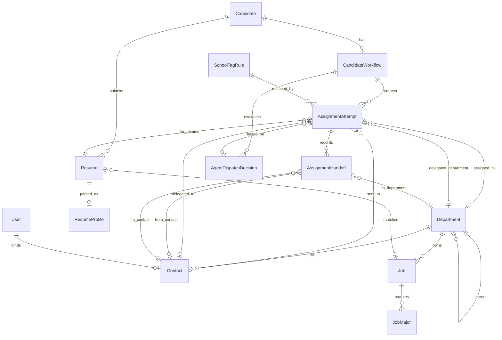

# 智能简历筛选系统 — 数据库设计

> 存储：PostgreSQL；以 Django 模型组织。本设计覆盖输入件落库、前置数据准备、候选人处理主流程、分配下发、权限。所有数据同处**一个池**，按时间标签筛选，**不分批次**。

## 一、建模关键判断

1. **人 / 投递分离**：`简历信息列表` 一行 = 一次投递。同一人可投多个岗位，故拆为 **Candidate（同学/人）** 与 **Resume（投递记录）**。人用 `identity_hash = hash(规范化姓名 + 手机号)` 标识；`应聘ID` 按投递唯一（简历包 `姓名（应聘ID）` 据此定位投递）。
2. **单一数据池 + 时间标签**：不引入批次概念。候选人、投递、分配同处一个池，按 `imported_at` 等时间标签筛选；每次导入按 `identity_hash` / `应聘ID` 幂等并入（增量更新不覆盖历史）。院校、部门、接口人、岗位需求为**主数据**，同在池中维护。
3. **处理结果就近存放**：院校打标作为前置处理落在 Candidate（个人学历属性）；志愿、岗位类别落在 Resume（投递属性）；分配进入候选人级工作流。
4. **Rule / AI 策略可追溯**：简历分类、分配与下发记录 `dispatch_strategy`（rule/ai）、分类理由、AI 决策证据，支持人工核对。
5. **分类与分配合并为同一环节**：岗位分类不再是独立流程步骤，而是简历分配+下发策略内部动作。Rule 按确定性规则完成分类和分配；AI 读取简历正文和项目经历后生成可审计决策，再进入同一分配工作流。
6. **配置/字典外置**：院校标签准入规则、南北省份归属等进配置表或规则表，不写死。
7. **招聘周期边界**：v1 不引入批次/周期表，以当前数据池作为一个持续招聘周期；同一 `Candidate` 只维护一个当前分配流程。历史招聘周期隔离暂不设计。

## 二、ER 关系图

**对象图注**

| 对象 | 含义 | 所属域 |
| ---- | ---- | ------ |
| Department | 部门主数据，支持一层/二层/三级树形结构；二级部门用于岗位归属和 HR 下发目标，三级部门用于二级接口人继续转派 | 主数据 |
| Contact | 部门接口人主数据，绑定二级或三级部门；二级接口人负责转派，三级接口人负责最终反馈 | 主数据 / 下发 |
| Job | 岗位需求主数据，来自校招岗位分类及专业要求；承载岗位类别、部门、工作地、学历、HC 等 | 主数据 / 需求 |
| JobMajor | 岗位需求专业明细；一条岗位需求可配置多个需求专业 | 主数据 / 需求 |
| Candidate | 候选人/同学实体，以姓名 + 手机号归一后的 `identity_hash` 识别人 | 候选人数据 |
| Resume | 投递记录实体，一条记录对应一个应聘ID；同一候选人可有多条投递/志愿 | 候选人数据 |
| ResumeProfile | 简历结构化画像，从简历文件解析正文、项目经历、实习经历、技能等，供 AI 策略使用 | AI 数据 |
| CandidateWorkflow | 候选人级分配流程，一个候选人一个当前流程；记录当前志愿、流程状态、归档原因、通过结果 | 工作流 |
| AssignmentAttempt | 分配尝试，一次具体的 Rule/AI/手动分配动作；承载目标部门、接口人、下发状态和反馈结果 | 工作流 / 下发 |
| AssignmentHandoff | 分配转交记录，记录 HR 下发给二级接口人、二级接口人转派给三级接口人的动作历史 | 工作流 / 审计 |
| AgentDispatchDecision | AI 策略决策记录，保存推荐动作、推荐部门/接口人、置信度、理由、证据和风险点 | AI 审计 |
| SchoolTagRule | 院校标签准入规则，由 HR 配置；Rule/AI 策略都必须先通过启用规则才可自动分配 | 配置 / 规则 |
| User | 系统用户，承载 HR、二级接口人、三级接口人、管理员等角色；接口人用户可绑定 Contact | 权限 |

> 关系符号说明：`||` 表示一条必有记录，`o|` 表示零或一条，`o{` 表示零到多条。例如 `Candidate ||--o{ Resume` 表示一个候选人可以有多条投递记录；`Candidate ||--o| CandidateWorkflow` 表示一个候选人最多一个当前分配流程。

## 三、主数据（CRUD 维护）

### Department 部门（树形）

| 字段      | 类型           | 说明           |
| --------- | -------------- | -------------- |
| id        | PK             |                |
| name      | varchar        | 部门名         |
| level     | smallint       | 1=一层，2=二层，3=三级 |
| parent_id | FK→Department | 一层为空；二层挂一层；三级挂二层 |
| entity    | varchar        | 招聘主体       |

### Contact 接口人

| 字段          | 类型           | 说明         |
| ------------- | -------------- | ------------ |
| id            | PK             |              |
| name          | varchar        | 姓名         |
| employee_no   | varchar unique | 工号         |
| department_id | FK→Department | 所属二级或三级部门 |
| contact_level | varchar        | secondary / tertiary；二级接口人可转派，三级接口人可反馈 |
| can_delegate  | bool           | 是否允许向下属三级部门接口人转派，通常仅二级接口人为 true |
| is_active     | bool           | 是否启用     |

> 权限口径：二级接口人只能把 HR 下发给自己的分配尝试转派给其所属二级部门下的启用三级接口人；三级接口人只处理转派给自己的尝试并提交反馈。

### School 院校

| 字段     | 类型           | 说明                                          |
| -------- | -------------- | --------------------------------------------- |
| id       | PK             |                                               |
| name     | varchar unique | 学校                                          |
| platform | varchar        | 平台（打标用）                                |
| region   | varchar null   | 所在地/南北（查重与志愿排序中户籍缺失时兜底，待确认来源） |

### Job 岗位需求（即「校招岗位分类及专业要求」+「结构化需求表」）

| 字段          | 类型           | 说明                                           |
| ------------- | -------------- | ---------------------------------------------- |
| id            | PK             |                                                |
| entity        | varchar        | 主体                                           |
| department_id | FK→Department | 二级部门                                       |
| category      | varchar        | 岗位类别（分配策略匹配目标）                   |
| public_name   | varchar        | 对外发布名称                                   |
| is_public     | bool           | 是否对外发布                                   |
| position_name | varchar        | 职位名称                                       |
| job_family    | varchar        | 岗位族                                         |
| location      | varchar        | 工作地点                                       |
| education     | varchar        | 学历要求                                       |
| headcount     | int            | 需求数量（HC，用于岗位需求展示与后续容量策略） |

### JobMajor 岗位需求专业（需求专业多值）

| 字段   | 类型    | 说明     |
| ------ | ------- | -------- |
| id     | PK      |          |
| job_id | FK→Job |          |
| major  | varchar | 需求专业 |

## 四、候选与投递（数据池）

### Candidate 候选人

| 字段                    | 类型           | 说明                                                  |
| ----------------------- | -------------- | ----------------------------------------------------- |
| id                      | PK             |                                                       |
| identity_hash           | varchar unique | `hash(规范化姓名 + 手机号)`，全局唯一标识一个人     |
| name                    | varchar        | 姓名                                                  |
| phone                   | varchar        | 手机号（原文，仅存储）                                |
| gender                  | varchar        | 性别                                                  |
| household_province      | varchar        | 户口所在地                                            |
| first_degree_school     | varchar        | 第一学历毕业院校                                      |
| highest_degree_school   | varchar        | 最高学历毕业院校                                      |
| highest_major           | varchar        | 最高学历专业                                          |
| first_degree_platform   | varchar        | 前置院校分类：第一学历平台标签（非命中=非目标院校） |
| highest_degree_platform | varchar        | 前置院校分类：最高学历平台标签                      |
| imported_at             | datetime       | 导入时间（时间标签，用于筛选）                        |
| updated_at              | datetime       | 最近更新时间                                          |

> 约束：unique(identity_hash)；规范化规则（姓名/手机号）见《需求与技术方案》身份模型。手机号缺失时哈希不稳定，回退为以该条 `应聘ID` 单独成人。
> 简历库主列表以 Candidate 为展示粒度，一名候选人一行；候选人的全部投递通过详情页/抽屉按 Resume 展示。

### Resume 投递记录

| 字段            | 类型           | 说明                                                                          |
| --------------- | -------------- | ----------------------------------------------------------------------------- |
| id              | PK             |                                                                               |
| candidate_id    | FK→Candidate  |                                                                               |
| apply_id        | varchar unique | 应聘ID（全局唯一，投递维度）                                                  |
| resume_file     | varchar        | 简历包文件名（`姓名（应聘ID）`）；文件落盘 `media/resumes/`，供分配页导出 |
| entity          | varchar        | 招聘主体                                                                      |
| org             | varchar        | 所属机构                                                                      |
| position_name   | varchar        | 对外职位名称（投递岗位）                                                      |
| status          | varchar        | 原始应聘状态（待处理等），用于展示与筛选                                      |
| apply_date      | date           | 应聘日期（查重与志愿排序依据）                                                |
| volunteer_rank  | smallint null  | 查重与志愿排序：志愿次序（1–4）                                              |
| assigned_entity | varchar null   | 查重与志愿排序：分配主体（GW/YLS）                                            |
| job_id          | FK→Job null   | 简历分类、分配与下发环节匹配到的岗位                                          |
| job_category    | varchar null   | 简历分类、分配与下发环节写入的岗位类别标签                                    |
| category_mode   | varchar        | rule / ai                                                                     |
| category_reason | text null      | AI 模式可解释理由                                                             |
| imported_at     | datetime       | 导入时间（时间标签，用于筛选）                                                |

### ResumeProfile 简历结构化画像

| 字段                  | 类型           | 说明                                                       |
| --------------------- | -------------- | ---------------------------------------------------------- |
| id                    | PK             |                                                            |
| resume_id             | OneToOne→Resume | 一条投递对应一份解析画像                                  |
| parse_status          | varchar        | pending / parsed / failed / unsupported                    |
| file_checksum         | varchar null   | 简历文件内容哈希；文件变化后触发重新解析                   |
| raw_text              | text null      | 从 PDF/DOC/DOCX/TXT 抽取出的正文                           |
| summary               | text null      | 简历摘要                                                   |
| project_experiences   | jsonb          | 项目经历数组，含项目名称、角色、技术栈、职责、成果等       |
| internship_experiences| jsonb          | 实习/工作经历数组                                          |
| skills                | jsonb          | 技能关键词数组                                             |
| certificates          | jsonb          | 证书、竞赛、奖项等                                         |
| parse_model           | varchar null   | 解析使用的模型或解析器版本                                 |
| parse_error           | text null      | 解析失败原因                                               |
| parsed_at             | datetime null  | 最近解析时间                                               |
| created_at            | datetime       |                                                            |
| updated_at            | datetime       |                                                            |

> AI 策略依赖 `ResumeProfile`。若简历文件缺失、格式不支持、正文抽取失败或项目经历不足，AI 决策必须显式记录风险点，不得静默生成高置信度下发结论。

## 五、简历分类、分配与下发

### SchoolTagRule 院校标签准入规则

| 字段                | 类型     | 说明                                         |
| ------------------- | -------- | -------------------------------------------- |
| id                  | PK       |                                              |
| name                | varchar  | 规则名称                                     |
| first_degree_tags   | jsonb    | 第一学历允许标签数组，如`["985", "211"]`   |
| highest_degree_tags | jsonb    | 最高学历允许标签数组                         |
| is_active           | bool     | 是否启用                                     |
| priority            | int      | 展示/评估顺序，规则之间为 OR，不影响命中语义 |
| created_at          | datetime |                                              |
| updated_at          | datetime |                                              |

> 命中口径：候选人的 `first_degree_platform` 命中某条启用规则的 `first_degree_tags`，且 `highest_degree_platform` 命中同一条规则的 `highest_degree_tags`，才算通过该规则；多条启用规则之间是 OR。「非目标院校」只是普通标签，HR 可配置进规则。
> v1 采用 JSONB 保存标签数组，便于快速配置与读取；若后续需要统计标签引用、复杂组合条件或规则审计，再拆成规则明细表。

### CandidateWorkflow 候选人分配流程

| 字段              | 类型                       | 说明                                         |
| ----------------- | -------------------------- | -------------------------------------------- |
| id                | PK                         |                                              |
| candidate_id      | OneToOne→Candidate        | 一个候选人唯一一个分配流程                   |
| status            | varchar                    | pending / in_progress / passed / archived    |
| dispatch_strategy | varchar                    | rule / ai，最近一次分配使用的策略             |
| current_resume_id | FK→Resume null            | 当前处理到的投递                             |
| current_rank      | smallint null              | 当前志愿序号                                 |
| archive_reason    | varchar null               | 归档原因                                     |
| archive_detail    | text null                  | 归档说明，如未命中规则、无下一志愿、无接口人 |
| passed_attempt_id | FK→AssignmentAttempt null | 通过的分配尝试                               |
| started_at        | datetime null              | 首次进入分配时间                             |
| completed_at      | datetime null              | 通过或归档时间                               |
| created_at        | datetime                   |                                              |
| updated_at        | datetime                   |                                              |

> 约束：unique(candidate_id)。归档候选人不单独建表，通过 `status=archived` + 归档字段查询；后续规则调整不会自动恢复归档流程，HR 可手动强制分配。
> `current_resume` / `current_rank` 驱动简历库主列表的当前志愿展示：初始指向第一志愿，反馈未通过后切换到下一志愿，通过后保留通过志愿，归档后保留最后处理志愿。

**流程状态枚举**

| 状态        | 中文含义 | 进入方式                                          | 是否终态               |
| ----------- | -------- | ------------------------------------------------- | ---------------------- |
| pending     | 待分配   | 创建流程但尚未生成有效尝试                        | 否                     |
| in_progress | 进行中   | 生成待下发/已下发尝试，或归档后被手动强制分配恢复 | 否                     |
| passed      | 已通过   | 任一尝试反馈通过                                  | 是                     |
| archived    | 已归档   | 无可继续尝试的志愿，或自动分配前置条件失败        | 是（可被手动分配恢复） |

**归档原因枚举**

| 值                      | 含义                             |
| ----------------------- | -------------------------------- |
| no_active_school_rule   | 没有任何启用的院校标签准入规则   |
| school_rule_not_matched | 候选人院校标签未命中任何启用规则 |
| no_next_resume          | 没有下一条可尝试志愿             |
| job_not_matched         | 投递未匹配到岗位                 |
| department_not_found    | 岗位未关联有效二级部门           |
| contact_not_found       | 二级部门下没有可用二级接口人     |
| sub_contact_not_found   | 二级部门下没有可用三级接口人     |
| agent_no_recommendation | AI 未形成有效下发建议            |
| all_rejected            | 全部可尝试志愿均被反馈未通过     |
| rerun_preserved         | 分配环节重跑时保留既有归档结果   |

> `archive_reason` 存枚举，`archive_detail` 存人类可读说明和具体上下文，前端归档候选人页按这两个字段展示原因。

### AssignmentAttempt 分配尝试

| 字段                         | 类型                   | 说明                                                          |
| ---------------------------- | ---------------------- | ------------------------------------------------------------- |
| id                           | PK                     |                                                               |
| workflow_id                  | FK→CandidateWorkflow  | 所属候选人流程                                                |
| resume_id                    | FK→Resume             | 本次尝试使用的投递                                            |
| attempt_no                   | int                    | 流程内尝试序号                                                |
| source                       | varchar                | rule / ai / manual                                            |
| status                       | varchar                | pending_dispatch / dispatched_l2 / assigned_l3 / passed / rejected / cancelled |
| department_id                | FK→Department null    | 分配到的二级部门                                              |
| contact_id                   | FK→Contact            | 二级接口人，HR 下发对象                                       |
| sub_department_id            | FK→Department null    | 三级部门，二级接口人转派后写入                                |
| sub_contact_id               | FK→Contact null       | 三级接口人，最终反馈人                                        |
| matched_rule_id              | FK→SchoolTagRule null | 自动分配命中的院校规则；手动分配为空                          |
| agent_decision_id            | FK→AgentDispatchDecision null | AI 策略决策依据；规则/手动分配为空                    |
| match_mode                   | varchar                | rule / ai                                                     |
| match_reason                 | text null              | 分配/匹配理由                                                 |
| confidence_score             | decimal null           | AI 置信度，规则/手动分配为空                                  |
| review_required              | bool                   | 是否需要 HR 重点复核；AI 低置信度时为 true                    |
| welink_message_id            | varchar null           | WeLink 消息标识，真实集成后回填                               |
| dispatched_at                | datetime null          | HR 下发给二级接口人的时间                                     |
| assigned_to_sub_at           | datetime null          | 二级接口人转派给三级接口人的时间                              |
| feedback_result              | varchar null           | passed / rejected                                             |
| feedback_note                | text null              | 三级接口人反馈备注                                            |
| feedback_at                  | datetime null          | 反馈提交时间                                                  |
| cancelled_at                 | datetime null          | 取消时间                                                      |
| cancel_reason                | varchar null           | 取消原因，如分配环节重跑、通过后取消其他尝试、手动分配替换     |
| manual_reason                | text null              | HR 手动强制分配原因；自动分配为空                             |
| department_name_snapshot     | varchar null           | 分配时二级部门名称快照                                        |
| contact_name_snapshot        | varchar null           | 分配时二级接口人姓名快照                                      |
| contact_employee_no_snapshot | varchar null           | 分配时二级接口人工号快照                                      |
| sub_department_name_snapshot | varchar null           | 转派时三级部门名称快照                                        |
| sub_contact_name_snapshot    | varchar null           | 转派时三级接口人姓名快照                                      |
| sub_contact_employee_no_snapshot | varchar null       | 转派时三级接口人工号快照                                      |
| resume_apply_id_snapshot     | varchar null           | 投递应聘ID快照                                                |
| position_name_snapshot       | varchar null           | 投递岗位名称快照                                              |
| created_by_id                | FK→User null          | 手动分配或下发操作者；系统自动分配可为空                      |
| created_at                   | datetime               |                                                               |
| updated_at                   | datetime               |                                                               |

> 状态约束：反馈一旦提交即锁定，不允许二次修改。三级接口人反馈「通过」后，`CandidateWorkflow.status=passed`，并取消同候选人其他未反馈尝试；三级接口人反馈「未通过」后，系统自动寻找下一志愿，若无可分配投递则归档。Rule 策略创建 `source=rule` 尝试，AI 策略创建 `source=ai` 尝试，HR 手动强制分配创建 `source=manual` 尝试。手动强制分配绕过院校规则和志愿顺序；已通过候选人不可再强制分配。

### AssignmentHandoff 分配转交记录

| 字段              | 类型                   | 说明                                      |
| ----------------- | ---------------------- | ----------------------------------------- |
| id                | PK                     |                                           |
| attempt_id        | FK→AssignmentAttempt  | 所属分配尝试                              |
| action            | varchar                | hr_dispatch / sub_assign / sub_reassign   |
| from_contact_id   | FK→Contact null       | 转出接口人；HR 下发时为空                 |
| to_department_id  | FK→Department null    | 转入部门，HR 下发为二级部门，二级转派为三级部门 |
| to_contact_id     | FK→Contact            | 转入接口人                                |
| note              | text null              | 转派备注                                  |
| created_by_id     | FK→User null          | 操作者                                    |
| created_at        | datetime               |                                           |

> `AssignmentHandoff` 只做审计，不替代 `AssignmentAttempt` 上的当前二级/三级接口人字段。列表查询优先读 `AssignmentAttempt.contact_id`、`sub_contact_id`；详情页展示转交历史时读取本表。

### AgentDispatchDecision AI 策略决策

| 字段                    | 类型                        | 说明                                                |
| ----------------------- | --------------------------- | --------------------------------------------------- |
| id                      | PK                          |                                                     |
| workflow_id             | FK→CandidateWorkflow       | 所属候选人流程                                      |
| resume_id               | FK→Resume                  | 本次评估的志愿投递                                  |
| resume_profile_id       | FK→ResumeProfile null      | 使用的简历画像                                      |
| processing_run_id       | FK→ProcessingRun null      | 对应分配环节运行记录                                 |
| recommendation          | varchar                     | dispatch / review / archive                         |
| recommended_job_id      | FK→Job null                | 推荐匹配的岗位需求                                  |
| recommended_department_id | FK→Department null        | 推荐二级部门                                        |
| recommended_contact_id  | FK→Contact null            | 推荐二级接口人                                      |
| confidence_score        | decimal                     | 0–1 置信度                                          |
| reason                  | text                        | 推荐理由                                            |
| evidence                | jsonb                       | 引用证据，如项目经历、技能关键词、专业匹配片段      |
| risk_flags              | jsonb                       | 风险点，如简历缺失、项目描述薄弱、专业不匹配        |
| model_name              | varchar null                | 模型名称                                            |
| prompt_version          | varchar null                | 提示词版本                                          |
| raw_response_summary    | text null                   | 原始响应摘要，不保存冗长调试内容                    |
| created_at              | datetime                    |                                                     |

> `recommendation=dispatch` 且置信度达到配置阈值时，可创建 `source=ai` 的待下发尝试；`recommendation=review` 时进入 HR 复核，不直接下发给接口人；`recommendation=archive` 时可归档并记录 `agent_no_recommendation`。AI 决策不得绕过 `SchoolTagRule`、志愿顺序、反馈锁定和已通过候选人不可再分配等硬规则。表名保留 Agent，是因为 AI 策略内部以智能体方式完成简历阅读、岗位适配和分流建议。

**尝试状态枚举**

| 状态             | 中文含义 | 允许操作                                 |
| ---------------- | -------- | ---------------------------------------- |
| pending_dispatch | 待下发       | HR 可下发、取消；接口人不可见                  |
| dispatched_l2    | 已下发二级   | 二级接口人可转派给下属三级接口人；HR 可查看、导出 |
| assigned_l3      | 已转派三级   | 三级接口人可反馈通过/未通过；二级接口人和 HR 可查看 |
| passed           | 已通过   | 终态，只读                               |
| rejected         | 未通过   | 终态，只读，系统自动尝试下一志愿         |
| cancelled        | 已取消   | 终态，只读                               |

**状态一致性规则**

- `status=passed` 时，`feedback_result=passed` 且 `feedback_at` 必须非空。
- `status=rejected` 时，`feedback_result=rejected` 且 `feedback_at` 必须非空。
- `status in (pending_dispatch, dispatched_l2, assigned_l3, cancelled)` 时，`feedback_result` 应为空。
- `feedback_at` 非空即表示反馈锁定，后续不得修改反馈结果和备注。
- `status=dispatched_l2` 时，`contact_id`、`dispatched_at` 必须非空，`sub_contact_id` 为空。
- `status=assigned_l3` 时，`contact_id`、`sub_contact_id`、`assigned_to_sub_at` 必须非空。
- 二级转派时，`sub_contact.department.parent_id` 必须等于 `AssignmentAttempt.department_id`，且操作者绑定的二级接口人必须等于 `contact_id`。
- `source=rule` 时，`matched_rule_id` 必须非空，`agent_decision_id` 为空。
- `source=ai` 时，`agent_decision_id` 必须非空，并保存 `confidence_score` 与 `review_required`。
- `source=manual` 时，`matched_rule_id` 与 `agent_decision_id` 为空，建议填写 `manual_reason`。
- 创建尝试时写入快照字段，历史列表和导出优先展示快照，避免部门/接口人/岗位后续改名导致历史不可读。

**核心流转**

| 触发               | 流转                                                                                                     |
| ------------------ | -------------------------------------------------------------------------------------------------------- |
| Rule 策略生成尝试 | `CandidateWorkflow: pending/archived → in_progress`；`AssignmentAttempt: source=rule, pending_dispatch`  |
| AI 策略生成尝试 | 生成 `AgentDispatchDecision`；高置信度创建 `source=ai, pending_dispatch`，低置信度进入 HR 复核或归档 |
| HR 下发            | `pending_dispatch → dispatched_l2`，写入 `dispatched_at`、WeLink 消息标识和 `hr_dispatch` 转交记录；支持单条、勾选批量、当前筛选全部下发 |
| 二级接口人转派     | `dispatched_l2 → assigned_l3`，写入 `sub_contact_id`、`assigned_to_sub_at` 和 `sub_assign` 转交记录 |
| 三级接口人反馈通过 | `assigned_l3 → passed`；流程置 `passed`；取消同流程其他未反馈尝试                                  |
| 三级接口人反馈未通过 | `assigned_l3 → rejected`；自动寻找下一志愿；无下一志愿则流程归档                                  |
| HR 手动强制分配    | 取消同流程未反馈尝试；目标为二级接口人时创建 `source=manual, pending_dispatch` 尝试；目标为三级接口人时直接创建 `source=manual, assigned_l3` 尝试并写入二级/三级字段和转交记录；归档流程恢复为 `in_progress` |
| 分配环节重跑       | 只取消未反馈自动尝试并重建；不修改已反馈、已通过、已归档记录                                             |

### 分配环节重跑与数据保留

- 没有任何启用 `SchoolTagRule` 时，Rule 和 AI 策略都直接失败并提示先配置规则，不创建分配尝试。
- 重跑分配环节不清空全部历史；已反馈、已通过、已归档记录保留，只取消并重建未反馈的自动分配尝试。
- 切换 Rule / AI 策略时，只取消并重建未反馈的自动尝试；Rule 尝试与 AI 尝试都算自动尝试，手动尝试、已反馈尝试和已通过流程不受影响。
- HR 批量下发以 `AssignmentAttempt` 为入口：`POST /api/workflow-attempts/bulk-dispatch/`。传 `ids` 时处理勾选记录；不传或空数组时按当前筛选处理全部；只流转 `pending_dispatch`，其他状态跳过并返回统计。
- 简历导出以 `AssignmentAttempt` 为入口：`/api/workflow-attempts/export/?ids=` 从 `Resume.resume_file` 定位 `media/resumes/` 文件，无文件时写入压缩包缺失清单。

### 约束、索引与删除策略

**唯一约束**

| 模型              | 约束                            |
| ----------------- | ------------------------------- |
| Candidate         | unique(identity_hash)           |
| Resume            | unique(apply_id)                |
| ResumeProfile     | unique(resume_id)               |
| CandidateWorkflow | unique(candidate_id)            |
| AssignmentAttempt | unique(workflow_id, attempt_no) |
| AssignmentHandoff | 无强制唯一；按 attempt_id + created_at 排序 |
| Contact           | unique(employee_no)             |
| School            | unique(name)                    |
| ProvinceRegion    | unique(province)                |

**查询索引**

| 模型              | 索引                         | 用途                           |
| ----------------- | ---------------------------- | ------------------------------ |
| CandidateWorkflow | status                       | 工作流/归档候选人列表          |
| CandidateWorkflow | updated_at                   | 最近处理排序                   |
| AssignmentAttempt | status                       | 尝试状态筛选                   |
| AssignmentAttempt | contact_id, status           | 二级接口人只看下发给自己的尝试 |
| AssignmentAttempt | sub_contact_id, status       | 三级接口人只看转派给自己的尝试 |
| AssignmentAttempt | workflow_id, status          | 取消同流程未反馈尝试           |
| AssignmentAttempt | source, status               | 分配环节重跑时定位未反馈自动尝试 |
| AssignmentHandoff | attempt_id, created_at       | 分配尝试详情页展示转交历史     |
| AgentDispatchDecision | workflow_id, resume_id     | 查看候选人某志愿的 AI 决策 |
| AgentDispatchDecision | recommendation, confidence_score | AI 复核队列和筛选      |
| Resume            | candidate_id, volunteer_rank | 按志愿顺序寻找下一投递         |
| Resume            | job_id                       | 按岗位筛选投递                 |
| SchoolTagRule     | is_active, priority          | 分配环节读取启用规则             |
| ProcessingRun     | step, status                 | 任务列表与轮询                 |

**外键删除策略**

| 关系                                                  | 删除策略 | 说明                                     |
| ----------------------------------------------------- | -------- | ---------------------------------------- |
| Candidate → Resume                                   | CASCADE  | 删除候选人时删除其投递                   |
| Resume → ResumeProfile                              | CASCADE  | 删除投递时删除其解析画像                 |
| Candidate → CandidateWorkflow                        | CASCADE  | 删除候选人时删除当前流程                 |
| CandidateWorkflow → AssignmentAttempt                | CASCADE  | 删除流程时删除尝试                       |
| CandidateWorkflow → AgentDispatchDecision            | CASCADE  | 删除流程时删除 AI 决策                   |
| AssignmentAttempt → AssignmentHandoff                | CASCADE  | 删除尝试时删除转交审计                   |
| Resume → AssignmentAttempt                           | PROTECT  | 已产生分配历史的投递不允许直接删除       |
| Resume → AgentDispatchDecision                       | CASCADE  | 投递删除时删除对应 AI 决策               |
| Resume → CandidateWorkflow.current_resume            | SET_NULL | 当前投递被删除时清空指针，流程保留       |
| AssignmentAttempt → CandidateWorkflow.passed_attempt | SET_NULL | 通过尝试被清理时清空指针，流程状态仍保留 |
| AgentDispatchDecision → AssignmentAttempt            | SET_NULL | 决策记录清理时保留尝试历史快照           |
| Contact → AssignmentAttempt                          | PROTECT  | 保留历史接口人分配记录                   |
| Contact → AssignmentHandoff                          | PROTECT  | 保留转交历史                             |
| Department → AssignmentAttempt                       | PROTECT  | 保留历史部门分配记录                     |
| Department → AssignmentHandoff                       | PROTECT  | 保留转交部门历史                         |
| SchoolTagRule → AssignmentAttempt                    | SET_NULL | 规则删除后历史尝试仍保留快照和匹配理由   |
| User → AssignmentAttempt.created_by                  | SET_NULL | 操作者账号删除不影响历史记录             |
| Job → Resume                                         | SET_NULL | 岗位主数据调整不删除投递                 |

> 历史类记录优先保留。若业务上需要删除主数据，先停用或改名；确需硬删除时，由管理端做影响检查。

## 六、系统 / 任务 / 权限

### ProcessingRun 处理任务（Celery 跟踪）

| 字段                     | 类型      | 说明                                       |
| ------------------------ | --------- | ------------------------------------------ |
| id                       | PK        |                                            |
| scope                    | jsonb     | 处理范围/筛选条件（如时间标签区间、状态）  |
| step                     | varchar   | import / pre_school / demand / dedup / dispatch |
| mode                     | varchar   | dispatch 环节记录 rule / ai                |
| status                   | varchar   | pending / running / success / failed       |
| celery_task_id           | varchar   |                                            |
| params                   | jsonb     | 运行参数（如规则版本、分配策略、AI 阈值、触发来源、处理范围） |
| started_at / finished_at | datetime  |                                            |
| error                    | text null |                                            |

### Config 配置（键值）

| 字段  | 类型       | 说明                                  |
| ----- | ---------- | ------------------------------------- |
| key   | varchar PK | 如 ai_timeout_seconds、ai_confidence_threshold、welink_enabled |
| value | jsonb      | 配置值                                |

### ProvinceRegion 省份南北字典

| 字段     | 类型       | 说明    |
| -------- | ---------- | ------- |
| province | varchar PK | 省份    |
| region   | varchar    | 南 / 北 |

### ImportSnapshot 上传撤销快照（单级）

| 字段       | 类型     | 说明                                                                       |
| ---------- | -------- | -------------------------------------------------------------------------- |
| id         | PK       |                                                                            |
| created_at | datetime |                                                                            |
| label      | varchar  | 如「上传简历前」                                                           |
| payload    | text     | Candidate/Resume/CandidateWorkflow/AssignmentAttempt 的 django 序列化 json |

> 每次上传含简历的数据前写一份，**仅保留最近一份**；`/api/import/undo/` 用 payload 还原这些表，回到上传前状态，撤销后该快照删除。

### User 用户（继承 AbstractUser）

| 字段            | 类型             | 说明                 |
| --------------- | ---------------- | -------------------- |
| ...AbstractUser |                  | 用户名/密码/W3 等    |
| role            | varchar          | hr / secondary_contact / tertiary_contact / admin |
| contact_id      | FK→Contact null | 角色为接口人时绑定   |

> RBAC 通过 Django Group/Permission 实现。二级接口人仅可见 `contact_id` 指向自己的 `AssignmentAttempt`，并可转派给所属二级部门下的三级接口人；三级接口人仅可见 `sub_contact_id` 指向自己的 `AssignmentAttempt`，并提交通过/未通过反馈。v1 demo 后端仍可 AllowAny，接口人演示身份临时绑定数据库第一个对应层级接口人。

## 七、待确认（影响建模）

1. 院校所在地/南北信息来源：放入 School.region 还是单独维护？
2. `需求专业` 是否需要结构化为多值（已按 JobMajor 设计，确认是否够用）。
3. Job 岗位需求随招聘周期如何更新/失效（作为主数据持续维护）。
4. 院校标签准入规则的默认初始化口径：是否预置规则、预置哪些平台标签。
5. AI 策略使用的简历格式范围、正文保留策略、置信度阈值与低置信度复核流程。
