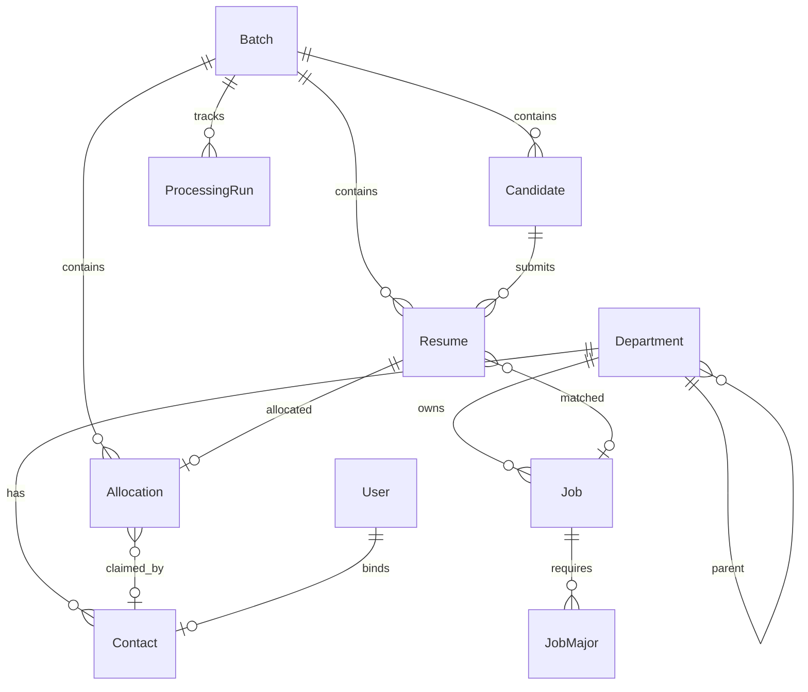

# 智能简历筛选系统 — 数据库设计

> 存储：PostgreSQL；以 Django 模型组织。本设计覆盖输入件落库、五步处理结果、分配下发、权限与批次。

## 一、建模关键判断

1. **人 / 投递分离**：`简历信息列表` 一行 = 一次投递。同一人可投多个岗位，故拆为 **Candidate（同学/人）** 与 **Resume（投递记录）**。人用 `identity_hash = hash(规范化姓名 + 手机号)` 标识；`应聘ID` 按投递唯一（简历包 `姓名（应聘ID）` 据此定位投递）。
2. **批次隔离**：候选人、投递、分配、处理任务都归属某个 **Batch（批次）**（单批 ~3 万）；院校、部门、接口人、岗位需求等为**主数据**，跨批次维护（表格导入 + 增删改查）。
3. **处理结果就近存放**：院校打标（Step3）落在 Candidate（个人学历属性）；志愿、岗位类别、分配落在 Resume（投递属性）。
4. **双模式可追溯**：分类/匹配结果记录 `mode`（rule/ai）与 `reason`（AI 理由），支持规则 vs AI 对比。
5. **配置/字典外置**：分配倍数、南北省份归属等进配置表，不写死。

## 二、ER 关系图

## 三、主数据（CRUD 维护，跨批次）

### Department 部门（树形）
| 字段 | 类型 | 说明 |
|------|------|------|
| id | PK | |
| name | varchar | 部门名 |
| level | smallint | 1=一层，2=二层 |
| parent_id | FK→Department | 一层为空 |
| entity | varchar | 招聘主体 |

### Contact 接口人
| 字段 | 类型 | 说明 |
|------|------|------|
| id | PK | |
| name | varchar | 姓名 |
| employee_no | varchar unique | 工号 |
| department_id | FK→Department | 所属二层部门 |

### School 院校
| 字段 | 类型 | 说明 |
|------|------|------|
| id | PK | |
| name | varchar unique | 学校 |
| platform | varchar | 平台（打标用） |
| region | varchar null | 所在地/南北（Step1 户籍缺失兜底，待确认来源） |

### Job 岗位需求（即「校招岗位分类及专业要求」+「结构化需求表」）
| 字段 | 类型 | 说明 |
|------|------|------|
| id | PK | |
| entity | varchar | 主体 |
| department_id | FK→Department | 二层部门 |
| category | varchar | 岗位类别（Step2 映射目标） |
| public_name | varchar | 对外发布名称 |
| is_public | bool | 是否对外发布 |
| position_name | varchar | 职位名称 |
| job_family | varchar | 岗位族 |
| location | varchar | 工作地点 |
| education | varchar | 学历要求 |
| headcount | int | 需求数量（HC，Step5 分配倍数基数） |

### JobMajor 岗位需求专业（需求专业多值）
| 字段 | 类型 | 说明 |
|------|------|------|
| id | PK | |
| job_id | FK→Job | |
| major | varchar | 需求专业 |

## 四、候选与投递（批次数据）

### Candidate 候选人
| 字段 | 类型 | 说明 |
|------|------|------|
| id | PK | |
| batch_id | FK→Batch | |
| identity_hash | varchar | `hash(规范化姓名 + 手机号)`，批次内唯一标识一个人 |
| name | varchar | 姓名 |
| phone | varchar | 手机号（原文，仅存储） |
| gender | varchar | 性别 |
| household_province | varchar | 户口所在地 |
| first_degree_school | varchar | 第一学历毕业院校 |
| highest_degree_school | varchar | 最高学历毕业院校 |
| highest_major | varchar | 最高学历专业 |
| first_degree_platform | varchar | **Step3** 第一学历平台标签（非命中=非目标院校） |
| highest_degree_platform | varchar | **Step3** 最高学历平台标签 |
| is_target_school | bool | **Step3** 是否目标院校（Step5 筛选用） |

> 约束：unique(batch_id, identity_hash)；规范化规则（姓名/手机号）见《需求与技术方案》身份模型。手机号缺失时哈希不稳定，回退为以该条 `应聘ID` 单独成人。

### Resume 投递记录
| 字段 | 类型 | 说明 |
|------|------|------|
| id | PK | |
| batch_id | FK→Batch | |
| candidate_id | FK→Candidate | |
| apply_id | varchar | 应聘ID（按投递唯一） |
| resume_file | varchar | 简历包文件路径（`姓名（应聘ID）`） |
| entity | varchar | 招聘主体 |
| org | varchar | 所属机构 |
| position_name | varchar | 对外职位名称（投递岗位） |
| status | varchar | 应聘状态（待处理等，Step5 筛选用） |
| apply_date | date | 应聘日期（Step1 志愿排序依据） |
| volunteer_rank | smallint null | **Step1** 志愿次序（1–4） |
| assigned_entity | varchar null | **Step1** 分配主体（GW/YLS） |
| job_id | FK→Job null | **Step2** 匹配到的岗位 |
| job_category | varchar null | **Step2** 岗位类别标签 |
| category_mode | varchar | rule / ai |
| category_reason | text null | AI 模式可解释理由 |

## 五、分配与下发（Step5）

### Allocation 分配
| 字段 | 类型 | 说明 |
|------|------|------|
| id | PK | |
| batch_id | FK→Batch | |
| resume_id | FK→Resume | |
| department_id | FK→Department | 分配到的二层部门（池） |
| contact_id | FK→Contact null | 二层接口人；先到先得时领取后回填 |
| reason | varchar | 分配理由（志愿优先/专业匹配/同比例） |
| match_mode | varchar | rule / ai（专业匹配） |
| status | varchar | 待领取 / 已领取 / 已下发 / 已通知 |
| claimed_at | datetime null | 领取时间（状态共享/先到先得） |
| notified_at | datetime null | WeLink 下发时间 |

> **状态共享方案（待确认）**：若一份简历对多接口人暴露、先到先得，则 Allocation 绑定到 Department 池，领取时用 `select_for_update` 行锁回填 contact_id 并置「已领取」，避免重复领取。

## 六、系统 / 任务 / 权限

### Batch 批次
| 字段 | 类型 | 说明 |
|------|------|------|
| id | PK | |
| name | varchar | 批次名 |
| created_by | FK→User | |
| created_at | datetime | |

### ProcessingRun 处理任务（Celery 跟踪）
| 字段 | 类型 | 说明 |
|------|------|------|
| id | PK | |
| batch_id | FK→Batch | |
| step | varchar | import / step1..step5 |
| mode | varchar | rule / ai |
| status | varchar | pending / running / success / failed |
| celery_task_id | varchar | |
| params | jsonb | 运行参数（如分配倍数） |
| started_at / finished_at | datetime | |
| error | text null | |

### Config 配置（键值）
| 字段 | 类型 | 说明 |
|------|------|------|
| key | varchar PK | 如 allocation_multiplier |
| value | jsonb | 如 5 |

### ProvinceRegion 省份南北字典
| 字段 | 类型 | 说明 |
|------|------|------|
| province | varchar PK | 省份 |
| region | varchar | 南 / 北 |

### User 用户（继承 AbstractUser）
| 字段 | 类型 | 说明 |
|------|------|------|
| ...AbstractUser | | 用户名/密码/W3 等 |
| role | varchar | hr / contact / admin |
| contact_id | FK→Contact null | 角色为接口人时绑定 |

> RBAC 通过 Django Group/Permission 实现；接口人仅可见/领取分配给本部门的简历。

## 七、待确认（影响建模）

1. 院校所在地/南北信息来源：放入 School.region 还是单独维护？
2. `需求专业` 是否需要结构化为多值（已按 JobMajor 设计，确认是否够用）。
3. Job 岗位需求是按批次还是作为跨批次主数据维护。
4. 简历分配是否状态共享（影响 Allocation 是否绑定到池 + 领取流程）。
